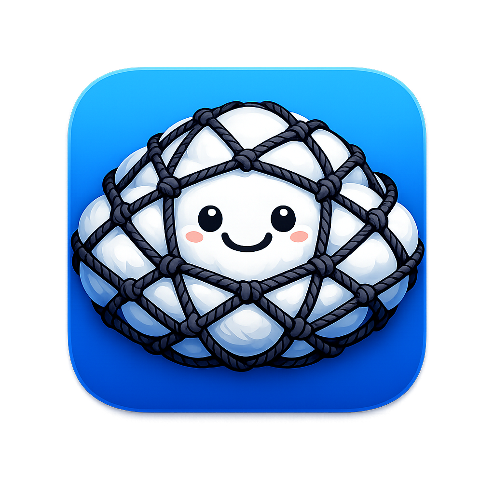

<p align="center">
  
</p>

<h1 align="center">DotNetCloud</h1>

<p align="center"><em>Meet <strong>Dot</strong> — a smiling cloud with a net wrapped around her, and the mascot who completes the name <strong>Dot</strong>NetCloud.</em></p>

<p align="center"><strong>A self-hosted, open-source cloud platform built on .NET 10/C#.</strong></p>

DotNetCloud is a modern alternative to NextCloud and OwnCloud, designed to leverage .NET's async, multithreaded capabilities to provide a comprehensive, extensible cloud solution that anyone can install on their own server.

🌐 **Website:** [dotnetcloud.net](https://dotnetcloud.net) (Coming soon)

---

## What Is DotNetCloud?

DotNetCloud gives you full control of your data by running your own cloud server. Install it on your own hardware, your own domain, and never depend on a third-party cloud provider again.

### Features (Planned)

| Feature | Description | Status |
|---|---|---|
| 📁 **Files** | File sync and sharing with desktop client, browser UI with context menus, drag-drop move, upload queue management, and paste-to-upload | ✅ Phase 1 |
| 📝 **Document Editing** | Browser-based editing via Collabora Online (LibreOffice-based) | ✅ Phase 1 |
| 💬 **Chat** | Real-time messaging, channels, direct messages | ✅ Phase 2 |
| 📱 **Android App** | Mobile client with photo auto-upload | ✅ Phase 2 |
| 👤 **Contacts** | Contact management with CardDAV support | ✅ Phase 3 |
| 📅 **Calendar** | Events, scheduling, CalDAV support | ✅ Phase 3 |
| 📝 **Notes** | Markdown-based note taking | ✅ Phase 3 |
| 📋 **Tracks** | Kanban boards and project management | 🔄 Rearchitecting |
| 🖼️ **Photos** | Photo library, albums, geo-clustering, slideshow, editing | ✅ Phase 5 |
| 🎵 **Music** | Music player with equalizer, playlists, favorites, Subsonic API | ✅ Phase 5 |
| 🎬 **Video** | Video library, collections, subtitles, watch progress, streaming | ✅ Phase 5 |
| 📧 **Email** | Integrated email client (SMTP/IMAP/Gmail) | Phase 6 |
| 🔖 **Bookmarks** | Browser bookmark sync via extension | Phase 6 |
| 📹 **Video Calls** | WebRTC video calling and screen sharing | Phase 7 |
| 🔍 **Search** | Full-text search across all modules | Phase 8 |
| 🔒 **E2EE** | Optional zero-knowledge encryption | Phase 8 |
| 🤖 **AI Assistant** | LLM-powered assistant via Ollama (local) or Claude/OpenAI (cloud) | ✅ Phase 9 |

### Roadmap

See [MASTER_PROJECT_PLAN.md](docs/MASTER_PROJECT_PLAN.md) for the full phased implementation plan with detailed status tracking.

| Phase | Milestone | Status |
|---|---|---|
| **Phase 0** | Foundation — core platform, auth, module system, CLI, web shell, observability | ✅ Complete |
| **Phase 1** | Files + Desktop Sync Client — file browser, upload/download, sharing, Collabora editing, bulk operations, trash, tags, versioning, Windows & Linux sync | ✅ Complete |
| **Phase 2** | Chat + Notifications + Android — real-time messaging, push notifications, Android MAUI client | ✅ Complete |
| **Phase 3** | Contacts + Calendar + Notes + NextCloud Migration | ✅ Complete |
| **Phase 4** | Project Management (Tracks) | 🔄 Rearchitecting |
| **Phase 5** | Photos + Music + Video | ✅ Complete |
| **Phase 6** | Email + Bookmarks | ⬜ Planned |
| **Phase 7** | Video Calling + Screen Sharing | ⬜ Planned |
| **Phase 8** | Search + Auto-Updates + E2EE | ⬜ Planned |
| **Phase 9** | AI Assistant | ✅ Complete |

---

## Why DotNetCloud?

- **Own your data** — Self-hosted on your server, your domain, your rules
- **Modern platform** — Built on .NET 10 with true async/multithreaded performance, overcoming the limitations PHP-based alternatives have hit
- **Extensible** — Third-party developers can build modules with the same power as first-party features using a well-documented plugin API
- **Cross-platform** — Server runs on Windows and Linux. Clients for Windows, Linux, and Android.
- **Multiple databases** — Supports PostgreSQL, SQL Server, and MariaDB via Entity Framework Core
- **Secure** — Process-isolated modules, granular permissions, OAuth2/OIDC, MFA (TOTP + FIDO2), optional zero-knowledge encryption
- **Easy to install** — One-command setup with interactive wizard

---

## Quick Start

> **Full installation guide:** [docs/admin/server/INSTALLATION.md](docs/admin/server/INSTALLATION.md) — covers Linux, Windows, and Docker with manual and automated install paths, reverse proxy setup, TLS, and troubleshooting.

### Linux (Debian/Ubuntu/Mint)

```sh
curl -fsSL https://raw.githubusercontent.com/LLabmik/DotNetCloud/main/tools/install.sh | bash
```

The installer now runs the beginner-friendly setup automatically on a fresh install.
If you need to run it again later, use:

```sh
sudo dotnetcloud setup --beginner
```

During beginner setup, DotNetCloud now asks one simple deployment question:

- private home/LAN or local test install: uses self-signed HTTPS on DotNetCloud directly
- public internet with a real domain name behind a reverse proxy: keeps DotNetCloud on local HTTP and tells you to put nginx, Apache, Caddy, or another reverse proxy with TLS in front of it
- public internet directly on the DotNetCloud server: lets DotNetCloud serve HTTPS itself when you already have a public certificate file, while still explaining why a reverse proxy is usually the better public setup

If you choose the reverse-proxy option and want a beginner-friendly walkthrough, see:

- [docs/admin/server/REVERSE_PROXY_BEGINNER_GUIDE.md](docs/admin/server/REVERSE_PROXY_BEGINNER_GUIDE.md)

### Windows

```powershell
winget install DotNetCloud
dotnetcloud setup --beginner
```

For a one-command IIS reverse-proxy install, see the [Windows + IIS Install Guide](docs/admin/server/WINDOWS_IIS_INSTALL_GUIDE.md).

### Docker

```sh
dotnetcloud setup --docker
docker compose up -d
```

---

## Architecture

DotNetCloud uses a **modular monolith with process-isolated modules** architecture. Each module (Files, Chat, Calendar, etc.) runs in its own process, communicating with the core via gRPC over Unix sockets or Named Pipes. This provides:

- **Security** — Modules can't access each other's data or the core's sensitive data
- **Reliability** — A crashed module doesn't take down the whole system
- **Extensibility** — Third-party modules use the exact same architecture as first-party ones

```mermaid
graph TB
    %% ── Clients ──────────────────────────────────────────────
    subgraph Clients["Clients"]
        direction LR
        BlazorUI["🌐 Blazor Web UI<br/><small>Interactive Server + WASM</small>"]
        Desktop["🖥️ Desktop Sync Client<br/><small>Avalonia · Windows &amp; Linux</small>"]
        Android["📱 Android App<br/><small>.NET MAUI</small>"]
        CLI["⌨️ CLI<br/><small>dotnetcloud setup / serve / …</small>"]
    end

    %% ── Core Process ─────────────────────────────────────────
    subgraph Core["DotNetCloud Core Process (Supervisor)"]
        direction TB

        subgraph CoreServices["Core Services"]
            direction LR
            Supervisor["Process<br/>Supervisor"]
            AuthServer["OpenIddict<br/>OAuth2 / OIDC"]
            Identity["ASP.NET Core<br/>Identity + MFA"]
            SignalR["SignalR Hub<br/><small>Real-time · Presence</small>"]
            CapSystem["Capability<br/>System"]
            EventBus["Event Bus<br/><small>Pub / Sub</small>"]
        end

        subgraph Infra["Shared Infrastructure"]
            direction LR
            Serilog["Serilog<br/><small>Structured Logging</small>"]
            OTel["OpenTelemetry<br/><small>Metrics · Traces</small>"]
            HealthChecks["Health Checks<br/><small>/health · /ready · /live</small>"]
            SecurityMW["Security<br/>Middleware<br/><small>CSP · HSTS · Headers</small>"]
        end

        RESTAPI["REST API  ·  gRPC Host"]
    end

    %% ── Module Processes ─────────────────────────────────────
    subgraph Modules["Module Processes (Process-Isolated)"]
        direction LR

        subgraph FilesM["📁 Files Module"]
            direction TB
            FilesLogic["Files · Sharing<br/>Trash · Versions<br/>Chunked Upload"]
            FilesWOPI["WOPI Host"]
            FilesDB[("Files DB<br/><small>files.*</small>")]
            FilesLogic --- FilesDB
        end

        subgraph ChatM["💬 Chat Module"]
            direction TB
            ChatLogic["Channels · DMs<br/>Reactions · Typing"]
            ChatDB[("Chat DB<br/><small>chat.*</small>")]
            ChatLogic --- ChatDB
        end

        subgraph CalM["📅 Calendar Module"]
            direction TB
            CalLogic["Events · Recurring<br/>CalDAV"]
            CalDB[("Calendar DB<br/><small>calendar.*</small>")]
            CalLogic --- CalDB
        end

        subgraph ConM["👤 Contacts Module"]
            direction TB
            ConLogic["vCard · Groups<br/>CardDAV"]
            ConDB[("Contacts DB<br/><small>contacts.*</small>")]
            ConLogic --- ConDB
        end

        subgraph NotesM["📝 Notes Module"]
            direction TB
            NotesLogic["Markdown · Tags<br/>Folders · Search"]
            NotesDB[("Notes DB<br/><small>notes.*</small>")]
            NotesLogic --- NotesDB
        end

        subgraph TracksM["📋 Tracks Module"]
            direction TB
            TracksLogic["Boards · Cards<br/>Sprints · Time"]
            TracksDB[("Tracks DB<br/><small>tracks.*</small>")]
            TracksLogic --- TracksDB
        end

        subgraph PhotosM["🖼️ Photos Module"]
            direction TB
            PhotosLogic["Library · Albums<br/>Geo · Slideshow"]
            PhotosDB[("Photos DB<br/><small>photos.*</small>")]
            PhotosLogic --- PhotosDB
        end

        subgraph MusicM["🎵 Music Module"]
            direction TB
            MusicLogic["Library · Playlists<br/>Streaming · Subsonic"]
            MusicDB[("Music DB<br/><small>music.*</small>")]
            MusicLogic --- MusicDB
        end

        subgraph VideoM["🎬 Video Module"]
            direction TB
            VideoLogic["Library · Collections<br/>Subtitles · Streaming"]
            VideoDB[("Video DB<br/><small>video.*</small>")]
            VideoLogic --- VideoDB
        end
    end

    %% ── External / Managed Components ────────────────────────
    subgraph Managed["Managed Components (Optional)"]
        direction LR
        Collabora["📄 Collabora CODE<br/><small>Document Editing · WOPI</small>"]
        LiveKit["📹 LiveKit<br/><small>WebRTC SFU · Video Calls</small>"]
    end

    %% ── Core Database ────────────────────────────────────────
    CoreDB[("Core Database<br/><small>PostgreSQL · SQL Server · MariaDB</small><br/><small>Users · Roles · Teams · Orgs<br/>Permissions · Settings · Modules</small>")]

    %% ── Connections: Clients → Core ──────────────────────────
    BlazorUI -- "HTTP · SignalR<br/>WebSocket" --> RESTAPI
    Desktop -- "REST API<br/>OAuth2 PKCE" --> RESTAPI
    Android -- "REST API · SignalR<br/>OAuth2 PKCE" --> RESTAPI
    CLI -- "HTTP" --> RESTAPI

    %% ── Connections: Core ↔ Modules (gRPC) ───────────────────
    RESTAPI -- "gRPC<br/><small>Unix Socket / Named Pipe</small>" --> FilesLogic
    RESTAPI -- "gRPC<br/><small>Unix Socket / Named Pipe</small>" --> ChatLogic
    RESTAPI -- "gRPC<br/><small>Unix Socket / Named Pipe</small>" --> CalLogic
    RESTAPI -- "gRPC<br/><small>Unix Socket / Named Pipe</small>" --> ConLogic
    RESTAPI -- "gRPC<br/><small>Unix Socket / Named Pipe</small>" --> NotesLogic
    RESTAPI -- "gRPC<br/><small>Unix Socket / Named Pipe</small>" --> TracksLogic
    RESTAPI -- "gRPC<br/><small>Unix Socket / Named Pipe</small>" --> PhotosLogic
    RESTAPI -- "gRPC<br/><small>Unix Socket / Named Pipe</small>" --> MusicLogic
    RESTAPI -- "gRPC<br/><small>Unix Socket / Named Pipe</small>" --> VideoLogic

    %% ── Connections: Core → Database ─────────────────────────
    CoreServices --> CoreDB

    %% ── Connections: Managed Components ──────────────────────
    FilesWOPI <-- "WOPI Protocol" --> Collabora
    SignalR -. "WebRTC Signaling" .-> LiveKit

    %% ── Desktop Sync Detail ──────────────────────────────────
    Desktop -. "IPC" .-> SyncService["🔄 Sync Service<br/><small>Background Daemon<br/>Windows Service / systemd</small>"]
    SyncService -- "REST API<br/>Chunked Upload" --> RESTAPI

    %% ── Styling ──────────────────────────────────────────────
    classDef clientNode fill:#4a90d9,stroke:#2c5f8a,color:#fff
    classDef coreNode fill:#2ecc71,stroke:#1a9c54,color:#fff
    classDef moduleNode fill:#e67e22,stroke:#c0651a,color:#fff
    classDef dbNode fill:#9b59b6,stroke:#7d3c98,color:#fff
    classDef managedNode fill:#95a5a6,stroke:#7f8c8d,color:#fff
    classDef infraNode fill:#1abc9c,stroke:#148f77,color:#fff

    class BlazorUI,Desktop,Android,CLI,SyncService clientNode
    class Supervisor,AuthServer,Identity,SignalR,CapSystem,EventBus,RESTAPI coreNode
    class Serilog,OTel,HealthChecks,SecurityMW infraNode
    class FilesLogic,FilesWOPI,ChatLogic,CalLogic,ConLogic,NotesLogic,TracksLogic,PhotosLogic,MusicLogic,VideoLogic moduleNode
    class CoreDB,FilesDB,ChatDB,CalDB,ConDB,NotesDB,TracksDB,PhotosDB,MusicDB,VideoDB dbNode
    class Collabora,LiveKit managedNode
```



For full details, see the [Architecture Document](docs/architecture/ARCHITECTURE.md).

---

## Platform Support

| Platform | Server | Desktop Client | Mobile Client |
|---|---|---|---|
| **Windows** | ✅ | ✅ (Avalonia) | — |
| **Linux (Debian-derived)** | ✅ | ✅ (Avalonia) | — |
| **Android** | — | — | ✅ (.NET MAUI) |
| **macOS** | 🔜 Future | 🔜 Future | — |
| **iOS** | — | — | 🔜 Future |

### Deployment Options

| Option | Reverse Proxy |
|---|---|
| Bare metal (built-in process supervisor) | IIS, Apache, nginx, or direct Kestrel |
| Docker Compose | Any |
| Kubernetes (Helm chart) | Any |

### Database Support

| Database | Status |
|---|---|
| PostgreSQL | ✅ Supported |
| SQL Server | ✅ Supported |
| MariaDB | ✅ Supported |
| Oracle | 🔜 Future |

---

## Desktop Sync Client

The sync client keeps your files synchronized between your devices and your DotNetCloud server.

- **Background sync service** — Runs as a Windows Service or systemd unit, syncs even when you're logged out
- **Tray app** — Shows sync status, folder selection, account settings
- **Multi-user** — Multiple OS users on the same machine each get fully isolated sync (independent credentials, sync folders, and selective-sync settings). Single-account per OS user install today; multi-account planned.
- **Chunked, resumable uploads** — Large files sync efficiently; interrupted transfers resume automatically
- **Conflict resolution** — Both versions are kept with a clear notification to resolve
- **Selective sync** — Choose which folders sync to which devices

**Get started:** [Installation & Setup](docs/clients/desktop/SETUP.md) · [User Guide](docs/user/SYNC_CLIENT.md) · [Troubleshooting](docs/clients/desktop/TROUBLESHOOTING.md)

---

## Building Modules

DotNetCloud is designed for extensibility. Third-party developers can build modules that integrate deeply with the platform — adding database tables, API endpoints, Blazor UI pages, background jobs, and event handlers.

```sh
# Scaffold a new module
dotnet new dotnetcloud-module -n MyCustomModule
```

See the [Module Development Guide](docs/modules/README.md) for the full walkthrough, including the [Example Module](src/Modules/Example/) as a working reference.

---

## Migrating from NextCloud

Planning to migrate? DotNetCloud will include a migration tool:

```sh
dotnetcloud migrate --from nextcloud --data-dir /var/www/nextcloud
```

Imports users, files, calendars, contacts, and bookmarks.

---

## Documentation

### Server Administration

- [Installation Guide](docs/admin/server/INSTALLATION.md) — one-line install, manual install, build from source, Docker, non-interactive setup
- [Windows + IIS Install Guide](docs/admin/server/WINDOWS_IIS_INSTALL_GUIDE.md) — beginner-friendly IIS reverse-proxy setup
- [Docker Beginner Guide](docs/admin/server/DOCKER_BEGINNER_GUIDE.md) — deploy DotNetCloud with Docker from scratch
- [Reverse Proxy Beginner Guide](docs/admin/server/REVERSE_PROXY_BEGINNER_GUIDE.md) — Apache-first walkthrough with Caddy alternative
- [Server Configuration](docs/admin/server/CONFIGURATION.md) — Kestrel, TLS, auth, logging, rate limiting, CORS, telemetry
- [Upgrading](docs/admin/server/UPGRADING.md) — update, rollback, version compatibility
- [Backup & Restore](docs/admin/BACKUP.md)
- [Collabora Administration](docs/admin/COLLABORA.md) — browser-based document editing setup
- [Files Module Configuration](docs/admin/CONFIGURATION.md) — storage, quotas, trash retention
- [PIM Module Administration](docs/admin/PIM_MODULES.md) — Contacts, Calendar, Notes configuration and operations
- [Phase 3 Release Notes](docs/admin/PHASE_3_RELEASE_NOTES.md) — PIM suite release notes and upgrade instructions

### User Guides

- [Getting Started with Files](docs/user/GETTING_STARTED.md)
- [Contacts](docs/user/CONTACTS.md) — manage contacts, groups, CardDAV sync, vCard import/export
- [Calendar](docs/user/CALENDAR.md) — calendars, events, reminders, CalDAV sync, iCalendar import/export
- [Notes](docs/user/NOTES.md) — Markdown notes, folders, tags, version history, sharing

### Clients

- [Desktop Sync Client Setup](docs/clients/desktop/SETUP.md) · [User Guide](docs/user/SYNC_CLIENT.md) · [Troubleshooting](docs/clients/desktop/TROUBLESHOOTING.md)
- [Android Client](docs/clients/android/README.md)

### Developer

- [Architecture](docs/architecture/ARCHITECTURE.md) — system design and module architecture
- [API Reference](docs/api/README.md) — REST API, authentication, response format
- [Module Development](docs/modules/README.md) — build your own modules
- [Development Workflow](docs/development/DEVELOPMENT_WORKFLOW.md)

---

## Technology Stack

| Component | Technology |
|---|---|
| Server | ASP.NET Core (.NET 10) |
| Web UI | Blazor |
| Desktop Client | Avalonia |
| Mobile Client | .NET MAUI (Android) |
| Database ORM | Entity Framework Core |
| Auth | ASP.NET Core Identity + OpenIddict (OAuth2/OIDC) |
| Real-time | SignalR |
| Module IPC | gRPC |
| Video (optional) | LiveKit (Apache 2.0) |
| Document Editing (optional) | Collabora CODE / Collabora Online (MPL-2.0) |
| Logging | Serilog |
| Telemetry | OpenTelemetry |

All dependencies are open source with permissive licenses. Zero cost. See the [full dependency list](docs/architecture/ARCHITECTURE.md#21-dependencies).

---

## Contributing

DotNetCloud is open source and welcomes contributions!

### Developer Quick Setup

For detailed, consistent commit messages (including AI-assisted workflows), set the repository commit template once in your clone:

```sh
git config commit.template .gitmessage
```

See `CONTRIBUTING.md` for full commit guidance and examples.

- **Repository:** [github.com/LLabmik/DotNetCloud](https://github.com/LLabmik/DotNetCloud) (primary)
- **License:** AGPL-3.0 (server & modules), Apache 2.0 (SDK/interfaces)
- **Module SDK:** Apache 2.0 — build proprietary or open-source modules

---

## License

- **Server & first-party modules:** [AGPL-3.0](LICENSE)
- **DotNetCloud.Core SDK (interfaces):** [Apache-2.0](src/Core/DotNetCloud.Core/LICENSE)
- **Documentation:** [CC BY-SA 4.0](docs/LICENSE)
- **Logo & mascot (Dot):** [CC BY-ND 4.0](assets/LICENSE) — © 2026 Ben P Kimball dba LLabmik Software Development

---

## Support

DotNetCloud is free and open source. Commercial support and services are available for individuals and organizations.

📧 Contact: [dotnetcloud.net](https://dotnetcloud.net)
