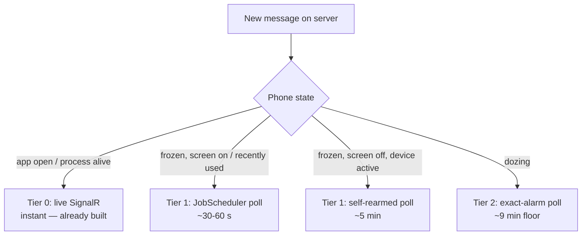

# Android Background Chat Alerts — Design & As Built

**Status: ✅ SHIPPED, DEPLOYED AND LIVE-VERIFIED (2026-09-19/20).** Chat alerts reach a closed phone
through the app's **own** machinery — no third-party push service, no Google, no companion app and
**no foreground service**. Background alerts are posted by a self-re-arming `JobScheduler` poll of a
purpose-built aggregate endpoint, with an exact-alarm path for Doze.

**Transport of record = Tiers 1–2** (background-job poll + exact-alarm Doze path). An opt-in
"instant delivery" foreground service was **declined** (see "Rejected options") — it would have bought
seconds at the cost of a permanent notification and an FGS type that needs a Play-store justification.

**Owner:** client agent (`monolith`). The one server-side item (`GET /api/v1/chat/alerts`) was
delivered by the server agent (`cloud.kimball.home`) and is **deployed and verified**.

**Related:** `docs/ANDROID_CHAT_ALERT_SOUND_PLAN.md` (the in-app alert-sound fix this builds on),
`docs/modules/chat/PUSH.md` (server push providers), `docs/clients/android/{SETUP,DISTRIBUTION}.md`.

---

## 1. Invariants (operator decisions)

1. **Google must be out of the loop entirely** — no message content _and_ no metadata through Google
   infrastructure. This is why the client ships **no** Firebase package and no Firebase config.
2. **Notifications are completely generic.** No sender names, no channel names, no message text
   outside the DotNetCloud server. A notification says "New message" (or "You were mentioned"), and
   the user opens the app to read it. The text is chosen **on the device**.
3. **No foreground service for chat.** The 2026-09-12 rule stands: no `dataSync` budget, no
   `specialUse` justification, no persistent notification.
4. **No user setup.** Nothing to install, register or point at the instance.

### Rejected options

| Option                                     | Why not                                                                                      |
| ------------------------------------------ | -------------------------------------------------------------------------------------------- |
| Google FCM                                 | Ruled out by invariant 1 (no content _and_ no metadata may leave the instance via Google).   |
| A third-party push distributor app         | Requires **every user** to install and configure a separate app — too high a price per user. |
| A foreground service we own (instant push) | Permanent notification + a restricted FGS type; unnecessary at the accepted latency budget.  |

---

## 2. Why the phone must ask, not be told

| Lever                                    | Reality                                                                                                                                                           | Consequence for this design                                                                       |
| ---------------------------------------- | ----------------------------------------------------------------------------------------------------------------------------------------------------------------- | ------------------------------------------------------------------------------------------------- |
| **Cached-process freezer** (Android 12+) | A backgrounded app is frozen within seconds–minutes of becoming cached, and a frozen process receives no socket data.                                             | The sticky but unpromoted `ChatConnectionService` socket stops delivering once the app is cached. |
| **Battery-optimization exemption**       | Affects Doze / App Standby, **not** the cached-app freezer.                                                                                                       | "The user exempted us" must never be treated as "we can hold a socket".                           |
| **Foreground service**                   | The only sanctioned way to hold a connection indefinitely, and every API 34+ type carries a cost (`dataSync` budget, `specialUse` review).                        | Declined — see "Rejected options".                                                                |
| **`JobScheduler` / `AlarmManager`**      | Run the app while it is frozen or dead, but are **self**-scheduled: no server can trigger them, and Doze clamps them (`setExactAndAllowWhileIdle` ≈ 9 min floor). | The alert is "phone asks". The cadence below **is** the delivery latency while the app is closed. |

**The unavoidable conclusion:** no OS mechanism is simultaneously Google-free _and_ connection-free, so
the design is a **tiering of how fast the phone asks**.



### 2.1 Tier 0 — live (already built)

While the app process is alive the existing `CoreHub` SignalR connection delivers instantly, and the
in-app path owns the foreground case (`ChatAlertPolicy` + the in-app ding). The poll deliberately does
**nothing** while the app is in the foreground.

### 2.2 Tier 1 — background poll

- **A purpose-built server endpoint**, `GET /api/v1/chat/alerts` (§3): a tiny aggregate of counts plus a
  `topChannelId` tap target and an `ETag`/`304` path.
- **`ChatAlertJobService`** — **job id `3108`**, deliberately _not_ `3107` (that is the media-sync job).
  It copies the two hard-won details of `MediaUploadJobService` / `AndroidBackgroundMediaSync`:
  **`SetPersisted(true)`** and **`SetOverrideDeadline(latency + slack)`** — a minimum-latency-only
  one-shot was measured being deferred **indefinitely** on this device. One deliberate difference:
  **`NetworkType.Any`**, not the media job's `Unmetered` — chat alerts must work on cellular.
- **Adaptive cadence, self-re-arming**: 60 s while unmuted messages are waiting, 300 s when nothing is,
  and the Tier 2 alarm while the device dozes.
- ⚠️ **"Poll immediately on unlock" is not implementable.** `ACTION_SCREEN_ON` / `ACTION_USER_PRESENT`
  are runtime-only broadcasts and `CONNECTIVITY_ACTION` stopped reaching manifest receivers in Android 7,
  so none can be registered statically; a dynamic receiver only exists while the process is alive — the
  case where live SignalR already delivers. A persisted job already survives reboot
  (`SetPersisted(true)`), so no boot receiver is needed either.

### 2.3 Tier 2 — exact-alarm fast path

- `IExactAlarmPermissionService` / `AndroidExactAlarmPermissionService` and
  `CalendarReminderScheduler`'s `SetExactAndAllowWhileIdle()` are existing patterns in this app, so
  `ChatAlertAlarmReceiver` reuses them to give the Doze path a hard ~9-minute floor.
- ⚠️ Play review: `USE_EXACT_ALARM` is restricted to alarm/calendar-class apps. The app already
  qualifies via calendar reminders, but requesting it _for chat polling_ is a review conversation — the
  inexact `JobScheduler` path stays as the graceful fallback when the user declines.
- Uses `GoAsync` with a bounded budget, and honours Do Not Disturb and the chat notification prefs.

---

## 3. Server contract — `GET /api/v1/chat/alerts` ✅ delivered

⚠️ `ChannelMemberService.GetUnreadCountsAsync` executes **2 queries per channel membership**, which is
fine for one interactive call and not fine for a 1–2 min poll from every device — hence a purpose-built
aggregate:

```json
{
  "v": 1,
  "unread": 7,
  "mentions": 1,
  "unmutedUnread": 4,
  "unmutedMentions": 0,
  "topChannelId": "<guid>",
  "changedAt": "<utc>"
}
```

- **Constant cost, whatever the membership count** — the counts are grouped and joined to the caller's
  memberships; nothing scales per channel.
- **`ETag` / `If-None-Match` → `304` with an empty body.** ⚠️ Measured cost, stated honestly: the idle
  path is **three cheap constant queries** (memberships, message count, max `SentAt`) and **zero**
  aggregate queries — not literally zero queries.
- **`unmutedMentions` exists so mute is absolute.** `mentions` still counts every mention (consistent
  with `UnreadCountDto.MentionCount`), but only the `unmuted*` values can raise an alert or change its
  wording, so a mention inside a muted channel can never surface as "You were mentioned".
- **`topChannelId`** is the _unmuted_ channel holding the most recent unread message, so a notification
  never deep-links into a channel the user silenced.
- **ETag stability:** the token is a SHA-256 of a canonical state string, **never**
  `string.GetHashCode()` — .NET randomizes string hashing per process, so a hash-code token would change
  on every module-host restart and silently break conditional polling.
- **Additive:** `GetUnreadCountsAsync` and `GET /api/v1/chat/unread` are untouched.

---

## 4. Client contract — payloads and generic text

`Services/NotificationPayloadContract.cs` (Android-free, unit-testable on plain `net10.0`) holds the
version-1 payload contract and the mapping to notification text. Both live paths — the in-app SignalR
alert and the poll — render through it, so they produce identical, content-free notifications.

- **Identifiers only.** `NotificationPayload` deliberately has no title/body/sender/channel-name
  properties, so a regressed or hostile payload carrying text is parsed and the text **discarded**.
- **Text is chosen on the device**: "New message", "You were mentioned", "New announcement",
  "New direct message", "Calendar reminder"; the body is always empty.
- `NotificationKind.Silent` exists for refresh-only signals (e.g. a calendar change) that must never
  raise a notification.
- `Platforms/Android/ChatNotificationRenderer.cs` posts the notification, owns the deep-link extras
  (`channelId`, `eventId`, `serverUrl`) and derives **stable** ids with an FNV-1a hash — never
  `string.GetHashCode()`, which is randomized per process and would stack duplicate notifications after
  a restart.

### 4.1 Alert correctness — never two alerts for one message

- **One shared high-water mark, owned by the poller.** `ChatAlertStateStore` persists the newest server
  `changedAt` the app has accounted for (`chat_alert_last_acknowledged_utc`), and the **only** writer is
  `ChatAlertPoller` — so the Doze alarm and the job, which both call the same `IChatAlertPoller.PollAsync`,
  can never both alert for one change. A message alerts only when the server's `changedAt` (newest message
  time) is strictly newer than that mark, and the poller advances the mark on any run where an alert was due
  (even when it skipped the post), so a notification cannot appear after the poll already handled the
  change. Reading a channel does not move `changedAt`, so clearing messages can never re-alert them.
- **The in-app (SignalR) path is not a watermark writer** — it is kept in step by three other mechanisms:
  `ChatAlertPolicy` posts no system notification while the app is visible (it dings instead), the poller
  refuses to post while `IAppForegroundService.IsInForeground` (though it still advances the mark), and the
  server's counts gate the decision — reading a channel calls `MarkReadAsync`, which zeroes `unmutedUnread`,
  and the decision requires `unmutedUnread > 0`. ⚠️ Consequence to know: a message that dings in-app while the
  user is on another screen and is left **unread** can still produce a notification on a later poll.
- **Never alert while `IAppForegroundService.IsInForeground`** — the in-app ding owns the foreground case.
- **Mute is absolute** — the poll consults the server's mute state (via the `unmuted*` counts and the
  local `ChannelMuteStateService`), so a mute performed while offline is still honoured.
- **Honour Do Not Disturb** and the existing chat notification preferences before posting.
- **Tap routing** reuses the deep-link extras; a stale session falls through to Login.

---

## 5. As built

**Server — `src/Modules/Chat/…`**

- `ChatAlertsDto` + `ChatAlertsCheckResult` in `DTOs/ChatDtos.cs`; `IChannelMemberService.GetAlertsAsync`
  implemented in `ChannelMemberService.cs` (aggregate query + `BuildAlertsToken`).
- `ChatController` — `[HttpGet("alerts")]`, `If-None-Match` in, `ETag` out, `304` on a match.
- Tests: `tests/DotNetCloud.Modules.Chat.Tests/ChannelMemberAlertsTests.cs` + controller tests.

**Android — `src/Clients/DotNetCloud.Client.Android/…`**

- Android-free half (unit-testable on `net10.0`): `ChatAlertsSummary`, `ChatAlertPollDecision`
  (`ChatAlertPollOutcome`, `ChatAlertDecision`), `ChatAlertCadence`, `ChatAlertStateStore`,
  `IChatAlertPoller`, `IChatAlertNotifier`, `IChatAlertScheduler`, `ChatAlertPoller` and
  `NotificationPayloadContract`.
- Android half (`Platforms/Android/`): `ChatAlertJobService` (**job id 3108**), `ChatAlertAlarmReceiver`,
  `AndroidChatAlertScheduler`, `ChatAlertNotifier` and `ChatNotificationRenderer`.
- Wired in `MauiProgram` (typed client + `AuthenticatedHttpClientHandler`), `MainApplication.OnCreate`
  (idempotent re-arm) and `AndroidManifest.xml`.
- Tests: `ChatAlertCadenceTests`, `ChatAlertPollDecisionTests`, `ChatAlertStateStoreTests`,
  `ChatAlertPollerTests` (stubbed `HttpMessageHandler`, wire JSON built by hand so a contract mismatch
  fails the test) and `NotificationPayloadContractTests`.

---

## 6. Findings worth not re-deriving

1. **Screen-on / unlock / connectivity broadcasts cannot be manifest-registered** — see §2.2. While the
   app is closed, the cadence _is_ the latency; do not plan around a screen-state trigger.
2. ⚠️ **The Android manifest merger rejects a hand-written manifest entry that is not
   attribute-identical to its `[Service]` / `[BroadcastReceiver]` counterpart.** Adding `Enabled = true`
   to the receiver attribute emitted `android:enabled="true"` in the generated manifest while the
   source-manifest copy lacked it; the build failed with **`AMM0000 … duplicated`**, reporting _every_
   duplicated component in the app, which makes the real culprit easy to miss. Keep the two copies
   identical.
3. **Do not reuse job id `3107`** — it is the media-sync job. Chat alerts are **3108**.
4. **The core module proxy forwarded every request header twice** (`ModuleApiProxyTransformer` in
   `src/Core/DotNetCloud.Core.Server/Program.cs`): YARP's base transform already copies every header
   except hop-by-hop ones, and the transformer's loop re-added each one, so module hosts received
   `If-None-Match` twice as `"…","…"` and **`304` could never match**. Blast radius: every
   conditional-header endpoint reaching a module (chat alerts, Files chunk dedup, Bookmarks ETags) —
   silent degradation, no data loss. Fixed with a `Contains` guard + regression test
   (`ModuleApiProxyTransformerTests`). **Diagnostic trick:** if the client sends `If-None-Match: X` and
   the server answers `200` **with the same `ETag: X`**, the token matched and the comparison failed —
   the header is being mangled in transit.
5. **While the app process is alive the poll normally logs `Suppressed`, so only a _dead_ process proves it
   posted the alert.** A live process alerts through the in-app path instead (and once the user reads the
   channel, `unmutedUnread` drops to 0, which the poll's decision keys on); a poll that does run while the
   app is in the foreground is skipped by the foreground guard and advances the mark. Use
   `adb shell am kill <pkg>` (leaves the persisted job armed); **`am force-stop` cancels** the persisted job
   and clears notifications.
6. **`SetOverrideDeadline` is not optional** on a one-shot `JobScheduler` job: without it, a
   minimum-latency-only job was measured sitting `RUNNABLE` and over its latency while the screen was
   awake and never being dispatched.

---

## 7. Verification (live) — ✅ passed

Server (2026-09-19, `cloud.kimball.home`): 15/15 deploy targets, `/health/ready` Healthy 14/14, route
proven through the gateway (`401` on `/api/v1/chat/alerts` vs control `404`), then the conditional leg
proven live: **`200` + `ETag` (189 bytes) → `304` with an empty body**.

Device (2026-09-19/20, phone `R5CWC356B2K`): job **3108** shows `PERSISTED` with
`Minimum latency: +5m0s`, `Max execution delay: +6m0s` and an any-network constraint; with the app
process **dead**, a new message produced `finished (Alerted, pending: True)` + `posted=True`,
`foreground=False` → **one generic notification** (channel `chat_messages`, title "New message", **empty
body**) whose tap opened exactly its channel; reading it cleared the notification with no second alert
and the next poll returned **`304`**; a message in a **muted** channel produced `Suppressed` and nothing
at all; and `dumpsys activity services net.dotnetcloud.client` stayed **empty** (no foreground service).

**Reproduce a headless run:** `adb shell cmd jobscheduler run -f net.dotnetcloud.client 3108`. The `200`
leg needs a message from **another user** — a same-user message creates no unread.
