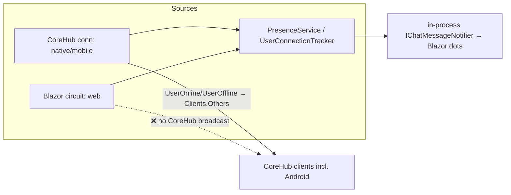
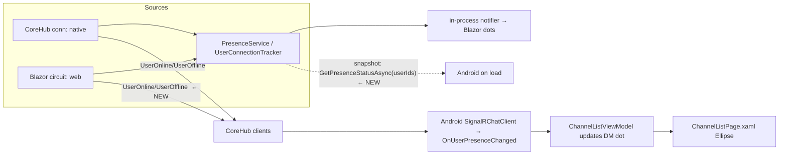

# Android Chat — DM Presence Dots (mirror Blazor)

**Status:** implemented (code-complete; live E2E pending) — 2026-09-09
**Date:** 2026-09-09
**Branch:** `fix/android-improvements`
**Scope:** Server (Core.Server) + Android client — done on monolith at operator's request (full feature; not a mint22 handoff).

> **Implementation status:** All server (Core.Server) + Android client changes in §4–§6 are implemented.
> Server unit tests (§4.3) pass (CoreHub + new PresenceCircuitHandler tests); `dotnet test
tests/DotNetCloud.Core.Server.Tests/` = 693 passed / 1 pre-existing `ProgramRootCaTests` failure /
> 1 skip. Android app builds clean (`net10.0-android` arm64, 0 warnings); Android.Tests 269 pass /
> 1 skip. **Live E2E (§8.2) still required before commit** — needs a server running the new
> Core.Server build plus one web and one Android user. Do not commit until verified.

---

## 1. Goal & Acceptance Criteria

Add an **online presence dot** next to each Direct Message user in the Android chat's
**Direct Messages** section (`ChannelListPage`), mirroring the Blazor chat sidebar
(`ChannelList`). A green dot = the DM peer is online; gray = offline.

**Acceptance criteria:**

- ☐ DM rows (`ChannelType == "DirectMessage"`) show a small colored dot.
- ☐ Dot is green when the peer has **any** active connection (web/Blazor circuit OR
  mobile/native CoreHub connection), gray otherwise.
- ☐ Initial state is correct when the channel list loads (no need to wait for a live
  presence event).
- ☐ Dot updates in **real-time** when the peer comes online / goes offline — including
  when the peer is a **web (Blazor)** user (this currently does not reach Android).
- ☐ Channel rows (Public/Private) and Group rows are unaffected (no dot — a group is not
  a single user).
- ☐ Unit tests for the new server behavior pass; Android builds clean; no regressions.

> Note: this plan targets the **monolith** codebase. The live server code changes here are
> Core.Server-only (presence fan-out + a hub query method). No client version bump is needed
> (only required when rebuilding release client bundles).

---

## 2. Reference — How Blazor renders DM presence dots

### 2.1 UI

- `src/Modules/Chat/DotNetCloud.Modules.Chat/UI/ChannelList.razor`
  - DM/Group section loop renders:
    ```razor
    <span class="presence-dot @GetPresenceClass(channel)" title="@channel.PresenceStatus"></span>
    ```
- `ChannelList.razor.css` — `.presence-online { background:#16a34a }`, `.presence-away { background:#d97706 }`, `.presence-offline { background:#6b7280 }`.
- `ChannelList.razor.cs` — `GetPresenceClass(channel)` maps `PresenceStatus` → `presence-online/away/offline`.

### 2.2 View model

- `UI/ViewModels.cs` → `ChannelViewModel.PresenceStatus` (string `"Online"|"Away"|"Offline"`, default `"Offline"`), plus `OtherUserId` (peer GUID) on DM channels.

### 2.3 Initial state + real-time (the important part)

- `UI/ChatPageLayout.razor.cs`:
  - `ResolveDmChannelNamesAsync()` builds `_dmChannelToOtherUser` (DM channelId → peer userId),
    then queries presence **in-process**:
    ```csharp
    var onlineStatus = await PresenceTracker.GetOnlineStatusAsync(peerIds);
    // for each DM whose peer isOnline → dm.PresenceStatus = "Online";
    ```
    (`PresenceTracker` = injected `IPresenceTracker` → Core.Server `PresenceService`.)
  - Subscribes `ChatMessageNotifier.UserPresenceChanged += OnUserPresenceChanged;`
  - `OnUserPresenceChanged(notification)` updates `channel.PresenceStatus` to
    `"Online"`/`"Offline"` for the DM channel whose peer == `notification.UserId`.

### 2.4 Presence state source of truth (server)

- `src/Core/DotNetCloud.Core.Server/RealTime/UserConnectionTracker.cs` — maps userId →
  active connection IDs (CoreHub connections + Blazor circuits). A user is online iff
  `_userConnections` contains them.
- `src/Core/DotNetCloud.Core.Server/RealTime/PresenceService.cs` — wraps the tracker;
  `UserConnectedAsync/UserDisconnectedAsync` are invoked only on **first/last** connection
  transitions; `GetOnlineStatusAsync(IEnumerable<Guid>)` returns
  `IReadOnlyDictionary<Guid,bool>`.

**Two presence sources funnel into the same tracker:**

1. `CoreHub.OnConnectedAsync/OnDisconnectedAsync` (native / mobile / desktop SignalR
   connections to `/hubs/core`).
2. `PresenceCircuitHandler.OnCircuitOpenedAsync/OnCircuitClosedAsync` (web / Blazor Server
   circuits).

---

## 3. The Gap (why Android currently sees no presence)

Android is a **remote native client** — it has no in-process access to `PresenceService`.
Today:

1. **No initial snapshot.** Nothing on the wire tells Android which of its DM peers are
   currently online when the channel list loads.
2. **Incomplete real-time fan-out.** `CoreHub` broadcasts `UserOnline` / `UserOffline` to
   `Clients.Others` **only when a CoreHub connection transitions** (i.e. native↔native).
   A **web user's** circuit open/close (`PresenceCircuitHandler`) only fires the in-process
   `IChatMessageNotifier` (Blazor circuits) — it never broadcasts over CoreHub. So a peer
   who is on the **web** would never appear online to Android.



---

## 4. Server Changes (Core.Server)

### 4.1 Broadcast web (circuit) presence to native CoreHub clients

**File:** `src/Core/DotNetCloud.Core.Server/RealTime/PresenceCircuitHandler.cs`

- Inject an optional `IHubContext<CoreHub>` (singleton → scoped is fine). It is registered
  as a scoped `CircuitHandler` via `AddScoped<CircuitHandler, PresenceCircuitHandler>()`
  in `Extensions/SignalRServiceExtensions.cs`; `IHubContext<CoreHub>` is available from DI.
- In `OnCircuitOpenedAsync`, **only in the existing `if (isFirstConnection)` block**
  (after `_presenceService.UserConnectedAsync(...)`), broadcast:
  ```csharp
  await _hubContext.Clients.All.SendAsync(
      "UserOnline",
      new { UserId = userId, Timestamp = DateTime.UtcNow });
  ```
- In `OnCircuitClosedAsync`, **only in the existing `if (isLastConnection)` block**
  (after `_presenceService.UserDisconnectedAsync(...)`), broadcast the matching
  `"UserOffline"` event with the same anonymous payload shape.
- **Why `Clients.All` is safe here:** the broadcast only fires on a _first_ (resp. _last_)
  connection for that user, so the user has no other active connection to self-echo to.
  (In `CoreHub` the equivalent uses `Clients.Others` because there the caller's own
  connection is live; here it is not a CoreHub member.)
- Keep the existing in-process `_chatMessageNotifier?.NotifyUserPresenceChanged(...)` calls
  untouched.

**Rationale / no duplicates:** both sources mutate the _same_ `UserConnectionTracker` and
both gate on first/last, so exactly one source broadcasts each transition.

### 4.2 Initial presence snapshot query hub method

**File:** `src/Core/DotNetCloud.Core.Server/RealTime/CoreHub.cs`

Add a public hub method that Android can invoke over its existing `/hubs/core` connection
(the wire equivalent of Blazor's in-process `PresenceService.GetOnlineStatusAsync`):

```csharp
/// <summary>
/// Returns the current online/offline presence for the requested user IDs.
/// Presence is global: a user is online with any active connection (Blazor circuit or CoreHub).
/// </summary>
public async Task<IReadOnlyDictionary<Guid, bool>> GetPresenceStatusAsync(
    IReadOnlyList<Guid> userIds)
{
    // Validate/parse; delegate to _presenceService.GetOnlineStatusAsync(userIds)
    return await _presenceService.GetOnlineStatusAsync(userIds);
}
```

Notes:

- `CoreHub` already injects `PresenceService _presenceService`.
- SignalR serializes `IReadOnlyDictionary<Guid,bool>` as JSON object keyed by
  `Guid.ToString()` — the Android client will deserialize to
  `Dictionary<string,bool>` and `Guid.Parse` keys (or the client can define a matching
  JSON type). Implementation should confirm round-trip with a unit test using the JSON
  contract.
- **Privacy:** the method only reveals presence for IDs the caller supplies. The Android
  client only ever queries the peer IDs it already knows from its own channel list. This
  mirrors Blazor, which queries only its resolved DM/member peers. (Optional hardening —
  restrict to users sharing a channel with the caller — requires a Chat gRPC lookup and is
  **out of scope**; document if later.)

### 4.3 Server unit tests

- `tests/DotNetCloud.Core.Server.Tests/RealTime/PresenceCircuitHandlerTests.cs` (new, or
  add to an existing file) using the existing `StubHubContext`/`StubClientProxy` pattern
  from `tests/.../RealTime/StubHubContext.cs`:
  - ☐ `OnCircuitOpenedAsync_FirstConnection_BroadcastsUserOnlineToCoreHubClients`
  - ☐ `OnCircuitOpenedAsync_SubsequentConnection_DoesNotBroadcast`
  - ☐ `OnCircuitClosedAsync_LastConnection_BroadcastsUserOfflineToCoreHubClients`
  - ☐ `OnCircuitClosedAsync_RemainingConnection_DoesNotBroadcast`
  - Follow the existing constructor signature + mocks used elsewhere; `Circuit` param may
    be passed as a stub or `null`-safe if the handler only uses `circuit.Id` (check ctor
    usage before writing; reuse an existing helper if any).
- `tests/DotNetCloud.Core.Server.Tests/RealTime/CoreHubTests.cs`:
  - ☐ `GetPresenceStatusAsync_ReturnsOnlineStatusForRequestedUsers`
  - ☐ `GetPresenceStatusAsync_EmptyInput_ReturnsEmpty` (and null-guard behavior)

---

## 5. Android Changes

### 5.1 Shared event-args record (Client.Core)

**File:** `src/Clients/DotNetCloud.Client.Core/IChatSignalRClient.cs`

Add (next to `ChatTypingEventArgs`):

```csharp
/// <summary>Payload for a user presence change received over the CoreHub connection.</summary>
/// <param name="UserId">User whose presence changed.</param>
/// <param name="IsOnline">Whether the user is now online.</param>
public sealed record UserPresenceChangedEventArgs(Guid UserId, bool IsOnline);
```

Why Client.Core: `ICoreHubClient` (compiled into Android.Tests via Compile Include)
references Client.Core types; Android.Tests does not reference the Android app project.

### 5.2 Android realtime interface

**File:** `src/Clients/DotNetCloud.Client.Android/Services/ICoreHubClient.cs`

Add (Android-only; SyncTray's `NoOpChatSignalRClient` implements only the base
`IChatSignalRClient`, so it is unaffected — do **not** put these on the shared interface):

```csharp
/// <summary>Raised when a user's presence (online/offline) changes.</summary>
event EventHandler<UserPresenceChangedEventArgs>? OnUserPresenceChanged;

/// <summary>
/// Returns online/offline presence for the given user IDs (current snapshot).
/// </summary>
Task<IReadOnlyDictionary<Guid, bool>> GetPresenceStatusAsync(
    IReadOnlyList<Guid> userIds,
    CancellationToken ct = default);

/// <summary>Raised when the underlying CoreHub connection has re-established after a drop.</summary>
event EventHandler? Reconnected;
```

### 5.3 SignalR client wiring

**File:** `src/Clients/DotNetCloud.Client.Android/Chat/SignalRChatClient.cs`

- Register handlers next to the existing `_hub.On<...>(...)` subscriptions:
  ```csharp
  _hub.On<PresenceEventPayload>("UserOnline", p =>
      OnUserPresenceChanged?.Invoke(this, new UserPresenceChangedEventArgs(p.UserId, true)));
  _hub.On<PresenceEventPayload>("UserOffline", p =>
      OnUserPresenceChanged?.Invoke(this, new UserPresenceChangedEventArgs(p.UserId, false)));
  ```
  Define a payload record (camelCase JSON — same shape as the server's anonymous object):
  ```csharp
  internal sealed record PresenceEventPayload(
      [property: JsonPropertyName("userId")] Guid UserId,
      [property: JsonPropertyName("timestamp")] DateTime Timestamp);
  ```
- Implement `GetPresenceStatusAsync` by invoking the hub:
  ```csharp
  // if (_hub?.State == Connected) → _hub.InvokeAsync<Dictionary<string,bool>>(
  //     "GetPresenceStatusAsync", userIds.Select(id => id.ToString()).ToList())
  // map back to Dictionary<Guid,bool>; return empty dict when disconnected (caller handles).
  ```
- **Reconnect resync (DECIDED):** raise the `Reconnected` event from the existing
  `_hub.Reconnected += ...` handler in `SignalRChatClient` (after re-joining channel groups),
  so a visible page can re-query the presence snapshot:
  ```csharp
  // at the end of the existing _hub.Reconnected handler
  Reconnected?.Invoke(this, EventArgs.Empty);
  ```
  `ChannelListViewModel` subscribes in ctor / unsubscribes in `Dispose`, and its handler
  re-runs the presence seed (only if `_dmChannelToOtherUser` is non-empty):
  ```csharp
  private void OnReconnected(object? sender, EventArgs e) =>
      _ = Task.Run(async () => await RefreshPresenceAsync());
  ```
  This covers the app-stays-open reconnect case (dots correct even if peers changed
  presence while disconnected); the page's own `OnAppearing` reload covers normal re-entry.

### 5.4 Channel item model

**File:** `src/Clients/DotNetCloud.Client.Android/ViewModels/ChannelListViewModel.cs`
(bottom — `ChannelItemViewModel`)

- Add observable presence state:
  ```csharp
  /// <summary>Whether the DM peer is currently online (DirectMessage rows only).</summary>
  [ObservableProperty] private bool _isOnline;
  ```
- Optional: expose `IsDirectMessage => ChannelType == "DirectMessage"` to drive XAML
  visibility (see 5.6).

### 5.5 Channel list view model

**File:** `src/Clients/DotNetCloud.Client.Android/ViewModels/ChannelListViewModel.cs`

- Switch the injected dependency from `IChatSignalRClient` to `ICoreHubClient`
  (MessageListViewModel already does this; DI resolves the same singleton via
  `MauiProgram.cs`). This is required to reach the presence event + query.
  - Ctor signature change only; MauiProgram already maps both to `SignalRChatClient`.
  - (No existing Android.Tests instantiates ChannelListViewModel; verify with a build.)
- Persist the DM peer map that `ResolveDmChannelNamesAsync()` currently builds only
  locally (`channelToOtherUser`) → promote to a field, e.g.
  `_dmChannelToOtherUser: Dictionary<Guid, Guid>` (channelId → peerId) and/or store
  `OtherUserId` on each `ChannelItemViewModel`.
- **Subscribe** in ctor:
  ```csharp
  _signalR.OnUserPresenceChanged += OnUserPresenceChanged;
  _signalR.Reconnected += OnReconnected;
  ```
  and **unsubscribe** both in `Dispose()`.
- **Presence seed after load** (shared helper, e.g. `RefreshPresenceAsync()`): at the end of
  the successful load path (after `ResolveDmChannelNamesAsync`) and again when `Reconnected`
  fires, gather DM peer ids from the map and call `GetPresenceStatusAsync(peerIds)` (guarded
  try/catch; on failure leave dots offline). For each peer reported online, set
  `IsOnline = true` on the matching DM `ChannelItemViewModel` (match by `OtherUserId` or via
  `_dmChannelToOtherUser`). Only run when the map is non-empty.
- **Handler:**
  ```csharp
  private void OnUserPresenceChanged(object? sender, UserPresenceChangedEventArgs e)
  {
      // find DM channel item whose peer == e.UserId → set item.IsOnline = e.IsOnline
      // Dispatch on MainThread like the existing OnUnreadCountUpdated handler
      // (MainThread.BeginInvokeOnMainThread with inline fallback for unit tests).
  }
  ```
- Because `ChannelItemViewModel` instances are shared between the flat `Channels` list and
  the grouped `ChannelGroups`, mutating the shared item updates the grouped UI in place.

### 5.6 View — presence dot

**File:** `src/Clients/DotNetCloud.Client.Android/Views/ChannelListPage.xaml`
(Channel row `DataTemplate` inside the grouped `CollectionView`)

- Add a small `Ellipse` (≈8–10px) to the row, **visible only for DirectMessage rows**:
  ```xml
  <Ellipse IsVisible="{Binding IsDirectMessage}"
           Fill="{Binding IsOnline, Converter={StaticResource OnlineStatusToColor}}"
           HeightRequest="9" WidthRequest="9"
           VerticalOptions="Center" />
  ```
  Position it inline before the DM name (mirrors Blazor, which places the dot to the left
  of the name) — wrap the name row in a horizontal container only if needed, or overlay on
  the avatar's corner (implementation choice; keep layout stable for non-DM rows).
- `OnlineStatusToColorConverter` already exists
  (`src/Clients/DotNetCloud.Client.Android/Converters/AppConverters.cs`, green `#22C55E` /
  gray `#475569`) and is registered app-wide in `App.xaml` as `OnlineStatusToColor`
  (already used by `ChannelDetailsPage` member dots).

---

## 6. Data-flow after change



---

## 7. File-by-File Summary

| File                                                                        | Change                                                                                                                                                 |
| --------------------------------------------------------------------------- | ------------------------------------------------------------------------------------------------------------------------------------------------------ |
| `src/Core/DotNetCloud.Core.Server/RealTime/PresenceCircuitHandler.cs`       | Broadcast `UserOnline`/`UserOffline` to CoreHub clients on first/last circuit connection (inject `IHubContext<CoreHub>`).                              |
| `src/Core/DotNetCloud.Core.Server/RealTime/CoreHub.cs`                      | New hub method `GetPresenceStatusAsync(IReadOnlyList<Guid>)` delegating to `PresenceService`.                                                          |
| `tests/.../RealTime/PresenceCircuitHandlerTests.cs` (new)                   | Circuit → CoreHub presence broadcast tests.                                                                                                            |
| `tests/.../RealTime/CoreHubTests.cs`                                        | Presence snapshot query tests.                                                                                                                         |
| `src/Clients/DotNetCloud.Client.Core/IChatSignalRClient.cs`                 | Add `UserPresenceChangedEventArgs` record.                                                                                                             |
| `src/Clients/DotNetCloud.Client.Android/Services/ICoreHubClient.cs`         | Add `OnUserPresenceChanged` + `GetPresenceStatusAsync` + `Reconnected` event.                                                                          |
| `src/Clients/DotNetCloud.Client.Android/Chat/SignalRChatClient.cs`          | Subscribe `UserOnline`/`UserOffline`; implement snapshot query; raise `Reconnected` on hub reconnect.                                                  |
| `src/Clients/DotNetCloud.Client.Android/ViewModels/ChannelListViewModel.cs` | Depend on `ICoreHubClient`; persist DM peer map; seed + live-update presence + resync on reconnect; `ChannelItemViewModel.IsOnline`/`IsDirectMessage`. |
| `src/Clients/DotNetCloud.Client.Android/Views/ChannelListPage.xaml`         | Presence `Ellipse` on DM rows.                                                                                                                         |

---

## 8. Testing & Verification

### 8.1 Unit tests

- **Server:** as listed in §4.3. Run:
  ```
  dotnet test tests/DotNetCloud.Core.Server.Tests/
  ```
  (Existing suite was ~686 pass on this branch; expect the 2 new CoreHub tests + new
  circuit-handler tests.)
- **Android:** the Android.Tests csproj compiles source files via explicit `<Compile
Include>` (no project reference to the app). `ChannelListViewModel` is **not** currently
  compiled there. Options:
  - ☐ Keep VM logic thin and validate via the Android **build** + live E2E only, OR
  - ☐ Add a focused unit test (e.g. presence-event → dot update on `ChannelItemViewModel`)
    and add the needed `<Compile Include>` entries (ChannelListViewModel.cs + its
    interface deps) to `tests/DotNetCloud.Client.Android.Tests/*.csproj`.
  - ⚠️ Caveat (repo memory): any NEW source file referenced by compiled ViewModels must be
    added to the csproj `<Compile Include>` list manually. Prefer editing existing files.
  - At minimum: `dotnet build src/Clients/DotNetCloud.Client.Android -f net10.0-android -c Debug -r android-arm64 /p:AndroidSdkDirectory="C:\Program Files (x86)\Android\android-sdk"` builds clean, 0 warnings.

### 8.2 Live E2E (required before commit)

- Needs the server running with the new Core.Server build **and** two logged-in users:
  one on the **web** (Blazor), one on the **Android** phone (Samsung `R5CWC356B2K`).
- Steps:
  1. User A (web) and User B (Android) each open a DM with the other.
  2. Android sees A's DM dot **green** while A's web chat is open.
  3. A closes/navigates away (circuit closes) → Android dot turns **gray** (≤ a few seconds).
  4. A reopens → dot turns green again.
  5. Repeat with A on a second Android/native device to confirm native→native still works.
  6. Cold-start Android (dot must be correct immediately — snapshot path, not waiting for an event).
- ⚠️ If the live server cannot be run/updated in this environment, **stop and tell the
  user before committing** (commit-gate rule). Do not commit unverified.

---

## 9. Documentation Updates (after implementation)

Per repo rules, update with **targeted edits**:

- ☐ `docs/IMPLEMENTATION_CHECKLIST.md` — mark any relevant Android chat task `✓`.
- ☐ `docs/MASTER_PROJECT_PLAN.md` — Quick Status Summary counts + step Status/Deliverables/Notes.
- ☐ Record lessons in repo memory `/memories/repo/DotNetCloud.md` (Android presence dots
  section): data-flow, files touched, testing gotchas (Android.Tests compile-includes,
  E2E requirements).
- No client version bump (only when rebuilding release bundles).

---

## 10. Decisions (confirmed by operator 2026-09-09)

- **Group rows excluded** from the presence dot — confirmed. A group is not a single user
  (this is why the feature is scoped to Direct Messages only). Blazor shows an always-gray
  dot there, which we intentionally do not copy. `IsDirectMessage` drives XAML visibility.
- **Snapshot privacy** — confirmed. The hub method returns presence only for the IDs the
  caller supplies, and Android only ever queries the peer IDs it knows from its own channel
  list (no bulk "who is online" query).
- **Reconnect resync mechanism** — confirmed. `ICoreHubClient.Reconnected` raised by
  `SignalRChatClient` on hub reconnect; `ChannelListViewModel` re-queries the presence
  snapshot (see §5.3 / §5.5).
- **Presence payload shape** uses the server's existing anonymous
  `{ UserId, Timestamp }` (camelCase JSON) and event names `UserOnline` / `UserOffline`
  so one client handler covers both presence sources.
- **Away/DND statuses:** not surfaced (mirrors Blazor DM dots, which are Online/Offline).

No remaining open items — ready to implement.
