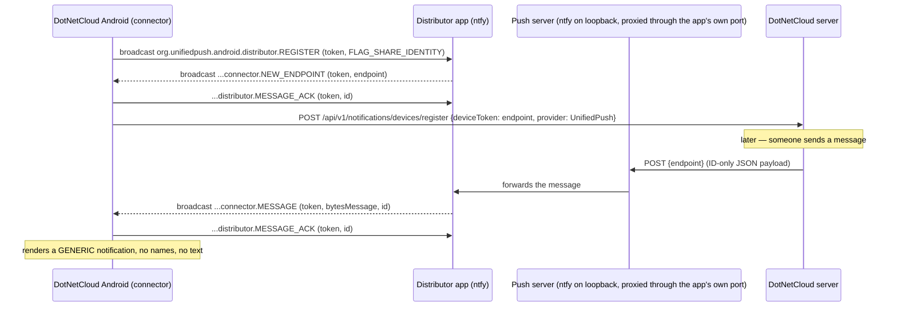

# Android Push — UnifiedPush Implementation Plan (privacy-first)

**Status — Android half: IMPLEMENTED & verified on device (2026-09-18).** Phases 1, 2 and the
client-side of Phase 5 are **done** on `feature/android-unifiedpush`: the `fdroid` flavour builds
again, register → endpoint → delivery → notification all work end-to-end against a self-hosted ntfy,
and FCM is deleted from both flavours. See "Implementation notes — Android half" at the end of §5
for the as-built file list and the exact verification evidence.
**Status — server half: still DEFERRED by the operator.** Phase 3 belongs to the server agent
(`cloud.kimball.home`) and **nothing there is authorised to start**.
This document is the **source of truth** for the work: read it end-to-end before starting.
**Plan finalized:** 2026-09-18 — the design is frozen apart from the §9 items; implementation can
start from this document alone.
**§9 decisions resolved 2026-09-18** (see §9). **§7.1 step 1 is answered: the distributor refuses a
push server URL containing a path** — so the Host-based `push.<domain>` topology, not the path-based
`/push` route, is the required one on the server half. That overturns part of requirement §1.5 and
needs the operator's decision (§9.10).
**Owner:** client agent (monolith) for the Android half; server agent (`cloud.kimball.home`) for the
server half + ntfy deployment (§7.1, §8). Tracked as a deferred handoff in
`docs/development/CLIENT_SERVER_MEDIATION_HANDOFF.md`.
**Before any code is written, resolve:** the remaining **§9 open items** (deliberately deferred by the
operator — do not guess) and §7.1 step 1 (does the distributor app accept a push server URL with a
path?). §9.1 is **already resolved**: FCM is removed outright (requirement §1.6).
**Related:** `docs/ANDROID_CHAT_ALERT_SOUND_PLAN.md` (the alert-sound fix this builds on),
`docs/architecture/ARCHITECTURE.md` (§push), `docs/clients/android/{SETUP,DISTRIBUTION}.md`

---

## 1. Requirements (operator decisions, 2026-09-17)

1. **Google must be out of the loop entirely.** No message content _and_ no metadata through
   Google infrastructure. FCM is therefore **not** an acceptable transport, even with encrypted or
   content-free payloads.
2. **Notifications are completely generic.** No sender names, no channel names, no message text
   anywhere outside the DotNetCloud server. A notification says "New message" (or "You were
   mentioned", "Calendar reminder"), and the user opens the app to read it.
3. The transport is **UnifiedPush (UP) with a self-hosted ntfy** as the push server.
4. This must not reintroduce a foreground service: the `dataSync` FGS was removed permanently
   (`faae32c9`) because Android 15/16 caps it to a rolling 24-hour budget.
5. **Push must add no new public surface** (operator, 2026-09-18): no extra port, certificate,
   hostname or firewall rule. ntfy runs on **loopback** and is proxied through the instance's own URL
   by an in-app route (§7.1, §8.7) — the same pattern already used for Collabora. Anything a
   self-hoster has to open in a firewall is a non-starter.
   - ⚠️ **Measured 2026-09-18 — this requirement is not satisfiable exactly as written.** The ntfy
     distributor rejects any push server URL containing a path (§7.1 step 1), so the proxy can
     **not** live at `https://<instance>/push`. The fallback this plan anticipated is therefore the
     **required** topology: **`push.<domain>` on the same 443, routed by Host inside Kestrel**. That
     keeps "no new port, no new firewall rule" but **costs a DNS record and a certificate entry for
     that name** — i.e. it does add a hostname. ✅ **The operator approved this trade-off on
     2026-09-18 (§9.10).**
6. **FCM is removed, not disabled** (operator decision, 2026-09-18). Neither flavour ships Firebase
   code — no fallback, no behind-a-flag build (§5 Phase 5 lists what gets deleted). A flag would keep
   the Google dependency in the tree and the Firebase config story alive; and the Play channel does
   not require FCM, because the distributor is a user-installed app regardless of how DotNetCloud
   itself was installed. The `PushProvider` abstraction stays: a future iOS client needs APNs.

## 2. What "done" looks like

- The `fdroid` flavour **builds again** (it does not today — §3.1) and installs on a device.
- First launch (and every launch after it) registers the app with a user-selected distributor and
  registers the resulting endpoint with the DotNetCloud server.
- With the app **force-stopped**, a message from another user produces a generic notification that
  sounds, and tapping it opens that channel.
- `logcat -s DotNetCloud` shows the full lifecycle (registered → endpoint → delivery → ACK) and
  nothing about message content ever leaves the device/server pair.
- **No Google/Firebase code in either flavour** — no `Xamarin.Firebase.Messaging` reference, no
  `FcmMessagingService`/`FcmPushService`, no `com.google.firebase` manifest entries; after Phase 5 the
  two flavours differ only by application id.

## 3. Current state — why it does not work today

### 3.1 Client blockers (verified 2026-09-17)

| #   | Blocker                                                                                                                                                                                                                                          | Evidence                                                                                                                                                                                                               |
| --- | ------------------------------------------------------------------------------------------------------------------------------------------------------------------------------------------------------------------------------------------------ | ---------------------------------------------------------------------------------------------------------------------------------------------------------------------------------------------------------------------- |
| B1  | **The flavour does not compile.** `<PackageReference Include="UnifiedPush.NET" />` (pinned `2.0.2` in `Directory.Packages.props`) does not exist on nuget.org, and `NuGet.config` only lists nuget.org.                                          | `dotnet build -p:BuildFlavor=fdroid` → `NU1101: Unable to find package UnifiedPush.NET`; probing `unifiedpush`, `unifiedpush.net`, `xamarin.unifiedpush`, `unifiedpush.android` on the flat container API → none exist |
| B2  | `UnifiedPushReceiver` derives from `UnifiedPush.MessagingReceiver` — a type that only exists in the missing package.                                                                                                                             | `Platforms/Android/UnifiedPushReceiver.cs:28`                                                                                                                                                                          |
| B3  | **Nothing ever asks a distributor to register.** `UnifiedPush.Connector.Register` appears only in a doc comment; there is no call site anywhere in the repo. So `OnNewEndpoint` can never fire.                                                  | `UnifiedPushReceiver.cs:34`; repo-wide grep                                                                                                                                                                            |
| B4  | Receiver declares only `MESSAGE` / `NEW_ENDPOINT` / `UNREGISTERED`; the spec's `REGISTRATION_FAILED` and `TEMP_UNAVAILABLE` are missing, and there is no `MESSAGE_ACK`.                                                                          | `AndroidManifest.xml:41-51`; `IntentFilter` attribute                                                                                                                                                                  |
| B5  | No service exposing `org.unifiedpush.android.connector.RAISE_TO_FOREGROUND` (the sanctioned way for a distributor to raise the app to foreground importance when delivering).                                                                    | repo-wide grep → no hits                                                                                                                                                                                               |
| B6  | Registration would throw before reaching the network: `UnifiedPushService.RegisterAsync` derives `userId` with `AccessTokenUserIdExtractor.ExtractUserId(accessToken)`, but the access token is JWE-encrypted and cannot be decoded client-side. | `Services/UnifiedPushService.cs:38`                                                                                                                                                                                    |
| B7  | `AndroidTargetSdkVersion` is **35**, so registration must use the SDK ≥ 34 shape (`FLAG_SHARE_IDENTITY`); the pending-intent form only applies to targetSdk < 34.                                                                                | `DotNetCloud.Client.Android.csproj:37`                                                                                                                                                                                 |

### 3.2 Server blockers

| #   | Blocker                                                                                                                                                                                                               | Evidence                                                                                                          |
| --- | --------------------------------------------------------------------------------------------------------------------------------------------------------------------------------------------------------------------- | ----------------------------------------------------------------------------------------------------------------- |
| S1  | `IUnifiedPushTransport` resolves to `UnifiedPushLoggingTransport`, whose `SendAsync` logs `"UnifiedPush to endpoint …"` and returns `Success` — **nothing is ever sent**.                                             | `ChatServiceRegistration.cs:59`, `UnifiedPushLoggingTransport.cs`                                                 |
| S2  | Push device registrations are in memory (`NotificationRouter._deviceMap`, `FcmPushProvider._registrations`) → lost on every module-host restart.                                                                      | `NotificationRouter.cs`                                                                                           |
| S3  | `NotificationRouter.CanSendPushAsync` suppresses push when `IsPresenceTracker.IsOnlineAsync(userId)` — the phone's own hub connection counts, so a frozen-but-connected phone gets neither SignalR handling nor push. | `NotificationRouter.cs:~180`                                                                                      |
| S4  | Payloads carry human-readable text (mention title `"{sender} mentioned you in #{channel}"`, DM `"{initiator} started a chat with you"`, call bodies). Under requirement §1.2 these must be stripped.                  | `MentionNotificationService.cs:66`, `DmChannelCreatedEventHandler.cs:85`, `CallNotificationEventHandler.cs:59-62` |
| S5  | No ordinary chat-message push is constructed at all (chat relies on SignalR), so "new message while closed" needs a new builder as well as the transport.                                                             | grep for `NotificationCategory.ChatMessage` → only the mute check in `NotificationRouter`                         |

## 4. Design

### 4.1 Data flow



### 4.2 Payload contract (version 1) — opaque IDs only

The server must send **nothing** that a push server, distributor, or observer could interpret:

```json
{
  "v": 1,
  "type": "message" | "mention" | "announcement" | "dm_channel_created" | "calendar_reminder",
  "channelId": "<guid, chat types only>",
  "messageId": "<guid|null>",
  "eventId": "<guid|null, calendar only>"
}
```

Rules:

- **No `title`/`body`/sender/channel names, ever.** Existing builders must be changed (S4).
- The client **ignores** any `title`/`body`/name fields it receives and always renders generic text
  (defence in depth: a future server regression cannot leak into the UI).
- Payload stays well under the 4096-byte UP limit (~150 bytes).
- Payload encryption (RFC 8291 / per-device keys) is **not required** while the payload is only
  IDs; it becomes necessary only if text is ever added back. Recorded as a future option, not a
  phase in this plan.
- The payload carries **no server identity** — fine while one account is active, but the app stores
  several server connections (`IServerConnectionStore.GetAll()`). Settle the multi-account design
  **before freezing this contract server-side** (§9.7).

### 4.3 Generic notification rendering

| `type`               | Title                | Body                                                                                 | Tap action                                                                               |
| -------------------- | -------------------- | ------------------------------------------------------------------------------------ | ---------------------------------------------------------------------------------------- |
| `message`            | "New message"        | "" (channel name only if it can be resolved from local cache without a network call) | open channel (`channelId` extra)                                                         |
| `mention`            | "You were mentioned" | ""                                                                                   | open channel                                                                             |
| `announcement`       | "New announcement"   | ""                                                                                   | open channel                                                                             |
| `dm_channel_created` | "New direct message" | ""                                                                                   | open channel, keep the existing Accept/Ignore/DND actions                                |
| `calendar_reminder`  | "Calendar reminder"  | ""                                                                                   | open the event (`eventId` extra) — event title is fetched locally/server-side after open |

Local (on-device) notifications are unaffected by the stripping rule where nothing leaves the
device — in particular `CalendarAlarmReceiver`'s AlarmManager reminders keep showing the event
title, and the in-app ding path is unchanged. Every tap action above assumes the deep link can
resolve a usable session; the force-stopped-with-expired-token case is an open item (§9.8).

Notification channels: no new channels; reuse `chat_messages`, `chat_mentions`,
`chat_announcements`, `dm_notifications`, `calendar_reminders`. Consider
`LockscreenVisibility.Secret` for chat channels so generic-but-present notifications do not appear
on a locked screen (decision item, §9).

### 4.4 Connector protocol (per UP spec AND_3.1.0)

App → distributor broadcasts:

- `org.unifiedpush.android.distributor.REGISTER` — extras `token` (UUIDv4, ≤100 bytes) plus, because
  targetSdk = 35, the broadcast option `FLAG_SHARE_IDENTITY`; optionally `message` ("DotNetCloud
  account e-mail" for the distributor UI). Repeated on every app start (spec §3: re-register each
  start to avoid inconsistent state) — matches the existing self-healing push registration.
- `org.unifiedpush.android.distributor.UNREGISTER` — extra `token` (also with the shared-identity
  option).
- `org.unifiedpush.android.distributor.MESSAGE_ACK` — extras `token`, `id`; sent whenever a
  received intent carried an `id`.

Distributor → app broadcasts (receiver must be `exported="true"`):

- `org.unifiedpush.android.connector.NEW_ENDPOINT` (token, endpoint, optional id) → store endpoint,
  ACK if `id` present, register endpoint with the server.
- `org.unifiedpush.android.connector.MESSAGE` (token, bytesMessage, optional id) → parse, render
  generic notification, ACK if `id` present.
- `org.unifiedpush.android.connector.REGISTRATION_FAILED` (token, reason
  `INTERNAL_ERROR|NETWORK|ACTION_REQUIRED|VAPID_REQUIRED`) → retry with a **new** token for
  INTERNAL_ERROR/NETWORK (respecting backoff); surface `ACTION_REQUIRED` to the user in Settings.
- `org.unifiedpush.android.connector.TEMP_UNAVAILABLE` (token[, useDistributor]) → mark the
  registration degraded; re-register when the distributor reports `NEW_ENDPOINT` again.
- `org.unifiedpush.android.connector.UNREGISTERED` (token[, useDistributor]) → drop the token and
  its endpoint; unregister the endpoint with the server; if `useDistributor` is present, register
  with it.

Also required:

- A service exposing `org.unifiedpush.android.connector.RAISE_TO_FOREGROUND` (bindable; the
  distributor binds with foreground importance for 5 s so a backgrounded app can process the
  message). Note: this is _not_ a foreground service declaration and does not consume the
  `dataSync` budget — it is the spec-sanctioned wake-up path.
- Distributor selection: `unifiedpush://link` deep link started for result; the result carries a
  `pi` pending intent whose sender identifies the chosen distributor. Apps must not rely on the
  default app handling the link.

## 5. Work breakdown

**Implementation order:** Phases 1–2 (client, monolith) and Phase 3 (server, `cloud.kimball.home`)
can run **in parallel** — they only share the §4.2 payload contract, which is frozen. Phase 4 needs
all three pieces (client + server + ntfy) and is the only true join point. Phase 5 goes last.

### Phase 1 — make the fdroid flavour build and register (client)

**Status:** ✓ completed & verified on device (2026-09-18) · owner: client agent (monolith)

| Step | Change                                                                                                                                                                                            | Files                                                                                                                                                  |
| ---- | ------------------------------------------------------------------------------------------------------------------------------------------------------------------------------------------------- | ------------------------------------------------------------------------------------------------------------------------------------------------------ |
| 1.1  | Remove the non-existent dependency; delete its uses so the project is dependency-free for UP.                                                                                                     | `DotNetCloud.Client.Android.csproj` (fdroid `ItemGroup`), `Directory.Packages.props` (drop `UnifiedPush.NET`), `Directory.Build.targets` if referenced |
| 1.2  | Add a pure, testable protocol helper: action/extras constants, `BuildRegisterIntent`, `BuildUnregisterIntent`, `BuildAckIntent`, `ParsePayload`, `TokenStoreKey`, `MapPayloadToNotificationText`. | new `Services/UnifiedPushProtocol.cs`                                                                                                                  |
| 1.3  | Managed connector: token store (per server), `RegisterAsync`, `UnregisterAsync`, `SelectDistributorAsync`, endpoint cache, ACK send, retry/backoff for `REGISTRATION_FAILED`.                     | new `Platforms/Android/UnifiedPushConnector.cs`, `Services/IUnifiedPushConnector.cs`, `Services/UnifiedPushRegistration.cs` (state model)              |
| 1.4  | Rewrite the receiver as a plain `BroadcastReceiver` implementing the five distributor→app actions and ACKs.                                                                                       | `Platforms/Android/UnifiedPushReceiver.cs`                                                                                                             |
| 1.5  | Add the `RAISE_TO_FOREGROUND` bindable service.                                                                                                                                                   | new `Platforms/Android/UnifiedPushForegroundService.cs`                                                                                                |
| 1.6  | Manifest: add the two missing intent actions + the service (explicit `Name` on every component — the crc-package trap).                                                                           | `Platforms/Android/AndroidManifest.xml`                                                                                                                |
| 1.7  | Fix the JWE userId bug (B6): read `sub` from the id_token (pattern already used in `MessageListViewModel`/`SignalRChatClient`) or drop the vestigial `?userId=` parameter.                        | `Services/UnifiedPushService.cs`                                                                                                                       |
| 1.8  | Register on startup and after login (reuse `App.RegisterPushDeviceAsync`), plus re-register on every app start per spec.                                                                          | `App.xaml.cs`, `Views/LoginPage.xaml.cs`                                                                                                               |
| 1.9  | Unit tests for the helper + registration state machine; add new files to the test csproj `Compile` list.                                                                                          | `tests/DotNetCloud.Client.Android.Tests/UnifiedPush*Tests.cs`                                                                                          |

**Acceptance:** `dotnet build -p:BuildFlavor=fdroid` succeeds with 0 warnings; tests green; on a
device with a distributor installed, logcat shows REGISTER → NEW_ENDPOINT → server registration.

- ✓ `fdroid` builds with 0 warnings and installs (it did not build at all before — blocker B1).
- ✓ `REGISTER` → `NEW_ENDPOINT` → endpoint sent to the server, observed in logcat.
- ☐ The server leg of that chain answered **404** on the deployed instance — expected to be wired by
  Phase 3; confirm server-side (see "Implementation notes", "Not verified here").

### Phase 2 — generic notifications everywhere (client)

**Status:** ✓ completed & verified on device (2026-09-18) · owner: client agent (monolith)

| Step | Change                                                                                                                                                          | Files                                                        |
| ---- | --------------------------------------------------------------------------------------------------------------------------------------------------------------- | ------------------------------------------------------------ |
| 2.1  | Render UP notifications from the ID-only payload, ignoring any text fields.                                                                                     | `Platforms/Android/UnifiedPushReceiver.cs`                   |
| 2.2  | Same rule for the local SignalR path (in-process notification when the app is backgrounded).                                                                    | `Chat/SignalRChatClient.cs` (`PostSignalRNotification`)      |
| 2.3  | ~~Keep the FCM handler generic~~ — **dropped**: FCM is deleted outright (requirement §1.6, Phase 5), so there is nothing to keep in sync.                       | —                                                            |
| 2.4  | Settings: show push status (distributor name, endpoint registered?, last error reason) + "Choose distributor" action; keep the existing "Message Sound" switch. | `ViewModels/SettingsViewModel.cs`, `Views/SettingsPage.xaml` |
| 2.5  | Tests for the payload→notification mapping (assert text is generic for every type, incl. hostile payloads carrying `title`/`body`).                             | test project                                                 |

**Acceptance:** every notification path renders generic text; a payload containing names/text still
renders generically.

### Phase 3 — server transport + registration persistence (deferred handoff to `cloud.kimball.home`, see §8)

Deliverables: a real `IUnifiedPushTransport` HTTP implementation, persisted device registrations,
ID-only payloads, message-category push builder, presence-suppression fix, and the in-app `/push`
proxy route (§8.7) that lets ntfy live on loopback behind the instance's own port.

**Where it runs:** server agent (`cloud.kimball.home`), tracked as a deferred handoff. **Not
authorised yet** (2026-09-18).

**Acceptance — all of it must be executed, not deferred (repo rule):**

1. Build clean + tests green (`dotnet build`; `DotNetCloud.Modules.Chat.Tests`, `Core.Server.Tests`;
   0 warnings). The one known pre-existing `ProgramRootCaTests` failure in Core.Server.Tests is not a
   regression.
2. Deployed with `sudo ./scripts/deploy.sh --force --verify`; `/health/ready` Healthy; **14/14**
   modules; `.last-deploy-commit` = HEAD.
3. **Registration persistence (S2):** register a device, restart the module host, confirm the
   registration survives and a send still attempts delivery.
4. **Payload (S4):** capture the bytes the server POSTs and show they contain IDs only — no sender,
   channel or message text, and no name fields hiding inside `Data`.
5. **Proxy route + ntfy:** `https://push.<domain>/v1/health` returns healthy **through the app's own
   443** (Host-routed); ntfy listens on loopback only (nothing on a public interface); a distributor
   subscription held open through the route survives several minutes without being buffered or cut.
6. **Negative cases:** `Enabled=false` → previous behaviour unchanged; a dead endpoint (404/410)
   prunes the registration; 429/5xx retries up to `MaxSendAttempts` and then gives up cleanly.
7. **Evidence recorded** in the handoff entry before hand-back: branch + commit, migration name(s),
   config channel used, captured payload, the public URL shape settled on, and the ntfy token's ACL.

### Phase 4 — verification (live)

**Status:** ☐ not started (deferred 2026-09-18) · needs **both** halves + a distributor on the phone

See §7. Requires ntfy deployed and a distributor installed on the test phone.

**Partially exercised 2026-09-18 with a local ntfy** (see "Implementation notes"): registration,
endpoint hand-off, delivery with the app backgrounded and force-stopped, generic rendering, the
raise-to-foreground bind, Settings status, and the no-Google check all passed. What still needs the
server half is the real server→push leg (§7 step 5) and the negatives that depend on it (muted
channel, DND, dead-endpoint pruning).

### Phase 5 — packaging + FCM removal

**Status:** ◐ client half completed & verified (2026-09-18) · server half pending (§9.10) · owner: client agent (monolith) for the deletions listed as client-side

- **Remove FCM outright** (requirement §1.6 — no fallback, no flag). Delete these and verify nothing
  still references them:
  - **Client:** `Platforms/Android/FcmMessagingService.cs`, `Services/FcmPushService.cs`, the
    `Xamarin.Firebase.Messaging` `PackageReference` (googleplay `ItemGroup`) and its
    `Directory.Packages.props` entry, the `MauiProgram` registration, the FCM manifest
    service/permissions, the `IPushNotificationService` doc wording, and the `About` page licence row.
  - **Server:** `FcmPushProvider`, `IFcmTransport`, `FcmHttpTransport`, `FcmLoggingTransport`,
    `FcmPushOptions`; in `ChatServiceRegistration.cs` the `Services.Configure<FcmPushOptions>`,
    `AddHttpClient("fcm")`, the `IFcmTransport` conditional and the FCM `IPushProviderEndpoint`
    registration; the `Chat:Push:Fcm` config section; the FCM block in the admin UI
    (`PushNotificationSettings.razor`).
  - **Keep** `PushProvider`, `DeviceRegistration.Provider`, `IPushNotificationService` and
    `NotificationRouter` — they are provider-agnostic and a future iOS/APNs provider needs them (§8.2
    keys the registration table on `(UserId, Provider, Token)`).
  - **Docs:** `docs/modules/chat/PUSH.md`, `docs/clients/android/{SETUP,DISTRIBUTION}.md` (`SETUP.md`
    has a whole "Firebase Configuration" section), `README.md` mentions, the `google-services.json`
    row in `docs/development/TESTING_PLAN.md`, the push table in
    `docs/architecture/ARCHITECTURE.md`, and the FCM "remaining work" items in
    `docs/ANDROID_CHAT_ALERT_SOUND_PLAN.md`.
  - **Flavour split:** with FCM gone the two flavours differ only by `ApplicationId` (+ store
    metadata). Decide whether to keep both flavours for store differentiation or collapse to one code
    path with two application ids, and record the outcome in `DISTRIBUTION.md`.
- **Play users must install a distributor** — say so plainly in the docs; there is no Google fallback
  by design. ⚠️ Verify before telling users the Play ntfy build is unusable: ntfy's **Play** build uses
  FCM only for its own default server (ntfy.sh); against a **self-hosted** server it uses its own
  connection ("instant delivery, FCM is not involved"). §7.2 keeps F-Droid/GitHub as the safe default
  until that is confirmed.
- Update `docs/clients/android/DISTRIBUTION.md` (drop the "package not on nuget.org" prebuild note,
  describe the ntfy requirement), `SETUP.md` (distributor install + server URL), `README.md` and the
  F-Droid metadata (permissions, no proprietary deps).
- `tools/install.sh`: optional ntfy provisioning (mirroring `maybe_install_collabora()` — same
  one-firewall-port story, since push is proxied through the app), the ntfy `/v1/health` probe
  alongside the existing health helpers, and the push-proxy URL in the runtime endpoint summary.
- `docker-compose.yml`: an `ntfy` service behind a `push` profile, plus the same guidance in
  `docs/admin/server/DOCKER_BEGINNER_GUIDE.md`.
- **Server config channel:** `Chat:Push:UnifiedPush` must live where a deploy cannot overwrite it —
  `/etc/dotnetcloud/config.json` (loaded by every module host via `DOTNETCLOUD_CONFIG_DIR`) or
  unit/compose environment. **Not** a module `appsettings.json`: `scripts/deploy.sh` republishes
  `modules/dotnetcloud.chat` and rsyncs `*.json` over it.

### Implementation notes — Android half, as built (2026-09-18)

**Files added** (under `src/Clients/DotNetCloud.Client.Android/`):

| File                                                             | Role                                                                                                                                                               |
| ---------------------------------------------------------------- | ------------------------------------------------------------------------------------------------------------------------------------------------------------------ |
| `Services/UnifiedPushProtocol.cs`                                | AND_3.1.0 action/extra constants, the §4.2 payload DTO + parser, and payload → generic notification mapping. Android-free, so the whole protocol is unit-testable. |
| `Services/UnifiedPushRegistration.cs`                            | The per-connection state model (`Unregistered`/`Pending`/`Registered`/`TempUnavailable`/`Failed`).                                                                 |
| `Services/UnifiedPushRegistrationPolicy.cs`                      | The state machine: token rotation on failure, backoff, when to report to the server, when to drop.                                                                 |
| `Services/UnifiedPushRegistrationStore.cs` (+ `I…`)              | Persists registrations **outside** the DI container, so the receiver works with no app process warmed up.                                                          |
| `Services/IUnifiedPushConnector.cs`                              | Connector surface used by the app (`RegisterAsync`, `UnregisterAsync`, `SelectDistributorAsync`, status).                                                          |
| `Services/PushEndpointRegistrar.cs` (+ `IPushEndpointRegistrar`) | `POST /api/v1/notifications/devices/register` for one server connection, resolving the user id from the **id_token** (blocker B6).                                 |
| `Platforms/Android/UnifiedPushIntents.cs`                        | Builds the `REGISTER` / `UNREGISTER` / `MESSAGE_ACK` intents, including the targetSdk ≥ 34 `FLAG_SHARE_IDENTITY` form.                                             |
| `Platforms/Android/UnifiedPushConnector.cs`                      | The Android adapter over the policy: token storage, distributor selection, endpoint cache, ACKs, retry.                                                            |
| `Platforms/Android/UnifiedPushNotificationRenderer.cs`           | Renders the generic notification per type and builds the tap deep link.                                                                                            |
| `Platforms/Android/UnifiedPushForegroundService.cs`              | The spec's bindable `RAISE_TO_FOREGROUND` service (not a foreground service — no FGS budget involved).                                                             |
| `Platforms/Android/DistributorLinkActivity.cs`                   | `unifiedpush://link` selection as an activity result (the spec forbids relying on a default handler).                                                              |
| `Platforms/Android/UnifiedPushReceiver.cs` (rewritten)           | A plain `BroadcastReceiver` implementing all five distributor→app actions plus ACKs, instead of deriving from a third-party base class.                            |

**Deviations from the plan as written:**

- `UnifiedPush.NET` does not exist on nuget.org (blocker B1), so nothing is taken from it: the
  connector is written against the spec directly and the dependency is dropped entirely.
- Step 1.2's intent helpers are **split**: the pure half (`UnifiedPushProtocol`, plus
  `Platforms/Android/UnifiedPushIntents.cs` for the actual `Intent` objects). The test project
  compiles on plain `net10.0` with no Android assembly, so a file touching `Android.Content.Intent`
  cannot be compiled into it — this split is what keeps the protocol unit-testable.
- **Android package visibility**: the manifest declares a `<queries>` entry for the distributor
  actions. Without it `PackageManager` cannot see an installed distributor at all — found on device,
  where it made distributor selection fail silently.
- **Notification ids are deterministic**, not derived from `string.GetHashCode()`: .NET randomises
  string hashes per process, so the previous ids changed on every cold start.
- Pushes carrying an **unknown connection token are ignored** (as the spec requires), not rendered.

**Verified on device (R5CWC356B2K, arm64 Debug, `adb install -r --no-incremental`):**

- The `fdroid` flavour builds with **0 warnings** (before this work it did not build at all), and the
  `googleplay` flavour still builds with FCM removed.
- Registration chain observed in logcat: `REGISTER` sent → `NEW_ENDPOINT` received → endpoint handed
  to the server.
- Delivery with the app **backgrounded, then force-stopped**: the distributor cold-started the app via
  the `RAISE_TO_FOREGROUND` service and posted a **generic** notification on the correct channel, with
  no sender, channel name or text.
- Tapping a notification while the app was backgrounded opened the correct channel.
- The Settings card shows the distributor, the registration state and the last error reason.
- No `com.google.firebase` provider/service remains in the package; neither csproj references
  `Xamarin.Firebase.Messaging`.
- `tests/DotNetCloud.Client.Android.Tests`: **425 passed**, including the new `Push/` tests — generic
  text for every payload type _including hostile payloads that carry `title`/`body`_, the registration
  policy/state machine, the registration store, the endpoint registrar, and the Settings status text.

**Not verified here, and why:**

- The real "message from another user → push" leg needs **Phase 3**: `IUnifiedPushTransport` is still
  the logging stub, so delivery was proven by POSTing an ID-only payload straight to the registered
  ntfy topic instead.
- The registration POST returned **404** against the deployed cloud instance. That path is expected to
  arrive with Phase 3, but **if the route already exists this is a separate bug** worth confirming
  server-side before the hand-back.
- `MESSAGE_ACK` was never observed on the wire because **ntfy does not send the `id` extra at all**, so
  the ACK path is covered by unit tests rather than by ntfy. A distributor that does send `id` will
  exercise it.

## 6. Estimate

Rough order of magnitude for the Android half: **1 focused day** for Phases 1–2 (the connector is
~250 lines of Intents plus a state machine, and the receiver already renders the notifications),
plus **half a day** for on-device verification once ntfy exists. The server half (§8) is a separate,
comparable effort owned by the server agent.

## 7. Verification recipe (live E2E)

1. **Run ntfy on loopback and proxy it through DotNetCloud's own port** — the public surface stays
   exactly `https://<instance>` (one host, one port, one certificate, **no new firewall rule**), using
   the pattern already shipped for Collabora: `MapCollaboraReverseProxy()` in `Core.Server/Program.cs`
   maps `/hosting`, `/browser`, `/cool`, `/lool` to a loopback `coolwsd` via
   `Files:Collabora:ProxyUpstreamUrl`, precisely so that "only one firewall port is needed".
   - **Install ntfy bound to loopback** — the Debian/Ubuntu archive (`archive.ntfy.sh/apt`) or the
     static binary + supplied `ntfy.service`, with `listen-http: 127.0.0.1:2586` and
     `base-url: "https://push.<domain>"` (Host-based — see the step-1 result below). Docker users add a
     sibling `ntfy` service behind a compose `push` profile (mirroring `--profile sqlserver`),
     provisioned via `NTFY_*` env — no `server.yml`.
   - **Add the proxy route in Core.Server — Host-based, NOT path-based** (beside the Collabora one):
     Kestrel sends the configured push host (`push.<domain>`) to the loopback ntfy, with WebSocket
     upgrade allowed, **response buffering off**, an activity timeout well above ntfy's keepalive
     (Collabora uses 15 minutes), and `X-Forwarded-For` preserved. The push host must be configurable
     (the same deploy-safe `Chat:Push:UnifiedPush` section), with the path-based variant kept only as
     a documented dead end.
   - ⚠️ **ntfy must run with `behind-proxy: true`** once it sits behind that route — otherwise every
     visitor appears as `127.0.0.1` and they all share one rate-limit bucket.
   - ✅ **ANSWERED 2026-09-18 — a path is NOT accepted; use the `push.<domain>` hostname on the same 443.** Tested on the ntfy distributor (ntfy Android app against a self-hosted ntfy at
     `http://192.168.0.154:2586` as the control):
     - control root URL `http://192.168.0.154:2586` → **accepted**, the dialog closes and the value
       persists;
     - `http://192.168.0.154:2586/push` → inline error **"Enter a valid service URL, e.g.
       https://ntfy.example.com"**, and SAVE is **refused** (the dialog stays open, nothing stored);
     - `https://ntfy.example.com/push` → the **same** error, so the rejection is
       **scheme-independent**, not an http-only quirk.
       The ntfy app validates the server URL as scheme + host + optional port only. Therefore the
       `/push/{**catch-all}` **path** route (§8.7) must **not** be built — route by **Host** instead.
       Everywhere else in this document that reads `https://<instance>/push`, read
       **`https://push.<domain>`**, and note it needs a DNS record + a certificate entry (see the §1.5
       deviation note and §9.10).
   - **Fallback topology** for instances that already run their own reverse proxy (and anyone who
     prefers it): ntfy gets its own port + certificate + one NAT/firewall rule.
     Protect the topics: `auth-file` + `auth-default-access: deny-all`, then a **dedicated** `dotnetcloud`
     ntfy user with `write-only` on the `up*` prefix and an access token for the server. ntfy tokens
     grant full access to the _account_, so never use the admin user's token; anonymous
     `ntfy access '*' 'up*' write-only` is the no-token fallback.
     ⚠️ **Never set ntfy's `firebase-key-file`** — that is ntfy's own FCM option and would put Google
     back in the path.
     ⚠️ **Reaching our own endpoint:** the app server POSTs to the endpoint the phone registered, which
     is the same public URL the app itself serves — so it needs the §8.1 endpoint rewrite
     (`https://<instance>/push` → `http://localhost:5080/push`, back into its own Kestrel; in Docker
     `http://localhost:8080/push`, or directly to the sibling `http://ntfy:80`). On the fallback topology,
     verify the server can reach the public endpoint at all (NAT loopback — an `/etc/hosts` entry keeps
     the hostname so the certificate still validates; never rewrite to a bare IP).
2. **Install a distributor** on the phone — **prefer the F-Droid/GitHub ntfy build** (the Play build
   uses FCM for its own default server, ntfy.sh). ⚠️ Verify before documenting the Play build as
   unsupported: against a **self-hosted** server ntfy uses its own connection ("instant delivery, FCM
   is not involved"), so it may well work — confirm, then document whichever is true.
   `adb install -r --no-incremental <ntfy-fdroid.apk>`.
3. Build + install the fdroid flavour:
   `dotnet build src/Clients/DotNetCloud.Client.Android -f net10.0-android -c Debug -p:BuildFlavor=fdroid -r android-arm64`
   then `adb install -r --no-incremental <apk>` (never plain `adb install` — incremental install
   causes a native crash on headless starts).
4. Launch, sign in, and in Settings pick the distributor. Evidence:
   - `adb logcat -s DotNetCloud` → `REGISTER sent`, `NEW_ENDPOINT <endpoint>`,
     `Push device registered (UnifiedPush)`.
   - Server-side: registration row present (Phase 3 persistence).
5. **Force-stop** the app (`adb shell am force-stop net.dotnetcloud.client`) and send a message from
   the web client. Expect: ntfy receives the POST, the distributor broadcasts `MESSAGE`, the app
   renders a **generic** notification.
   - Notification: `adb shell dumpsys notification --noredact | Select-String "net.dotnetcloud.client"` → `channel=chat_messages`.
   - Sound: `adb shell dumpsys audio` → a player for `net.dotnetcloud.client` with
     `usage=USAGE_NOTIFICATION` and `event:started` at the delivery time.
   - ACK: logcat shows `MESSAGE_ACK` for the message id.
6. Negative/edge cases: muted channel → no notification; DND user → no push; uninstall the
   distributor → `UNREGISTERED` and the endpoint is removed server-side; relaunch → re-registration
   succeeds (self-healing); device reboot → registration survives; doze (screen off 30 min) →
   message still arrives (distributor excluded from battery optimisation).
7. Confirm **no Google involvement** — after Phase 5 this is true for **both** flavours:
   `adb shell dumpsys package <pkg>` shows no `com.google.firebase` providers/services, and neither
   csproj references `Xamarin.Firebase.Messaging`.

## 8. Server specification (deferred handoff to `cloud.kimball.home`)

1. **Real transport.** `UnifiedPushHttpTransport : IUnifiedPushTransport` — `POST {endpoint}` with
   the raw JSON payload (`Content-Type: application/json`), optional `Authorization: Bearer …` for
   protected ntfy topics; treat `404`/`410` as a dead registration (remove it + notify the user),
   `429`/5xx as transient (the provider already retries up to `UnifiedPushOptions.MaxSendAttempts`).
   Replace the `UnifiedPushLoggingTransport` registration when `Chat:Push:UnifiedPush:Enabled`.
   Verify the exact publish semantics of the deployed ntfy version (plain body vs JSON envelope) —
   the UP contract only requires that a POST to the capability URL delivers the bytes.
   - The transport must serialize the **ID-only payload only** — never `PushNotification.Title`/
     `Body`. Change its signature to take the payload/`Data` instead of the whole notification, so
     text cannot leak by accident.
   - Support an optional **endpoint base-URL rewrite** (`EndpointRewriteFrom` → `EndpointRewriteTo`)
     applied before the POST. Required, not a nicety: the stored endpoint is the _public_ URL that this
     same server serves, so the internal hop must bypass it — `https://push.<domain>` →
     `http://localhost:2586` (straight to loopback ntfy; no need to re-enter its own Kestrel) on the
     default topology; in Docker `http://ntfy:80` on the bridge network, or `http://localhost:8080`
     if the rewrite is pointed at the container's own proxy host.
2. **Persist device registrations.** Move `NotificationRouter._deviceMap` +
   `FcmPushProvider._registrations` into a table **owned by the Chat module** (the module owns this
   data — do not reach into `Core.Data`'s `UserDevice` from a module), keyed by
   `(UserId, Provider, Token)` with `Endpoint`, `CreatedAt`, `LastSeenAt`; load on startup;
   prune on `404`/`410`/unregistered events. Requires an EF migration in **both** Chat provider
   layouts (`DotNetCloud.Modules.Chat.Data/Migrations` + `...Data.SqlServer/Migrations`). This is
   required for push to survive module-host restarts (self-healing registration only covers devices
   that come online again). The FCM provider that currently shares this in-memory dictionary is
   deleted in Phase 5 — but keep the `Provider` dimension, since a future iOS/APNs provider needs it.
3. **ID-only payloads.** For every chat push builder (mention, DM-created, call, and the new
   `ChatMessage` builder): set only `Data` (`v`, `type`, `channelId`, `messageId`, `eventId`) and
   leave `Title`/`Body` empty. Add an assertion/log so a future builder cannot silently reintroduce
   text.
4. **New message push.** Build the missing `NotificationCategory.ChatMessage` push (currently only
   mentions/DM/calls exist) so a message received while the app is closed produces a notification.
5. **Presence suppression.** `CanSendPushAsync` must not be blocked by _delivery-only_ mobile
   connections: either exclude mobile/bridge connections from the online check used for push
   suppression (mark the connection via a hub header at connect time), or apply a grace window so a
   connection that has not sent a heartbeat within the client keepalive interval does not count as
   online.
6. **ntfy deployment** (operator + installer) — **default = loopback ntfy proxied through a
   Host-routed `push.<domain>` on the app's own 443** (see §7.1 and its step-1 result): one public
   port, no extra firewall rule, one extra DNS record + certificate name, and a loopback ntfy hop. The installer mirrors `install_collabora()` (external APT repo + signing key,
   idempotent install, `systemctl enable/start`) — the same "only one firewall port is needed" story —
   and derives the public URL with `resolve_public_origin_from_config()` rather than hardcoding it.
   Docker adds the `push`-profile `ntfy` service; Helm needs its own ingress host. Keep the standalone
   port + certificate + firewall rule documented as the **fallback** for instances that already run
   their own reverse proxy. Document the topic privacy model (the endpoint is a capability URL; keep
   topics unguessable and/or authenticated). Users who decline run their own ntfy (or bring their own
   distributor).
7. **In-app push proxy route** (Core.Server) — route the configured **push host** to the loopback ntfy
   endpoint (Host-based, per the §7.1 step-1 result; a `/push` path route cannot work),
   mirroring `MapCollaboraReverseProxy()` (`Program.cs:1097`) and its `ProxyUpstreamUrl` self-proxy-loop
   guard: WebSocket upgrades allowed, response buffering disabled, activity timeout ≫ ntfy's keepalive
   (Collabora uses 15 min), `X-Forwarded-For` preserved, and excluded from response compression. Its
   config keys (upstream URL, public base URL) ride in the same deploy-safe
   `Chat:Push:UnifiedPush` section — **not** in `appsettings.json`
   (`scripts/deploy.sh` republishes Core.Server and all modules over the deployed `.json` files).

## 9. Decisions — resolved, plus open items

> **Open items:** still deferred by the operator (2026-09-17 / 2026-09-18) — ask again at
> implementation time, before any code is written. Each is a localised change rather than a redesign.
> (Implementation itself is also deferred — see the status at the top of this document.)

**Resolved (operator decisions, 2026-09-18):**

1. **FCM is removed entirely** — deleted from both flavours with no fallback and no behind-a-flag
   build; see requirement §1.6 and the Phase 5 deletion inventory. The `PushProvider` abstraction
   survives for APNs. Shipped on the Android side in the **same** commit as the transport work (§9.9).
2. **Lock-screen detail** — **no** `LockscreenVisibility.Secret`: the notifications are already
   generic, so the chat channels keep their current visibility.
3. **Channel name in the body** — **fully generic**: title only, empty body. No local-cache
   resolution of channel names.
4. **Calendar reminders** — the asymmetry is **confirmed**: pushed reminders are generic and resolve
   on open; on-device AlarmManager reminders keep full detail (nothing leaves the device).
5. **Distributor UX** — **Settings card only** (distributor name, registered?, last error reason,
   "Choose distributor").
6. **Public push URL shape** — **answered by the §7.1 step-1 test: the distributor rejects a URL
   containing a path**, so the shape is the **`push.<domain>` hostname variant** on the same 443. The
   path-based `https://<instance>/push` is a dead end.
7. **Multi-server accounts** — **one UP token + endpoint per saved server connection**
   (`IServerConnectionStore` supports several: `GetAll`/`Save`/`SetActive`/`Remove`). No server id is
   added to the §4.2 payload; the app maps endpoint → server URL, so a tap can never open a channel on
   the wrong instance, and a notification from a non-active server still routes correctly.
8. **Tap when the session is gone** — **fall through to Login**, reusing the existing session-loss
   behaviour. Not a silent no-op.
9. **Installer/Docker/Helm scope + FCM deletion timing** — the Android-side FCM deletion **ships in
   the same pass** as the transport work; installer/Docker/Helm provisioning stays part of the
   deferred server/ops half.

**Open:**

10. **Requirement §1.5 deviation — the push hostname** — ✅ **RESOLVED (operator, 2026-09-18): the
    Host-routed `push.<domain>` on the same 443 is APPROVED.** A DNS record + a certificate entry for
    that name are accepted; there is still no new port and no new firewall rule. The alternative
    (keep exactly one public name and give ntfy its own port + certificate + one firewall rule) was
    **declined**. The push hostname must be **configurable** in the deploy-safe config channel, not
    hard-coded.

## 10. References

- UnifiedPush Android specification (AND_3.1.0): https://unifiedpush.org/developers/spec/android/
- UnifiedPush implementations/distributors: https://unifiedpush.org/developers/implementations/
- Self-hosted push servers (ntfy, NextPush, Sunup, Conversations/XMPP):
  https://unifiedpush.org/users/distributors/
- ntfy install (apt / binary / systemd unit): https://docs.ntfy.sh/install/
- ntfy server config (`listen-http`, `base-url`, `auth-file`, `behind-proxy`, `cache-file`) and the
  **UnifiedPush ACL recipe** (`ntfy access '*' 'up*' write-only`): https://docs.ntfy.sh/config/
- **In-repo precedent for the push proxy route:** `MapCollaboraReverseProxy()` in
  `src/Core/DotNetCloud.Core.Server/Program.cs` (loopback upstream, `ProxyUpstreamUrl` self-proxy-loop
  guard, `ActivityTimeout`, `X-Forwarded-For`) — §8.7 should mirror it rather than invent a new proxy.
- Existing client scaffolding: `Platforms/Android/UnifiedPushReceiver.cs`,
  `Services/UnifiedPushService.cs`, `Services/IPushNotificationService.cs`
- Existing server scaffolding: `src/Modules/Chat/DotNetCloud.Modules.Chat/Services/`
  (`UnifiedPushProvider`, `IUnifiedPushTransport`, `UnifiedPushLoggingTransport`,
  `NotificationRouter`, `PushProviderOptions`)
- Prior art in this repo: `docs/ANDROID_CHAT_ALERT_SOUND_PLAN.md`
