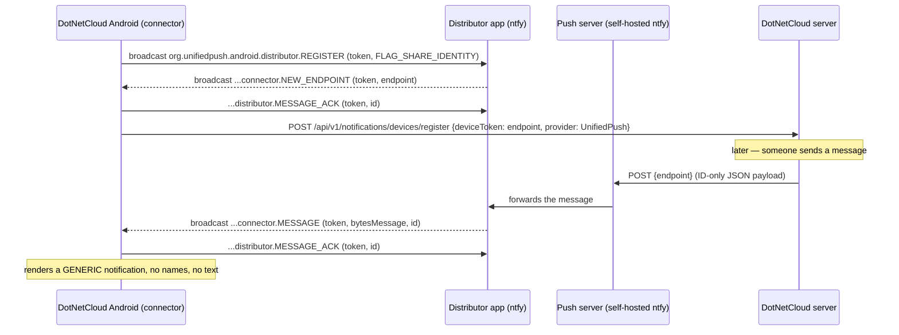

# Android Push — UnifiedPush Implementation Plan (privacy-first)

**Status:** planned — no implementation started
**Owner:** client agent (monolith) for the Android half; server half is a handoff (see §8)
**Related:** `docs/ANDROID_CHAT_ALERT_SOUND_PLAN.md` (the alert-sound fix this builds on),
`docs/architecture/ARCHITECTURE.md` (§push), `docs/clients/android/{SETUP,DISTRIBUTION}.md`

---

## 1. Requirements (operator decisions, 2026-09-17)

1. **Google must be out of the loop entirely.** No message content *and* no metadata through
   Google infrastructure. FCM is therefore **not** an acceptable transport, even with encrypted or
   content-free payloads.
2. **Notifications are completely generic.** No sender names, no channel names, no message text
   anywhere outside the DotNetCloud server. A notification says "New message" (or "You were
   mentioned", "Calendar reminder"), and the user opens the app to read it.
3. The transport is **UnifiedPush (UP) with a self-hosted ntfy** as the push server.
4. This must not reintroduce a foreground service: the `dataSync` FGS was removed permanently
   (`faae32c9`) because Android 15/16 caps it to a rolling 24-hour budget.

## 2. What "done" looks like

- The `fdroid` flavour **builds again** (it does not today — §3.1) and installs on a device.
- First launch (and every launch after it) registers the app with a user-selected distributor and
  registers the resulting endpoint with the DotNetCloud server.
- With the app **force-stopped**, a message from another user produces a generic notification that
  sounds, and tapping it opens that channel.
- `logcat -s DotNetCloud` shows the full lifecycle (registered → endpoint → delivery → ACK) and
  nothing about message content ever leaves the device/server pair.
- No Google/Firebase code is involved in the delivered build.

## 3. Current state — why it does not work today

### 3.1 Client blockers (verified 2026-09-17)

| # | Blocker | Evidence |
|---|---------|----------|
| B1 | **The flavour does not compile.** `<PackageReference Include="UnifiedPush.NET" />` (pinned `2.0.2` in `Directory.Packages.props`) does not exist on nuget.org, and `NuGet.config` only lists nuget.org. | `dotnet build -p:BuildFlavor=fdroid` → `NU1101: Unable to find package UnifiedPush.NET`; probing `unifiedpush`, `unifiedpush.net`, `xamarin.unifiedpush`, `unifiedpush.android` on the flat container API → none exist |
| B2 | `UnifiedPushReceiver` derives from `UnifiedPush.MessagingReceiver` — a type that only exists in the missing package. | `Platforms/Android/UnifiedPushReceiver.cs:28` |
| B3 | **Nothing ever asks a distributor to register.** `UnifiedPush.Connector.Register` appears only in a doc comment; there is no call site anywhere in the repo. So `OnNewEndpoint` can never fire. | `UnifiedPushReceiver.cs:34`; repo-wide grep |
| B4 | Receiver declares only `MESSAGE` / `NEW_ENDPOINT` / `UNREGISTERED`; the spec's `REGISTRATION_FAILED` and `TEMP_UNAVAILABLE` are missing, and there is no `MESSAGE_ACK`. | `AndroidManifest.xml:41-51`; `IntentFilter` attribute |
| B5 | No service exposing `org.unifiedpush.android.connector.RAISE_TO_FOREGROUND` (the sanctioned way for a distributor to raise the app to foreground importance when delivering). | repo-wide grep → no hits |
| B6 | Registration would throw before reaching the network: `UnifiedPushService.RegisterAsync` derives `userId` with `AccessTokenUserIdExtractor.ExtractUserId(accessToken)`, but the access token is JWE-encrypted and cannot be decoded client-side. | `Services/UnifiedPushService.cs:38` |
| B7 | `AndroidTargetSdkVersion` is **35**, so registration must use the SDK ≥ 34 shape (`FLAG_SHARE_IDENTITY`); the pending-intent form only applies to targetSdk < 34. | `DotNetCloud.Client.Android.csproj:37` |

### 3.2 Server blockers

| # | Blocker | Evidence |
|---|---------|----------|
| S1 | `IUnifiedPushTransport` resolves to `UnifiedPushLoggingTransport`, whose `SendAsync` logs `"UnifiedPush to endpoint …"` and returns `Success` — **nothing is ever sent**. | `ChatServiceRegistration.cs:59`, `UnifiedPushLoggingTransport.cs` |
| S2 | Push device registrations are in memory (`NotificationRouter._deviceMap`, `FcmPushProvider._registrations`) → lost on every module-host restart. | `NotificationRouter.cs` |
| S3 | `NotificationRouter.CanSendPushAsync` suppresses push when `IsPresenceTracker.IsOnlineAsync(userId)` — the phone's own hub connection counts, so a frozen-but-connected phone gets neither SignalR handling nor push. | `NotificationRouter.cs:~180` |
| S4 | Payloads carry human-readable text (mention title `"{sender} mentioned you in #{channel}"`, DM `"{initiator} started a chat with you"`, call bodies). Under requirement §1.2 these must be stripped. | `MentionNotificationService.cs:66`, `DmChannelCreatedEventHandler.cs:85`, `CallNotificationEventHandler.cs:59-62` |
| S5 | No ordinary chat-message push is constructed at all (chat relies on SignalR), so "new message while closed" needs a new builder as well as the transport. | grep for `NotificationCategory.ChatMessage` → only the mute check in `NotificationRouter` |

## 4. Design

### 4.1 Data flow



### 4.2 Payload contract (version 1) — opaque IDs only

The server must send **nothing** that a push server, distributor, or observer could interpret:

```json
{
  "v": 1,
  "type": "message" | "mention" | "announcement" | "dm_channel_created" | "calendar_reminder",
  "channelId": "<guid, chat types only>",
  "messageId": "<guid|null>",
  "eventId": "<guid|null, calendar only>"
}
```

Rules:

- **No `title`/`body`/sender/channel names, ever.** Existing builders must be changed (S4).
- The client **ignores** any `title`/`body`/name fields it receives and always renders generic text
  (defence in depth: a future server regression cannot leak into the UI).
- Payload stays well under the 4096-byte UP limit (~150 bytes).
- Payload encryption (RFC 8291 / per-device keys) is **not required** while the payload is only
  IDs; it becomes necessary only if text is ever added back. Recorded as a future option, not a
  phase in this plan.

### 4.3 Generic notification rendering

| `type` | Title | Body | Tap action |
|--------|-------|------|-----------|
| `message` | "New message" | "" (channel name only if it can be resolved from local cache without a network call) | open channel (`channelId` extra) |
| `mention` | "You were mentioned" | "" | open channel |
| `announcement` | "New announcement" | "" | open channel |
| `dm_channel_created` | "New direct message" | "" | open channel, keep the existing Accept/Ignore/DND actions |
| `calendar_reminder` | "Calendar reminder" | "" | open the event (`eventId` extra) — event title is fetched locally/server-side after open |

Local (on-device) notifications are unaffected by the stripping rule where nothing leaves the
device — in particular `CalendarAlarmReceiver`'s AlarmManager reminders keep showing the event
title, and the in-app ding path is unchanged.

Notification channels: no new channels; reuse `chat_messages`, `chat_mentions`,
`chat_announcements`, `dm_notifications`, `calendar_reminders`. Consider
`LockscreenVisibility.Secret` for chat channels so generic-but-present notifications do not appear
on a locked screen (decision item, §9).

### 4.4 Connector protocol (per UP spec AND_3.1.0)

App → distributor broadcasts:

- `org.unifiedpush.android.distributor.REGISTER` — extras `token` (UUIDv4, ≤100 bytes) plus, because
  targetSdk = 35, the broadcast option `FLAG_SHARE_IDENTITY`; optionally `message` ("DotNetCloud
  account e-mail" for the distributor UI). Repeated on every app start (spec §3: re-register each
  start to avoid inconsistent state) — matches the existing self-healing push registration.
- `org.unifiedpush.android.distributor.UNREGISTER` — extra `token` (also with the shared-identity
  option).
- `org.unifiedpush.android.distributor.MESSAGE_ACK` — extras `token`, `id`; sent whenever a
  received intent carried an `id`.

Distributor → app broadcasts (receiver must be `exported="true"`):

- `org.unifiedpush.android.connector.NEW_ENDPOINT` (token, endpoint, optional id) → store endpoint,
  ACK if `id` present, register endpoint with the server.
- `org.unifiedpush.android.connector.MESSAGE` (token, bytesMessage, optional id) → parse, render
  generic notification, ACK if `id` present.
- `org.unifiedpush.android.connector.REGISTRATION_FAILED` (token, reason
  `INTERNAL_ERROR|NETWORK|ACTION_REQUIRED|VAPID_REQUIRED`) → retry with a **new** token for
  INTERNAL_ERROR/NETWORK (respecting backoff); surface `ACTION_REQUIRED` to the user in Settings.
- `org.unifiedpush.android.connector.TEMP_UNAVAILABLE` (token[, useDistributor]) → mark the
  registration degraded; re-register when the distributor reports `NEW_ENDPOINT` again.
- `org.unifiedpush.android.connector.UNREGISTERED` (token[, useDistributor]) → drop the token and
  its endpoint; unregister the endpoint with the server; if `useDistributor` is present, register
  with it.

Also required:

- A service exposing `org.unifiedpush.android.connector.RAISE_TO_FOREGROUND` (bindable; the
  distributor binds with foreground importance for 5 s so a backgrounded app can process the
  message). Note: this is *not* a foreground service declaration and does not consume the
  `dataSync` budget — it is the spec-sanctioned wake-up path.
- Distributor selection: `unifiedpush://link` deep link started for result; the result carries a
  `pi` pending intent whose sender identifies the chosen distributor. Apps must not rely on the
  default app handling the link.

## 5. Work breakdown

### Phase 1 — make the fdroid flavour build and register (client)

| Step | Change | Files |
|------|--------|-------|
| 1.1 | Remove the non-existent dependency; delete its uses so the project is dependency-free for UP. | `DotNetCloud.Client.Android.csproj` (fdroid `ItemGroup`), `Directory.Packages.props` (drop `UnifiedPush.NET`), `Directory.Build.targets` if referenced |
| 1.2 | Add a pure, testable protocol helper: action/extras constants, `BuildRegisterIntent`, `BuildUnregisterIntent`, `BuildAckIntent`, `ParsePayload`, `TokenStoreKey`, `MapPayloadToNotificationText`. | new `Services/UnifiedPushProtocol.cs` |
| 1.3 | Managed connector: token store (per server), `RegisterAsync`, `UnregisterAsync`, `SelectDistributorAsync`, endpoint cache, ACK send, retry/backoff for `REGISTRATION_FAILED`. | new `Platforms/Android/UnifiedPushConnector.cs`, `Services/IUnifiedPushConnector.cs`, `Services/UnifiedPushRegistration.cs` (state model) |
| 1.4 | Rewrite the receiver as a plain `BroadcastReceiver` implementing the five distributor→app actions and ACKs. | `Platforms/Android/UnifiedPushReceiver.cs` |
| 1.5 | Add the `RAISE_TO_FOREGROUND` bindable service. | new `Platforms/Android/UnifiedPushForegroundService.cs` |
| 1.6 | Manifest: add the two missing intent actions + the service (explicit `Name` on every component — the crc-package trap). | `Platforms/Android/AndroidManifest.xml` |
| 1.7 | Fix the JWE userId bug (B6): read `sub` from the id_token (pattern already used in `MessageListViewModel`/`SignalRChatClient`) or drop the vestigial `?userId=` parameter. | `Services/UnifiedPushService.cs` |
| 1.8 | Register on startup and after login (reuse `App.RegisterPushDeviceAsync`), plus re-register on every app start per spec. | `App.xaml.cs`, `Views/LoginPage.xaml.cs` |
| 1.9 | Unit tests for the helper + registration state machine; add new files to the test csproj `Compile` list. | `tests/DotNetCloud.Client.Android.Tests/UnifiedPush*Tests.cs` |

**Acceptance:** `dotnet build -p:BuildFlavor=fdroid` succeeds with 0 warnings; tests green; on a
device with a distributor installed, logcat shows REGISTER → NEW_ENDPOINT → server registration 200.

### Phase 2 — generic notifications everywhere (client)

| Step | Change | Files |
|------|--------|-------|
| 2.1 | Render UP notifications from the ID-only payload, ignoring any text fields. | `Platforms/Android/UnifiedPushReceiver.cs` |
| 2.2 | Same rule for the local SignalR path (in-process notification when the app is backgrounded). | `Chat/SignalRChatClient.cs` (`PostSignalRNotification`) |
| 2.3 | Keep the FCM handler generic too (it stays in the tree until Phase 5 decides its fate). | `Platforms/Android/FcmMessagingService.cs` |
| 2.4 | Settings: show push status (distributor name, endpoint registered?, last error reason) + "Choose distributor" action; keep the existing "Message Sound" switch. | `ViewModels/SettingsViewModel.cs`, `Views/SettingsPage.xaml` |
| 2.5 | Tests for the payload→notification mapping (assert text is generic for every type, incl. hostile payloads carrying `title`/`body`). | test project |

**Acceptance:** every notification path renders generic text; a payload containing names/text still
renders generically.

### Phase 3 — server transport + registration persistence (handoff, see §8)

Deliverables: a real `IUnifiedPushTransport` HTTP implementation, persisted device registrations,
ID-only payloads, message-category push builder, and presence-suppression fix.

### Phase 4 — verification (live)

See §7. Requires ntfy deployed and a distributor installed on the test phone.

### Phase 5 — packaging + Google removal (decision, §9)

- Decide the fate of FCM: remove it from both flavours (recommended, matches requirement §1) or keep
  it behind an explicitly non-shipping build flag.
- Update `docs/clients/android/DISTRIBUTION.md` (drop the "package not on nuget.org" prebuild note,
  describe the ntfy requirement), `SETUP.md` (distributor install + server URL), `README.md` and the
  F-Droid metadata (permissions, no proprietary deps).

## 6. Estimate

Rough order of magnitude for the Android half: **1 focused day** for Phases 1–2 (the connector is
~250 lines of Intents plus a state machine, and the receiver already renders the notifications),
plus **half a day** for on-device verification once ntfy exists. The server half (§8) is a separate,
comparable effort owned by the server agent.

## 7. Verification recipe (live E2E)

1. **Deploy ntfy** (docker) reachable by the phone; protect the topics (auth token or a random
   topic prefix). Add it to `docker-compose.yml`/`deploy/` as part of Phase 3.
2. **Install a distributor** on the phone — use the **F-Droid/GitHub ntfy build, not the Play
   build** (the Play build itself uses FCM). `adb install -r --no-incremental <ntfy-fdroid.apk>`.
3. Build + install the fdroid flavour:
   `dotnet build src/Clients/DotNetCloud.Client.Android -f net10.0-android -c Debug -p:BuildFlavor=fdroid -r android-arm64`
   then `adb install -r --no-incremental <apk>` (never plain `adb install` — incremental install
   causes a native crash on headless starts).
4. Launch, sign in, and in Settings pick the distributor. Evidence:
   - `adb logcat -s DotNetCloud` → `REGISTER sent`, `NEW_ENDPOINT <endpoint>`,
     `Push device registered (UnifiedPush)`.
   - Server-side: registration row present (Phase 3 persistence).
5. **Force-stop** the app (`adb shell am force-stop net.dotnetcloud.client`) and send a message from
   the web client. Expect: ntfy receives the POST, the distributor broadcasts `MESSAGE`, the app
   renders a **generic** notification.
   - Notification: `adb shell dumpsys notification --noredact | Select-String "net.dotnetcloud.client"` → `channel=chat_messages`.
   - Sound: `adb shell dumpsys audio` → a player for `net.dotnetcloud.client` with
     `usage=USAGE_NOTIFICATION` and `event:started` at the delivery time.
   - ACK: logcat shows `MESSAGE_ACK` for the message id.
6. Negative/edge cases: muted channel → no notification; DND user → no push; uninstall the
   distributor → `UNREGISTERED` and the endpoint is removed server-side; relaunch → re-registration
   succeeds (self-healing); device reboot → registration survives; doze (screen off 30 min) →
   message still arrives (distributor excluded from battery optimisation).
7. Confirm **no Google involvement**: `adb shell dumpsys package net.dotnetcloud.client` shows no
   `com.google.firebase` providers/services in the fdroid build.

## 8. Server handoff specification (for the server agent)

1. **Real transport.** `UnifiedPushHttpTransport : IUnifiedPushTransport` — `POST {endpoint}` with
   the raw JSON payload (`Content-Type: application/json`), optional `Authorization: Bearer …` for
   protected ntfy topics; treat `404`/`410` as a dead registration (remove it + notify the user),
   `429`/5xx as transient (the provider already retries up to `UnifiedPushOptions.MaxSendAttempts`).
   Replace the `UnifiedPushLoggingTransport` registration when `Chat:Push:UnifiedPush:Enabled`.
   Verify the exact publish semantics of the deployed ntfy version (plain body vs JSON envelope) —
   the UP contract only requires that a POST to the capability URL delivers the bytes.
2. **Persist device registrations.** Move `NotificationRouter._deviceMap` +
   `FcmPushProvider._registrations` into a table (or reuse the existing `UserDevice` entity),
   keyed by `(UserId, Provider, Token)` with `Endpoint`, `CreatedAt`, `LastSeenAt`; load on startup;
   prune on `404`/`410`/unregistered events. This is required for push to survive module-host
   restarts (self-healing registration only covers devices that come online again).
3. **ID-only payloads.** For every chat push builder (mention, DM-created, call, and the new
   `ChatMessage` builder): set only `Data` (`v`, `type`, `channelId`, `messageId`, `eventId`) and
   leave `Title`/`Body` empty. Add an assertion/log so a future builder cannot silently reintroduce
   text.
4. **New message push.** Build the missing `NotificationCategory.ChatMessage` push (currently only
   mentions/DM/calls exist) so a message received while the app is closed produces a notification.
5. **Presence suppression.** `CanSendPushAsync` must not be blocked by *delivery-only* mobile
   connections: either exclude mobile/bridge connections from the online check used for push
   suppression (mark the connection via a hub header at connect time), or apply a grace window so a
   connection that has not sent a heartbeat within the client keepalive interval does not count as
   online.
6. **ntfy deployment** (operator): a service in `docker-compose.yml` + `deploy/`, TLS, auth, and
   documentation of the topic privacy model (the endpoint is a capability URL; keep topics
   unguessable and/or authenticated).

## 9. Open decisions

> **Deferred by the operator (2026-09-17): ask again at implementation time, before any code is
> written.** This section is deliberately left undecided — the plan is written so that each answer
> is a localised change rather than a redesign.

1. **FCM's fate** — remove from both flavours (recommended under §1), or keep it behind a build flag
   that never ships?
2. **Lock-screen detail** — set `LockscreenVisibility.Secret` on chat channels so even generic
   notifications stay off the lock screen?
3. **Channel name in the body** — resolve the channel name from the local cache for the notification
   body ("New message in #general") or stay fully generic? Names never leave the device either way.
4. **Calendar reminders** — pushed reminders must be generic + fetch-on-open; on-device
   AlarmManager reminders keep full detail (nothing leaves the device). Confirm that asymmetry is
   acceptable.
5. **Distributor UX** — prompt in Settings only, or also a first-run card (like the notification
   permission card)?

## 10. References

- UnifiedPush Android specification (AND_3.1.0): https://unifiedpush.org/developers/spec/android/
- UnifiedPush implementations/distributors: https://unifiedpush.org/developers/implementations/
- Existing client scaffolding: `Platforms/Android/UnifiedPushReceiver.cs`,
  `Services/UnifiedPushService.cs`, `Services/IPushNotificationService.cs`
- Existing server scaffolding: `src/Modules/Chat/DotNetCloud.Modules.Chat/Services/`
  (`UnifiedPushProvider`, `IUnifiedPushTransport`, `UnifiedPushLoggingTransport`,
  `NotificationRouter`, `PushProviderOptions`)
- Prior art in this repo: `docs/ANDROID_CHAT_ALERT_SOUND_PLAN.md`
