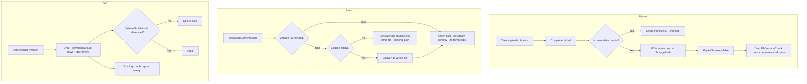

# Media Whole-File Storage Plan (Photos + Music + Video)

> **Status:** ✅ Implemented + deployed (2026-10-08) — build + unit tests green; read/conversion and GC paths verified live
> on mint22 (client-side upload + sync checks pending). See §8 and §12.
> **Date:** 2026-10-08
> **Scope:** Files module (storage/serve paths) + Photo/Music/Video consumers
> **Depends on:** `DotNetCloud.Modules.Files`, `DotNetCloud.Modules.Files.Data`, `DotNetCloud.Modules.Files.Host`
> **Approach:** Server-side reassembly + lazy conversion, with an `IsChunked` discriminator on `FileVersion`

---

## TL;DR

Immutable media files — **photos (`image/*`), music (`audio/*`), and video (`video/*`)** — are currently split into
4 MB content-addressed chunks like every other file. Chunking is valuable for documents because a small edit
re-uploads only the changed chunks, but for media it adds no value and costs read performance: **every read
reassembles all chunks into a temp file before serving**.

This plan stores immutable media as a **single whole file** on disk:

1. New media is reassembled **at upload completion** and stored whole.
2. Pre-existing chunked media is converted **lazily on first read** ("first use"), and the chunks are replaced.
3. Documents and all other mutable files keep the existing chunk pipeline unchanged.
4. `ContentHash` semantics are **unchanged** (still the manifest hash), so sync clients see no spurious changes.

The whole-file blob is written to the version's **existing** `StoragePath` (`files/ab/cd/<manifestHash>`) — a path that
is already populated but never backed by a real file today. A new `FileVersion.IsChunked` column distinguishes the two
storage modes.

---

## 1. Motivation

### Problem

The Files module is content-addressed and chunked end to end. `DownloadService.BuildStreamFromVersionAsync` loads every
`FileVersionChunk` for a version, copies each chunk blob into a **temp file**, and returns a seekable `FileStream`
(so HTTP range requests can seek). For a multi-GB video this means:

- A full disk copy on **every** playback / stream / thumbnail / metadata read.
- Extra latency before the first byte is served.
- 2× transient disk usage during playback.

Media files are **immutable** — a re-encode produces an entirely new file rather than an incremental edit — so
content-defined chunking buys no delta-upload benefit. Documents (Collabora/WOPI, office/text) are the opposite: they
change often, and chunk-level dedup + delta upload is exactly what we want.

### Goal

Store media whole so the read path can hand out the blob's `FileStream` **directly** — no temp copy — while leaving the
document/sync chunk pipeline untouched.

### Non-Goals

- Changing the upload protocol on any client (desktop, Android, web). Clients keep uploading chunks; the server
  reassembles.
- Reworking the document/WOPI pipeline (stays chunked).
- Changing dedup identity (`ContentHash`) or sync change detection.
- Re-encoding, transcoding, or touching the Video module's HLS/poster pipeline.

---

## 2. Current architecture (verified)

| Concern                     | Location                                                                                                                     | Notes                                                                                                                              |
| --------------------------- | ---------------------------------------------------------------------------------------------------------------------------- | ---------------------------------------------------------------------------------------------------------------------------------- |
| Chunk store primitive       | `src/Modules/Files/DotNetCloud.Modules.Files/Services/IFileStorageEngine.cs` + `LocalFileStorageEngine.cs`                   | Generic path→bytes. `WriteChunkAsync`, `ReadChunkAsync`, `OpenReadStreamAsync`, `ExistsAsync`, `DeleteAsync`, `GetTotalSizeAsync`. |
| Path derivation             | `ContentHasher.GetChunkStoragePath(hash)` → `chunks/ab/cd/<hash>`; `GetFileStoragePath(manifestHash)` → `files/ab/cd/<hash>` |                                                                                                                                    |
| Upload orchestration (REST) | `...Files.Data/Services/ChunkedUploadService.cs`                                                                             | `InitiateUploadAsync` / `UploadChunkAsync` / `CompleteUploadAsync` / `CancelUploadAsync`.                                          |
| Upload orchestration (gRPC) | `...Files.Host/Services/FilesGrpcService.cs`                                                                                 | Parallel `InitiateUpload` / `UploadChunk` / `CompleteUpload`. Desktop client path.                                                 |
| Document save (WOPI)        | `...Files.Data/Services/WopiService.cs` (`PutFileAsync`)                                                                     | Server-side chunking; documents only.                                                                                              |
| Read / reassemble           | `...Files.Data/Services/DownloadService.cs` (`BuildStreamFromVersionAsync`)                                                  | Concatenates chunks into a temp file; used by content, download, thumbnail, metadata, zip.                                         |
| Chunk GC                    | `...Files.Data/Services/Background/TrashCleanupService.cs`, `UploadSessionCleanupService.cs`                                 | Orphan sweep: `ReferenceCount <= 0` **AND** no `FileVersionChunk` row.                                                             |
| Version pruning             | `...Files.Data/Services/VersionRetentionEnforcer.cs`                                                                         | Removes old `FileVersion` + `FileVersionChunk`, decrements refcounts.                                                              |
| User deletion               | `...Files.Data/Events/UserDeletedEventSubscriber.cs`                                                                         | Cascades versions; deletes `FileNode.StoragePath` blobs when unreferenced.                                                         |
| Video streaming             | `src/Modules/Video/DotNetCloud.Modules.Video.Host/Controllers/VideoController.cs`                                            | Fast-paths a returned `FileStream` (no temp copy); otherwise makes its own temp copy.                                              |

### Key facts that shape the design

- **`FileVersion.StoragePath` / `FileNode.StoragePath` already contain `files/ab/cd/<manifestHash>`** but no blob is ever
  written there — it is a metadata pointer only. This is the natural home for the whole-file blob.
- **There is no `IsChunked` / `StorageMode` column.** "Chunked" is inferred from the presence of `FileVersionChunk` rows.
- **`ContentHash` = `ComputeManifestHash(chunkHashes)`** and is what sync clients compare. If we changed it, every client
  would re-download every media file. We must **not** change it.
- **The desktop sync client already falls back to direct download when the chunk manifest is empty**
  (`ChunkedTransferClient.DownloadAsync` → `_api.DownloadAsync`). Android downloads directly and never calls the chunk
  manifest. So removing a version's chunk links (empty manifest) is behaviourally safe.
- **Chunk deletion is refcount + join-row driven.** Removing a version's `FileVersionChunk` rows and decrementing
  refcounts lets the existing orphan sweep reclaim chunks still unreferenced by any other version.
- `ConcatenatedStream` exists in `DownloadService.cs` but is unused.

---

## 3. Design

### 3.1 Storage mode discriminator

Add `FileVersion.IsChunked` (`bool`, **default `true`**, not nullable):

- `true` → content lives as `FileVersionChunk` rows pointing at `chunks/…` blobs (current behaviour).
- `false` → content lives as a single whole-file blob at `FileVersion.StoragePath` (`files/…`).

Default `true` guarantees **every existing row — including existing media — is treated as chunked until converted**,
which is exactly the lazy-migration requirement.

`FileNode` needs no new column: the node's mode is derived from its latest `FileVersion`. (Node deletion already inspects
`FileNode.StoragePath`, which for whole-file media will now be a real blob.)

### 3.2 Blob location

Reuse `ContentHasher.GetFileStoragePath(version.ContentHash)` — the value already stored in `StoragePath`. No new path
scheme, no change to `ContentHash`, and whole-file dedup still works: identical content → identical manifest hash →
identical blob path.

### 3.3 Classification

A single static classifier `FileStorageClassifier.IsImmutableMedia(string? mimeType, string? fileName)`:

- MIME prefix `image/`, `audio/`, `video/` → media.
- Extension fallback for when MIME is missing (reuse the extension sets currently duplicated in
  `FilesGrpcService.GetExtensionsForMediaType` / `FilesImageHelper`).

Documents (office, PDF, text, archives, unknown) → not media → stay chunked.

### 3.4 Flow

### 3.5 Conversion routine (shared by upload completion + lazy read)

`WholeFileStorageService.ConvertVersionToWholeFileAsync(versionId)`:

1. Load the tracked `FileVersion` + ordered `FileVersionChunk`s (with `FileChunk`).
2. Skip if not eligible or `IsChunked == false` (idempotent).
3. Stream each chunk blob sequentially into a scratch file next to the target, then **atomically rename** it to
   `version.StoragePath`. If the blob already exists, skip the write.
4. Atomically flip `IsChunked = false` guarded by `Where(v => v.Id == versionId && v.IsChunked)`. **Only the caller that
   observes 1 affected row** removes the `FileVersionChunk` rows and decrements the chunk refcounts, inside a
   transaction.
5. On failure, delete the scratch file and leave the version chunked (the read path can still serve chunks).

**Concurrency (accepted):** rely on the DB-gated flip + atomic rename; do **not** use in-process locks, because both
`Core.Server` and `Files.Host` register Files services and may convert the same version in separate processes. Ordering
guarantees a reader always sees a consistent state:

- `IsChunked == true` → assemble chunks (valid regardless of an in-flight conversion).
- `IsChunked == false` → the blob is already complete (rename is atomic; the flag is flipped only afterwards).

### 3.6 Read / serve path

`DownloadService.BuildStreamFromVersionAsync`:

- `IsChunked == false` → `storageEngine.OpenReadStreamAsync(version.StoragePath)` returned directly (seekable, no temp copy).
- `IsChunked == true` and eligible media and the option is enabled → convert, then open the blob.
- Otherwise → existing chunk concatenation.

Consumers that today reconstruct first (thumbnail, metadata, zip, Video/Music/Photos streaming) inherit the win
automatically because they go through `IDownloadService`.

### 3.7 Deletion and GC

New helper `WholeFileBlobCleanup.DeleteIfUnreferencedAsync(db, storageEngine, storagePath, ct)` deletes a blob only if
**no** `FileVersion` and **no** `FileNode` references that `StoragePath`. Hooks:

- `TrashCleanupService.PermanentDeleteNodeAsync` — capture whole-file version paths before removing versions.
- `VersionRetentionEnforcer.ApplyAsync` — return the pruned whole-file paths; callers delete blobs
  (`ChunkedUploadService`, `WopiService`, `VersionService`, the scheduled retention pass).
- `UserDeletedEventSubscriber` — extend the step-7 sweep to consider `FileVersion.StoragePath` as well as
  `FileNode.StoragePath`.

Chunked versions keep using the existing orphan sweep unchanged.

---

## 4. Implementation

### Phase 1 — Classifier and storage primitive

- ✓ Add `FileStorageClassifier` (static) in `src/Modules/Files/DotNetCloud.Modules.Files/Services/`
  - ✓ `IsImmutableMedia(string? mimeType, string? fileName)` — `image/` / `audio/` / `video/` prefixes + extension fallback.
  - ✓ `IsWholeFileEligible(string? mimeType, string? fileName, bool optionEnabled)` — classifier + option gate.
- ✓ Add streaming write to the storage engine
  - ✓ `IFileStorageEngine.WriteFromStreamAsync(string storagePath, Stream source, long? expectedLength, CancellationToken)`.
  - ✓ Implement in `LocalFileStorageEngine` (streaming copy, length verification, `chmod 600` on Unix). Needed so whole
    videos are never buffered in memory.
- ✓ Add `FileUploadOptions.WholeFileMediaStorage` (`bool`, default `true`) in
  `src/Modules/Files/DotNetCloud.Modules.Files/Options/FileUploadOptions.cs`.

### Phase 2 — Schema

- ✓ Add `FileVersion.IsChunked` (`bool`, default `true`) in
  `src/Modules/Files/DotNetCloud.Modules.Files/Models/FileVersion.cs`.
- ✓ Configure in `src/Modules/Files/DotNetCloud.Modules.Files.Data/Configuration/FileVersionConfiguration.cs`
  - ✓ `HasDefaultValue(true)`, plus an index on `IsChunked` (`ix_file_versions_is_chunked`).
- ✓ Generate migrations
  - ✓ PostgreSQL: `src/Modules/Files/DotNetCloud.Modules.Files.Data/Migrations/20261009023024_AddFileVersionIsChunked.cs`
  - ✓ SQL Server: `src/Modules/Files/DotNetCloud.Modules.Files.Data.SqlServer/Migrations/20261009023045_AddFileVersionIsChunked_SqlServer.cs`

### Phase 3 — Conversion service

- ✓ Add `IWholeFileStorageService` + `WholeFileStorageService` in `src/Modules/Files/DotNetCloud.Modules.Files.Data/Services/`
  - ✓ `Task<bool> ConvertVersionToWholeFileAsync(Guid versionId, CancellationToken)` (see §3.5).
  - ✓ `Task<Stream?> OpenWholeFileStreamAsync(FileVersion version, CancellationToken)`.
  - ✓ `bool ShouldStoreWholeFile(string? mimeType, string? fileName)`.
  - ✓ Internal `ChunkSequenceReadStream` feeds the write one chunk at a time (bounded file handles).
- ✓ Register in `src/Modules/Files/DotNetCloud.Modules.Files.Data/FilesServiceRegistration.cs`
  (`AddFilesServices` + `AddFilesUiServices`).

### Phase 4 — Read / serve path (lazy conversion on first use)

- ✓ `DownloadService.BuildStreamFromVersionAsync` — loads the version; serves the blob directly when whole-file; converts
  chunked eligible media; otherwise unchanged (`ConcatenateChunksAsync`).
- ✓ `DownloadCurrentAsync` / `DownloadVersionAsync` — the version's `MimeType`/`IsChunked` are resolved inside
  `BuildStreamFromVersionAsync` and threaded through.
- ✓ `DownloadZipAsync` / `AddFileToZipAsync` — copies the blob for whole-file versions.
- ✓ `TryAutoRepairMissingVersionAsync` — before chunk matching, if the `node.StoragePath` blob exists and the node is
  media, creates a whole-file version (`IsChunked = false`).
- ✓ `GetChunkManifestAsync` — returns `[]` for whole-file versions (no join rows); desktop fallback path confirmed.

### Phase 5 — Upload completion (new media stored whole)

- ✓ `ChunkedUploadService.CompleteUploadAsync` — after the version + retention handling, if eligible calls
  `ConvertVersionToWholeFileAsync(version.Id)`.
- ✓ `FilesGrpcService.CompleteUpload` — same call via the shared service (desktop client gRPC path).
- ✓ `WopiService.PutFileAsync` — no conversion (documents); classifier returns false for its MIME types.

### Phase 6 — Deletion / GC

- ✓ Add `WholeFileBlobCleanup.DeleteIfUnreferencedAsync(...)` in `...Files.Data/Services/`.
- ✓ Hook into `TrashCleanupService.PermanentDeleteNodeAsync`.
- ✓ Change `VersionRetentionEnforcer.ApplyAsync` to return a `VersionRetentionResult` (count + pruned whole-file paths);
  updated the call sites (`ChunkedUploadService`, `WopiService`, `VersionService`, `VersionRetentionService`,
  `FilesGrpcService` ×2) to reap the blobs.
- ✓ Extend `UserDeletedEventSubscriber` step 1 to collect `FileVersion.StoragePath` for whole-file versions.
- ✓ `VersionService.RestoreVersionAsync` — copies `IsChunked` and, for chunked sources only, the chunk links.
- ✓ `FileService.CopyAsync` + gRPC `CopyNode` share the blob path safely (protected by the unreferenced check).
- ✓ **Orphan sweep safety net:** `IFileStorageEngine.EnumerateStoragePathsAsync(string prefix, CancellationToken)`
  (impl in `LocalFileStorageEngine`) + `WholeFileBlobSweepService` that enumerates `files/` blobs and deletes any not
  referenced by a `FileVersion` or `FileNode`, plus leftover `*.tmp-*` scratch files.

### Phase 7 — Tests and documentation

- ✓ Tests in `tests/DotNetCloud.Modules.Files.Tests/` (see §7).
- ✓ Add `docs/MEDIA_WHOLE_FILE_STORAGE_PLAN.md` (this file).
- ✓ Update `docs/IMPLEMENTATION_CHECKLIST.md` (targeted edits, `✓`/`☐`).
- ✓ Update `docs/MASTER_PROJECT_PLAN.md` (Quick Status Summary + step Status/Deliverables/Notes, targeted edits).
- ✓ Note in this doc that synced media now downloads via the direct `/content` endpoint (§10.6).

---

## 5. File-by-file change list

| File                                                                                                | Change                                                          |
| --------------------------------------------------------------------------------------------------- | --------------------------------------------------------------- |
| `src/Modules/Files/DotNetCloud.Modules.Files/Services/FileStorageClassifier.cs`                     | **New** — media classification.                                 |
| `src/Modules/Files/DotNetCloud.Modules.Files/Services/IFileStorageEngine.cs`                        | Add `WriteFromStreamAsync`, `EnumerateStoragePathsAsync`.       |
| `src/Modules/Files/DotNetCloud.Modules.Files/Services/LocalFileStorageEngine.cs`                    | Implement streaming write + enumeration.                        |
| `src/Modules/Files/DotNetCloud.Modules.Files/Models/FileVersion.cs`                                 | Add `IsChunked`.                                                |
| `...Files/Options/FileUploadOptions.cs`                                                             | Add `WholeFileMediaStorage`.                                    |
| `src/Modules/Files/DotNetCloud.Modules.Files.Data/Configuration/FileVersionConfiguration.cs`        | Default + index.                                                |
| `src/Modules/Files/DotNetCloud.Modules.Files.Data/Migrations/*`                                     | New migration (PostgreSQL).                                     |
| `src/Modules/Files/DotNetCloud.Modules.Files.Data.SqlServer/Migrations/*`                           | New migration (SQL Server).                                     |
| `src/Modules/Files/DotNetCloud.Modules.Files.Data/Services/IWholeFileStorageService.cs`             | **New**.                                                        |
| `src/Modules/Files/DotNetCloud.Modules.Files.Data/Services/WholeFileStorageService.cs`              | **New** — conversion + serve.                                   |
| `src/Modules/Files/DotNetCloud.Modules.Files.Data/Services/WholeFileBlobCleanup.cs`                 | **New** — unreferenced-blob deletion.                           |
| `src/Modules/Files/DotNetCloud.Modules.Files.Data/Services/Background/WholeFileBlobSweepService.cs` | **New** (or extend `TrashCleanupService`) — disk/DB reconciler. |
| `src/Modules/Files/DotNetCloud.Modules.Files.Data/Services/DownloadService.cs`                      | Read/convert/zip/auto-repair.                                   |
| `src/Modules/Files/DotNetCloud.Modules.Files.Data/Services/ChunkedUploadService.cs`                 | Convert on completion.                                          |
| `src/Modules/Files/DotNetCloud.Modules.Files.Data/Services/VersionService.cs`                       | Restore whole-file version.                                     |
| `src/Modules/Files/DotNetCloud.Modules.Files.Data/Services/VersionRetentionEnforcer.cs`             | Surface pruned blob paths.                                      |
| `src/Modules/Files/DotNetCloud.Modules.Files.Data/Services/Background/TrashCleanupService.cs`       | Blob GC hook.                                                   |
| `src/Modules/Files/DotNetCloud.Modules.Files.Data/Events/UserDeletedEventSubscriber.cs`             | Blob GC hook.                                                   |
| `src/Modules/Files/DotNetCloud.Modules.Files.Data/FilesServiceRegistration.cs`                      | DI.                                                             |
| `src/Modules/Files/DotNetCloud.Modules.Files.Host/Services/FilesGrpcService.cs`                     | Convert on gRPC completion; copy path.                          |
| `tests/DotNetCloud.Modules.Files.Tests/**`                                                          | New/updated tests.                                              |

---

## 6. Edge cases and risks

| #   | Case                                                               | Handling                                                                                                              |
| --- | ------------------------------------------------------------------ | --------------------------------------------------------------------------------------------------------------------- |
| 1   | Concurrent conversion of the same version (possibly cross-process) | DB-gated `IsChunked` flip + atomic rename; only the winning update removes join rows/decrements.                      |
| 2   | Crash between blob rename and DB flip                              | Version stays `IsChunked=true` (chunks still valid); the periodic orphan sweep removes the stray blob and `*.tmp-*`.  |
| 3   | Two files with identical content                                   | Same `ContentHash` → same blob path → dedup preserved; unreferenced check protects deletion.                          |
| 4   | A chunk shared with a document                                     | Decrement only; the chunk survives while the document still references it.                                            |
| 5   | Restore an older whole-file version                                | Copy `IsChunked=false`; do not copy chunk links.                                                                      |
| 6   | Copy / move node                                                   | `StoragePath` copied → shared blob; unreferenced check prevents premature deletion.                                   |
| 7   | Missing version row (pre-versioning)                               | `TryAutoRepairMissingVersionAsync` creates a whole-file version when the `files/…` blob exists and the node is media. |
| 8   | Streaming/range requests                                           | Whole-file `FileStream` is seekable → `enableRangeProcessing` works with no temp copy.                                |
| 9   | Download path crosses a `chunks/` ↔ `files/` boundary mid-request  | Conversion ordering guarantees a reader sees either valid chunks or a complete blob, never partial.                   |
| 10  | Feature disabled mid-rollout                                       | Option gate defaults media back to chunked; already-converted versions stay whole-file and are served from the blob.  |
| 11  | Whole-file media with multiple versions                            | Each version is converted independently on its own first use / at its own upload; shared content dedups to one blob.  |
| 12  | `GetTotalSizeAsync` / quota metrics                                | Sums the whole tree; both `chunks/` and `files/` counted — no change required.                                        |

---

## 7. Testing plan

`tests/DotNetCloud.Modules.Files.Tests/` (InMemory provider + `LocalFileStorageEngine` against a temp dir):

- ✓ `FileStorageClassifierTests` — mime prefixes, extension fallback, documents/archives excluded, null inputs.
- ✓ `WholeFileStorageServiceTests`
  - ✓ Conversion writes the blob at `StoragePath`, removes `FileVersionChunk` rows, decrements refcounts.
  - ✓ Idempotent: second call is a no-op.
  - ✓ Ineligible (document) version is not converted.
  - ☐ Concurrent calls convert once (single set of decrements) — not unit-testable against the InMemory provider; the
    guarantee comes from the DB-gated `IsChunked` flip (see §3.5) and was exercised live cross-process by the Video
    module host (see §8.4).
  - ✓ Failure mid-write leaves the version chunked and cleans up the scratch file.
- ✓ `DownloadServiceWholeFileTests`
  - ✓ Whole-file version returns a stream backed by the blob (no temp file) and is seekable.
  - ✓ First read of chunked media converts, then streams the blob.
  - ✓ Document version still concatenates chunks.
  - ✓ ZIP assembly copies the blob for whole-file entries.
  - ✓ `TryAutoRepairMissingVersionAsync` creates a whole-file version when the blob exists.
- ✓ Upload-completion tests (REST + gRPC path via `ChunkedUploadService`) — media converts, document does not.
- ✓ GC tests — `WholeFileBlobCleanup` (unreferenced deleted; referenced by version/trashed node kept),
  `VersionRetentionEnforcer` surfaces pruned whole-file paths.
- ✓ `WholeFileBlobSweepService` — unreferenced `files/` blob deleted; referenced blob kept; `*.tmp-*` cleaned.
- ✓ Migration/model tests — `IsChunked` defaults to `true`.

---

## 8. Verification / acceptance criteria

1. ✓ `dotnet build DotNetCloud.CI.slnf` succeeds with the NuGet audit **enabled** (no suppression). The repo's build was
   briefly blocked by seven new `SixLabors.ImageSharp` advisories published 2026-10-07; `Directory.Packages.props` was
   bumped 4.0.0 → **4.1.2** (the first patched version for all seven) rather than suppressing them.
2. ✓ `dotnet test tests/DotNetCloud.Modules.Files.Tests` green (926), plus dependent modules: Music 387, Photos 292,
   Video 213, Core.Server 799.
3. ✓ Migrations generated for both providers and the model is in sync
   (`dotnet ef migrations has-pending-model-changes` → "No changes"). Applied live by the mint22 deploy: the
   `core.FileVersions.IsChunked` column exists (`default true`, `NOT NULL`) and all 134 pre-existing version rows are
   `IsChunked = true`.
4. ◐ Live (mint22) — **deployed 2026-10-08 (15/15 targets, all assembly hashes verified, v0.6.13, `/health/ready`
   Healthy 14/14)**. The read path and GC were verified end-to-end; the upload path still needs a client-side upload.
   - ☐ Upload a **new** `.mp4` → blob at `StoragePath`, `chunks/` released, `FileVersion.IsChunked=false`, empty chunk
     manifest (needs a client upload; the equivalent conversion was proven via the lazy path below).
   - ✓ **A pre-existing chunked `.mp4` converts on first read and its chunks are reclaimed** — autonomously, in
     production: the `dotnetcloud.video` module host read the library at startup and
     `Converted version … to whole-file storage (24/15/3 chunk(s) released)` for the three `.mp4` files
     (97.7 MB / 59.3 MB / 12.2 MB). DB: `3` whole-file / `131` chunked versions, each converted version with `0` chunk
     links. Blob byte sizes exactly equal the version `Size` (the engine length-verifies the reassembly).
     Disk: `storage/chunks` **589 M → 428 M**, `storage/files` 162 M; `0` orphan chunk rows left (207/207 referenced).
     This also exercises the plan's **cross-process** case (§3.5 / edge case 1) — the conversion ran from a module-host
     process, not the core.
   - ◐ Video streams with no temp-file copy — the Video module now reads the whole-file blob directly; UI playback
     confirmation pending.
   - ☐ A `.docx` stays chunked (needs a client upload; logically guaranteed by the classifier, unit-tested).
   - ☐ Delete the file → the blob is removed (GC is unit-tested and the sweep is verified live; a real delete from the
     UI is pending).
5. ☐ Sync: media re-sync shows **no** content-hash change; the desktop client falls back to direct download (pending a
   desktop client check).
6. ✓ Orphan sweep — verified live: seeded `files/zz/zz/orphan-sweep-test` + a `*.tmp-0123456789abcdef` scratch file
   alongside a **referenced** `files/e3/b0/…` path, then restarted. Log:
   `Swept unreferenced whole-file blob files/zz/zz/orphan-sweep-test` and
   `Whole-file blob sweep: scanned 6, deleted 1 unreferenced, removed 1 scratch file(s)` — the referenced blob was kept.

---

## 9. Rollout / rollback

- **Rollout:** additive column (default preserves current behaviour) + option defaulting to on. Pre-existing media
  migrates lazily, so there is no bulk conversion step and no downtime.
- **Rollback:** set `FileUploadOptions.WholeFileMediaStorage = false`. New uploads revert to chunked; already-converted
  versions remain valid whole-file blobs (both modes are readable), so no data migration is required to roll back the
  behaviour. The `IsChunked` column can remain in place.

---

## 10. Accepted decisions

1. **Scope:** media = `image/*` + `audio/*` + `video/*`; documents and other mutable files stay chunked.
2. **New uploads:** converted to whole-file immediately at upload completion.
3. **Upload protocol:** unchanged — server-side reassembly only.
4. **Size threshold:** none — all media regardless of size.
5. **Identity:** `ContentHash` unchanged (manifest hash); whole-file blob reuses the existing `StoragePath`.
6. **Desktop sync of media** now uses the direct `/content` endpoint (empty-manifest fallback). The loss of
   parallel/resumable chunk download for media is accepted and documented. (Manifest `TotalSize` being `0` on this path
   is expected, not a defect.)
7. **Cross-process conversion** is serialized by the DB-gated `IsChunked` flip + atomic blob rename (no in-process locks).
8. **Orphan sweep** is the safety net for crash-window leaks (Phase 6).

---

## 11. References

- `docs/MEDIA_CONTENT_DEDUPLICATION_PLAN.md` — content-addressed canonical media model (context).
- `docs/architecture/ARCHITECTURE.md` — module/storage architecture.
- `src/Modules/Files/DotNetCloud.Modules.Files/Services/ContentHasher.cs` — path derivation and chunking.
- `src/Modules/Files/DotNetCloud.Modules.Files.Data/Services/DownloadService.cs` — read/reassembly.

---

## 12. Implementation notes (2026-10-08)

Delivered as planned, with three small refinements:

1. **Atomic write lives in the storage engine.** `LocalFileStorageEngine.WriteFromStreamAsync` stages the payload in a
   `{path}.tmp-{guid}` scratch file in the destination directory, verifies the expected length, `chmod 600`s it, then
   `File.Move(..., overwrite: true)` renames it into place. This keeps the "rename is atomic, flag flips afterwards"
   ordering while never exposing a partially written blob, and it lets the conversion stream gigabytes without buffering
   them in memory. Leftover `*.tmp-*` files from a crash are removed by the sweep.
2. **`EnumerateStoragePathsAsync` returns `IAsyncEnumerable<string>`** (rather than a materialized list) so the sweep
   never holds a full path list in memory.
3. **Restore bug fix found en route.** The gRPC `FilesGrpcService.RestoreVersion` previously created the new version
   row _without_ copying any chunk links, so a restored chunked version had no content. It now copies the chunk
   mappings (with refcount increments) for chunked sources and shares the blob for whole-file sources. This is a strict
   improvement and also required for whole-file versions to restore correctly.

Test coverage added (all in `tests/DotNetCloud.Modules.Files.Tests/`):

- `Services/FileStorageClassifierTests.cs` — MIME prefixes, extension fallback, documents/archives excluded, null inputs, option gate.
- `Services/WholeFileStorageServiceTests.cs` — conversion writes the blob and releases chunks; idempotent second call;
  document not converted; option-disabled not converted; missing chunk blob leaves the version chunked with no scratch file.
- `Services/DownloadServiceWholeFileTests.cs` — whole-file version streams the blob directly (seekable); first read of
  chunked media converts; document stays chunked; missing blob throws; ZIP uses the blob; auto-repair creates a
  whole-file version.
- `Services/ChunkedUploadServiceWholeFileTests.cs` — media converts at upload completion; document stays chunked.
- `Services/WholeFileBlobCleanupTests.cs` — unreferenced deleted; referenced by version/trashed node kept; chunk path no-op.
- `Services/VersionRetentionEnforcerWholeFileTests.cs` — pruned whole-file path surfaced; chunked prune returns none.
- `Services/WholeFileBlobSweepServiceTests.cs` — unreferenced `files/` blob deleted; referenced kept; scratch deleted;
  `chunks/` untouched.
- `LocalFileStorageEngineWholeFileTests.cs` — streamed write, length-mismatch failure cleanup, atomic overwrite, enumeration.
- `Models/FileVersionTests.cs` — `IsChunked` defaults to `true`.

**Note (sync):** desktop sync of media now downloads via the direct `/content` endpoint (the empty-manifest fallback),
per §10.6.

---

## Hardening: unverifiable / lost whole-file blobs (2026-10-08)

A live audit found one video (`20261005_225022.mp4`) whose `FileVersion` was flagged whole-file (`IsChunked = 0`) with
its chunks already released, but whose blob was **absent from disk** — the read path therefore returned 404
(`File content is unavailable: whole-file blob for version … is missing from storage`). The file still listed normally,
so the loss stayed invisible until playback. No delete path logged activity and the file has a single version, so the
state most likely came from an earlier build of this feature that flipped the flag without a durable blob. The content
was unrecoverable (no chunk mappings, no dedup sibling) and needs a re-upload or a restore from backup.

Three changes close the hole:

1. **Release chunks only behind a byte-exact blob.** `IFileStorageEngine.GetLengthAsync` was added, and
   `WholeFileStorageService.ConvertVersionToWholeFileAsync` now (a) treats a present-but-wrong-sized blob as corrupt
   and replaces it, (b) verifies the blob's length after the write, and (c) re-verifies immediately before the
   `IsChunked` flip — the point at which the chunks are released. A blob that cannot be verified leaves the version
   chunked with its reference counts untouched.
2. **Self-healing reads.** `DownloadService.BuildStreamFromVersionAsync` falls back to chunk reassembly when a
   whole-file blob is missing but chunk mappings survive, so an already-damaged version becomes readable again instead
   of 404ing.
3. **Make the failure mode visible.**
   - `WholeFileBlobIntegrityService` (`IWholeFileBlobIntegrityService`) audits every live whole-file version and
     distinguishes *recoverable* (chunks survive) from *unrecoverable* losses;
     `WholeFileBlobIntegrityAuditService` runs it every 12 h, logs an error per defect, and records the outcome in the
     background-service tracker.
   - `scripts/audit-whole-file-blobs.sh` runs the same check on demand against a live deployment (exit codes: `0` clean,
     `1` recoverable loss, `2` unrecoverable loss, `3` audit could not run). First production run:
     **13 whole-file versions — 12 healthy, 1 unrecoverable**.
   - `VideoController` returns a distinct `content_unavailable` error with an actionable message instead of a bare
     `file_not_found`, and the player's error card shows the server's reason rather than generic codec advice.

Test coverage added:

- `Services/WholeFileStorageServiceTests.cs` — conversion aborts (version stays chunked, refcounts intact) when the blob
  cannot be verified; a truncated pre-existing blob is replaced by a complete one.
- `Services/DownloadServiceWholeFileTests.cs` — a whole-file version whose blob is gone but whose chunks survive
  rebuilds from chunks.
- `Services/WholeFileBlobIntegrityServiceTests.cs` — healthy / unrecoverable / recoverable / truncated / trashed-node /
  chunked-not-scanned.
- `LocalFileStorageEngineWholeFileTests.cs` — `GetLengthAsync` present, missing, and after a streamed write.
