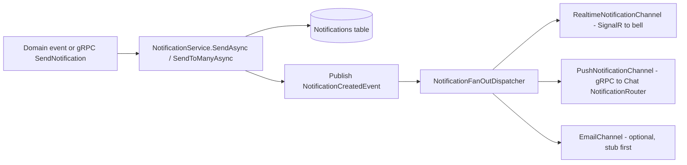

# Notification Fan-Out Unification Plan

> **Goal:** Replace the two parallel notification systems (in-app bell + device push) with a
> single pipeline: every event produces **one** persisted `NotificationDto`, and a single
> dispatcher fans it out to delivery channels (real-time SignalR, push, email).
>
> **Branch:** `fix/notification-flow`

---

## 1. Scope boundaries (MANDATORY)

### Out of scope — DO NOT touch

Chat message delivery stays **exactly as-is**. Do not modify, reroute, or "improve" any of:

- Chat messages, DMs, chat `@mentions`, typing indicators, video-call push.
- `src/Modules/Chat/DotNetCloud.Modules.Chat/Services/NotificationRouter.cs`
- `src/Modules/Chat/DotNetCloud.Modules.Chat/Services/MentionNotificationService.cs`
- `DmChannelCreatedEventHandler` and the `GlobalChatNotifications` Blazor component
  (`src/UI/DotNetCloud.UI.Web/Components/Shared/GlobalChatNotifications.razor*`).

The new fan-out only handles the **cross-module** notification events (Section 3).

### In scope

The 8 cross-module events handled by Core.Server's `NotificationEventSubscriber`
(`FileSharedEvent`, `QuotaWarningEvent`, `QuotaCriticalEvent`, `PublicLinkAccessedEvent`,
`ShareExpiringEvent`, `ResourceSharedEvent`, `UserMentionedEvent`, `ReminderTriggeredEvent`)
plus the `CoreCapabilities.SendNotification` gRPC path used by process-isolated modules.

---

## 2. Current state (facts you can rely on)

| Fact                                | Detail                                                                                                                                                                                                      |
| ----------------------------------- | ----------------------------------------------------------------------------------------------------------------------------------------------------------------------------------------------------------- |
| Bell source of truth                | `INotificationService` (Core capability) → `NotificationService` (EF Core, `Notifications` table). File: `src/Core/DotNetCloud.Core.Server/Services/NotificationService.cs`                                 |
| Bell only receives 3 events today   | `InAppNotificationEventHandler` handles only `ResourceSharedEvent`, `UserMentionedEvent`, `ReminderTriggeredEvent`.                                                                                         |
| Push handlers are no-ops            | 8 handlers in `src/Core/DotNetCloud.Core.Server/Services/` call `IPushNotificationService`, but `Program.cs` registers `NoOpPushNotificationService`.                                                       |
| Real push lives in Chat             | `NotificationRouter` → `FcmPushProvider` / `UnifiedPushProvider`, gated by `INotificationPreferenceStore` (`DbNotificationPreferenceStore`), with presence dedup + delivery queue.                          |
| No push RPC exists                  | `src/Modules/Chat/DotNetCloud.Modules.Chat.Host/Protos/chat_service.proto` has no push RPC.                                                                                                                 |
| gRPC client exists                  | `ChatGrpcApiClient` (`src/Core/DotNetCloud.Core.Server/Grpc/Clients/ChatGrpcApiClient.cs`) implements `IChatApiClient` (`src/Core/DotNetCloud.Core/Services/ModuleApis/IChatApiClient.cs`).                 |
| Real-time exists                    | `IRealtimeBroadcaster.SendToUserAsync(userId, eventName, message, ct)` (`src/Core/DotNetCloud.Core/Capabilities/IRealtimeBroadcaster.cs`), implemented by `RealtimeBroadcasterService` (SignalR `CoreHub`). |
| Event bus                           | `InProcessEventBus` (singleton) implements `DotNetCloud.Core.Events.IEventBus`. Registered in `Program.cs` line ~361. `PublishAsync<TEvent>(TEvent, CallerContext, CancellationToken)`.                     |
| `INotificationService` registration | `Program.cs` line ~373: `builder.Services.AddScoped<...INotificationService, NotificationService>();`                                                                                                       |
| `IChatApiClient` registration       | `Program.cs` line ~536: `builder.Services.AddScoped<...IChatApiClient, ChatGrpcApiClient>();`                                                                                                               |
| Caller context factory              | `CallerContext.CreateSystemContext()` in `src/Core/DotNetCloud.Core/Authorization/CallerContext.cs`.                                                                                                        |
| Bell component                      | `src/UI/DotNetCloud.UI.Web/Components/Shared/NotificationBell.razor` (no live refresh today).                                                                                                               |

---

## 3. The 8 events and their payloads

All events implement `IEvent` (`EventId`, `CreatedAt`) and live in `src/Core/DotNetCloud.Core/Events/`.

| Event                     | Recipient property            | Notification type | Priority | Action URL                               |
| ------------------------- | ----------------------------- | ----------------- | -------- | ---------------------------------------- |
| `ResourceSharedEvent`     | `SharedWithUserId`            | `Share`           | `Normal` | `BuildActionUrl(EntityType, EntityId)`   |
| `UserMentionedEvent`      | `MentionedUserId`             | `Mention`         | `High`   | `BuildActionUrl(ContentType, ContentId)` |
| `ReminderTriggeredEvent`  | `UserId`                      | `Reminder`        | `High`   | `BuildActionUrl(EntityType, EntityId)`   |
| `FileSharedEvent`         | `SharedWithUserId` (nullable) | `Share`           | `Normal` | `/apps/files?node={FileNodeId}`          |
| `QuotaWarningEvent`       | `UserId`                      | `SystemAlert`     | `High`   | `/apps/files`                            |
| `QuotaCriticalEvent`      | `UserId`                      | `SystemAlert`     | `Urgent` | `/apps/files`                            |
| `PublicLinkAccessedEvent` | `CreatedByUserId`             | `Info`            | `Normal` | `/apps/files?node={FileNodeId}`          |
| `ShareExpiringEvent`      | `CreatedByUserId`             | `SystemAlert`     | `High`   | `/apps/files?node={FileNodeId}`          |

Event property names (verified):

- `ResourceSharedEvent`: `SharedWithUserId`, `SourceModuleId`, `EntityType` (string), `EntityId`, `EntityDisplayName`, `Permission`.
- `UserMentionedEvent`: `MentionedUserId`, `SourceModuleId`, `ContentType` (string), `ContentId`, `ContentTitle`.
- `ReminderTriggeredEvent`: `UserId`, `SourceModuleId`, `EntityType`, `EntityId`, `Title`, `DueAtUtc` (`DateTime?`).
- `FileSharedEvent`: `FileNodeId`, `FileName`, `ShareId`, `ShareType`, `SharedWithUserId` (`Guid?`), `SharedByUserId`.
- `QuotaWarningEvent` / `QuotaCriticalEvent`: `UserId`, `UsedBytes` (long), `MaxBytes` (long), `UsagePercent` (double).
- `PublicLinkAccessedEvent`: `FileNodeId`, `FileName`, `ShareId`, `CreatedByUserId`.
- `ShareExpiringEvent`: `FileNodeId`, `FileName`, `ShareId`, `CreatedByUserId`, `ExpiresAt`.

---

## 4. Target architecture



The `NotificationService` publishes `NotificationCreatedEvent` **after** a successful
`SaveChangesAsync`. The dispatcher is an event-bus handler that resolves all
`INotificationChannel` implementations from a DI scope and calls each, catching per-channel
exceptions so one broken channel never blocks the others.

---

## 5. Implementation phases

Work in this order. Build after each phase.

---

### Phase 1 — Consolidate producers (close the 5-event gap)

**1.1** Create `src/Core/DotNetCloud.Core.Server/Services/NotificationProducer.cs`:

```csharp
using DotNetCloud.Core.Capabilities;
using DotNetCloud.Core.DTOs;
using DotNetCloud.Core.Events;
using Microsoft.Extensions.DependencyInjection;

namespace DotNetCloud.Core.Server.Services;

/// <summary>
/// Builds and persists an in-app notification for every cross-module notification event.
/// This is the single producer of bell notifications.
/// </summary>
internal sealed class NotificationProducer :
    IEventHandler<ResourceSharedEvent>,
    IEventHandler<UserMentionedEvent>,
    IEventHandler<ReminderTriggeredEvent>,
    IEventHandler<FileSharedEvent>,
    IEventHandler<QuotaWarningEvent>,
    IEventHandler<QuotaCriticalEvent>,
    IEventHandler<PublicLinkAccessedEvent>,
    IEventHandler<ShareExpiringEvent>
{
    private readonly IServiceScopeFactory _scopeFactory;

    public NotificationProducer(IServiceScopeFactory scopeFactory)
    {
        _scopeFactory = scopeFactory;
    }

    public async Task HandleAsync(ResourceSharedEvent e, CancellationToken ct = default)
    {
        await SendAsync(new NotificationDto
        {
            Id = Guid.CreateVersion7(),
            UserId = e.SharedWithUserId,
            SourceModuleId = e.SourceModuleId,
            Type = NotificationType.Share,
            Title = $"{e.EntityType} shared with you",
            Message = $"{e.EntityDisplayName} was shared with permission: {e.Permission}.",
            Priority = NotificationPriority.Normal,
            ActionUrl = BuildActionUrl(e.EntityType, e.EntityId),
            RelatedEntityType = MapEntityType(e.EntityType),
            RelatedEntityId = e.EntityId,
            CreatedAtUtc = e.CreatedAt
        }, ct);
    }

    public async Task HandleAsync(UserMentionedEvent e, CancellationToken ct = default)
    {
        await SendAsync(new NotificationDto
        {
            Id = Guid.CreateVersion7(),
            UserId = e.MentionedUserId,
            SourceModuleId = e.SourceModuleId,
            Type = NotificationType.Mention,
            Title = "You were mentioned",
            Message = e.ContentTitle,
            Priority = NotificationPriority.High,
            ActionUrl = BuildActionUrl(e.ContentType, e.ContentId),
            RelatedEntityType = MapEntityType(e.ContentType),
            RelatedEntityId = e.ContentId,
            CreatedAtUtc = e.CreatedAt
        }, ct);
    }

    public async Task HandleAsync(ReminderTriggeredEvent e, CancellationToken ct = default)
    {
        await SendAsync(new NotificationDto
        {
            Id = Guid.CreateVersion7(),
            UserId = e.UserId,
            SourceModuleId = e.SourceModuleId,
            Type = NotificationType.Reminder,
            Title = e.Title,
            Message = e.DueAtUtc.HasValue ? $"Due at {e.DueAtUtc.Value:u}" : "Reminder",
            Priority = NotificationPriority.High,
            ActionUrl = BuildActionUrl(e.EntityType, e.EntityId),
            RelatedEntityType = MapEntityType(e.EntityType),
            RelatedEntityId = e.EntityId,
            CreatedAtUtc = e.CreatedAt
        }, ct);
    }

    public async Task HandleAsync(FileSharedEvent e, CancellationToken ct = default)
    {
        // Only user-targeted shares; public-link shares do not target a user.
        if (e.SharedWithUserId is null)
            return;

        await SendAsync(new NotificationDto
        {
            Id = Guid.CreateVersion7(),
            UserId = e.SharedWithUserId.Value,
            SourceModuleId = "dotnetcloud.files",
            Type = NotificationType.Share,
            Title = "File shared with you",
            Message = $"\"{e.FileName}\" has been shared with you.",
            Priority = NotificationPriority.Normal,
            ActionUrl = $"/apps/files?node={e.FileNodeId}",
            CreatedAtUtc = e.CreatedAt
        }, ct);
    }

    public async Task HandleAsync(QuotaWarningEvent e, CancellationToken ct = default)
    {
        await SendAsync(new NotificationDto
        {
            Id = Guid.CreateVersion7(),
            UserId = e.UserId,
            SourceModuleId = "dotnetcloud.files",
            Type = NotificationType.SystemAlert,
            Title = "Storage almost full",
            Message = $"You're using {FormatBytes(e.UsedBytes)} of {FormatBytes(e.MaxBytes)} ({e.UsagePercent:F0}%).",
            Priority = NotificationPriority.High,
            ActionUrl = "/apps/files",
            CreatedAtUtc = e.CreatedAt
        }, ct);
    }

    public async Task HandleAsync(QuotaCriticalEvent e, CancellationToken ct = default)
    {
        await SendAsync(new NotificationDto
        {
            Id = Guid.CreateVersion7(),
            UserId = e.UserId,
            SourceModuleId = "dotnetcloud.files",
            Type = NotificationType.SystemAlert,
            Title = "Storage nearly full",
            Message = $"You're using {FormatBytes(e.UsedBytes)} of {FormatBytes(e.MaxBytes)} ({e.UsagePercent:F0}%). Free up space to continue uploading.",
            Priority = NotificationPriority.Urgent,
            ActionUrl = "/apps/files",
            CreatedAtUtc = e.CreatedAt
        }, ct);
    }

    public async Task HandleAsync(PublicLinkAccessedEvent e, CancellationToken ct = default)
    {
        await SendAsync(new NotificationDto
        {
            Id = Guid.CreateVersion7(),
            UserId = e.CreatedByUserId,
            SourceModuleId = "dotnetcloud.files",
            Type = NotificationType.Info,
            Title = "Public link accessed",
            Message = $"Your public link for \"{e.FileName}\" was accessed.",
            Priority = NotificationPriority.Normal,
            ActionUrl = $"/apps/files?node={e.FileNodeId}",
            CreatedAtUtc = e.CreatedAt
        }, ct);
    }

    public async Task HandleAsync(ShareExpiringEvent e, CancellationToken ct = default)
    {
        await SendAsync(new NotificationDto
        {
            Id = Guid.CreateVersion7(),
            UserId = e.CreatedByUserId,
            SourceModuleId = "dotnetcloud.files",
            Type = NotificationType.SystemAlert,
            Title = "Share expiring soon",
            Message = $"Your share for \"{e.FileName}\" expires at {e.ExpiresAt:u}.",
            Priority = NotificationPriority.High,
            ActionUrl = $"/apps/files?node={e.FileNodeId}",
            CreatedAtUtc = e.CreatedAt
        }, ct);
    }

    private async Task SendAsync(NotificationDto notification, CancellationToken ct)
    {
        await using var scope = _scopeFactory.CreateAsyncScope();
        var service = scope.ServiceProvider.GetRequiredService<INotificationService>();
        await service.SendAsync(notification.UserId, notification, ct);
    }

    // Keep the URL shapes from the original InAppNotificationEventHandler.
    private static string BuildActionUrl(string entityType, Guid entityId) =>
        entityType.ToLowerInvariant() switch
        {
            "contact" => $"/contacts?id={entityId}",
            "calendar" => $"/calendar?id={entityId}",
            "calendarevent" => $"/calendar?eventId={entityId}",
            "note" => $"/notes?id={entityId}",
            _ => "/"
        };

    private static CrossModuleLinkType? MapEntityType(string entityType) =>
        entityType.ToLowerInvariant() switch
        {
            "contact" => CrossModuleLinkType.Contact,
            "note" => CrossModuleLinkType.Note,
            "calendarevent" => CrossModuleLinkType.CalendarEvent,
            _ => null
        };

    private static string FormatBytes(long bytes) => bytes switch
    {
        >= 1_073_741_824 => $"{bytes / 1_073_741_824.0:F1} GB",
        >= 1_048_576 => $"{bytes / 1_048_576.0:F1} MB",
        >= 1_024 => $"{bytes / 1_024.0:F1} KB",
        _ => $"{bytes} B"
    };
}
```

---

### Phase 2 — `NotificationCreatedEvent` + dispatcher

**2.1** Create `src/Core/DotNetCloud.Core/Events/NotificationCreatedEvent.cs`:

```csharp
using DotNetCloud.Core.DTOs;

namespace DotNetCloud.Core.Events;

/// <summary>
/// Raised after an in-app notification has been persisted. Used to fan the
/// notification out to additional delivery channels (real-time, push, email).
/// </summary>
public sealed record NotificationCreatedEvent : IEvent
{
    /// <inheritdoc />
    public required Guid EventId { get; init; }

    /// <inheritdoc />
    public required DateTime CreatedAt { get; init; }

    /// <summary>The persisted notification to fan out.</summary>
    public required NotificationDto Notification { get; init; }
}
```

**2.2** Create `src/Core/DotNetCloud.Core.Server/Services/INotificationChannel.cs`:

```csharp
using DotNetCloud.Core.DTOs;

namespace DotNetCloud.Core.Server.Services;

/// <summary>
/// A delivery channel for persisted notifications (real-time, push, email, ...).
/// </summary>
public interface INotificationChannel
{
    /// <summary>Delivers a notification through this channel.</summary>
    Task DeliverAsync(NotificationDto notification, CancellationToken cancellationToken = default);
}
```

**2.3** Create `src/Core/DotNetCloud.Core.Server/Services/NotificationFanOutDispatcher.cs`:

```csharp
using DotNetCloud.Core.Events;
using Microsoft.Extensions.DependencyInjection;
using Microsoft.Extensions.Logging;

namespace DotNetCloud.Core.Server.Services;

/// <summary>
/// Fans a persisted notification out to all configured delivery channels.
/// Per-channel failures are logged and do not affect other channels.
/// </summary>
internal sealed class NotificationFanOutDispatcher : IEventHandler<NotificationCreatedEvent>
{
    private readonly IServiceScopeFactory _scopeFactory;
    private readonly ILogger<NotificationFanOutDispatcher> _logger;

    public NotificationFanOutDispatcher(
        IServiceScopeFactory scopeFactory,
        ILogger<NotificationFanOutDispatcher> logger)
    {
        _scopeFactory = scopeFactory;
        _logger = logger;
    }

    public async Task HandleAsync(NotificationCreatedEvent e, CancellationToken ct = default)
    {
        await using var scope = _scopeFactory.CreateAsyncScope();
        var channels = scope.ServiceProvider.GetRequiredService<IEnumerable<INotificationChannel>>();

        foreach (var channel in channels)
        {
            try
            {
                await channel.DeliverAsync(e.Notification, ct);
            }
            catch (Exception ex)
            {
                _logger.LogError(ex, "Notification channel {Channel} failed for notification {NotificationId}",
                    channel.GetType().Name, e.Notification.Id);
            }
        }
    }
}
```

**2.4** Modify `src/Core/DotNetCloud.Core.Server/Services/NotificationService.cs`:

- Add usings: `using DotNetCloud.Core.Authorization;` and `using DotNetCloud.Core.Events;`.
- Add a constructor parameter `IEventBus eventBus` and store it as `_eventBus`.
- In `SendAsync`, replace the end of the method:

```csharp
        _db.Notifications.Add(entity);
        await _db.SaveChangesAsync(cancellationToken);

        await _eventBus.PublishAsync(new NotificationCreatedEvent
        {
            EventId = Guid.CreateVersion7(),
            CreatedAt = DateTime.UtcNow,
            Notification = MapToDto(entity)
        }, CallerContext.CreateSystemContext(), cancellationToken);
    }
```

- In `SendToManyAsync`, replace the end of the method:

```csharp
        _db.Notifications.AddRange(entities);
        await _db.SaveChangesAsync(cancellationToken);

        foreach (var entity in entities)
        {
            await _eventBus.PublishAsync(new NotificationCreatedEvent
            {
                EventId = Guid.CreateVersion7(),
                CreatedAt = DateTime.UtcNow,
                Notification = MapToDto(entity)
            }, CallerContext.CreateSystemContext(), cancellationToken);
        }
    }
```

`MapToDto` already exists in this file (private static). No other changes to it.

---

### Phase 3 — Channel implementations

**3.1** Create `src/Core/DotNetCloud.Core.Server/Services/RealtimeNotificationChannel.cs`:

```csharp
using DotNetCloud.Core.Capabilities;
using DotNetCloud.Core.DTOs;

namespace DotNetCloud.Core.Server.Services;

/// <summary>
/// Sends a real-time SignalR event to the recipient so connected clients
/// (e.g. the notification bell) can refresh their unread badge immediately.
/// </summary>
internal sealed class RealtimeNotificationChannel : INotificationChannel
{
    private readonly IRealtimeBroadcaster _broadcaster;

    public RealtimeNotificationChannel(IRealtimeBroadcaster broadcaster)
    {
        _broadcaster = broadcaster;
    }

    public Task DeliverAsync(NotificationDto notification, CancellationToken ct = default)
    {
        return _broadcaster.SendToUserAsync(
            notification.UserId,
            "notification.created",
            notification,
            ct);
    }
}
```

**3.2** Create the push channel **after Phase 4** (it depends on the new gRPC method):

`src/Core/DotNetCloud.Core.Server/Services/PushNotificationChannel.cs`:

```csharp
using DotNetCloud.Core.DTOs;
using DotNetCloud.Core.Services.ModuleApis;

namespace DotNetCloud.Core.Server.Services;

/// <summary>
/// Delivers a notification as a device push via the Chat module (FCM/UnifiedPush).
/// Preference checks (push enabled, DND, muted channels, presence) happen inside
/// the Chat module's NotificationRouter — they are NOT duplicated here.
/// </summary>
internal sealed class PushNotificationChannel : INotificationChannel
{
    private readonly IChatApiClient _chatApiClient;

    public PushNotificationChannel(IChatApiClient chatApiClient)
    {
        _chatApiClient = chatApiClient;
    }

    public async Task DeliverAsync(NotificationDto notification, CancellationToken ct = default)
    {
        await _chatApiClient.SendPushNotificationAsync(
            notification.UserId,
            notification.Title,
            notification.Message ?? string.Empty,
            MapCategory(notification),
            BuildData(notification),
            ct);
    }

    private static string MapCategory(NotificationDto n) => n.Type switch
    {
        NotificationType.Share => n.SourceModuleId == "dotnetcloud.files" ? "FileShared" : "ResourceShared",
        NotificationType.Mention => "Mention",
        NotificationType.Reminder => "Reminder",
        NotificationType.Invitation => "CalendarInvitation",
        _ => "System"
    };

    private static Dictionary<string, string> BuildData(NotificationDto n) => new()
    {
        ["actionUrl"] = n.ActionUrl ?? string.Empty,
        ["type"] = n.Type.ToString(),
        ["sourceModuleId"] = n.SourceModuleId
    };
}
```

> **Note:** `SystemAlert` currently maps to the generic `System` push category. If finer
> push categories (QuotaWarning vs QuotaCritical) are required later, add a dedicated
> `NotificationType` value or a `PushCategory` string to `NotificationDto`. Do not block
> this phase on that.

**3.3 (Optional, can be deferred)** Create a no-op email channel so the pipeline is complete
without email plumbing:

`src/Core/DotNetCloud.Core.Server/Services/NullEmailChannel.cs`:

```csharp
using DotNetCloud.Core.DTOs;
using Microsoft.Extensions.Logging;

namespace DotNetCloud.Core.Server.Services;

/// <summary>
/// Placeholder email channel. Implement real email delivery later via
/// IEmailApiClient + IUserDirectory + the user's "notifications.Email" setting.
/// </summary>
internal sealed class NullEmailChannel : INotificationChannel
{
    private readonly ILogger<NullEmailChannel> _logger;

    public NullEmailChannel(ILogger<NullEmailChannel> logger)
    {
        _logger = logger;
    }

    public Task DeliverAsync(NotificationDto notification, CancellationToken ct = default)
    {
        _logger.LogDebug("Email channel not implemented; skipping notification {NotificationId}", notification.Id);
        return Task.CompletedTask;
    }
}
```

---

### Phase 4 — gRPC push RPC (Core.Server → Chat module)

**4.1** Edit `src/Modules/Chat/DotNetCloud.Modules.Chat.Host/Protos/chat_service.proto`.
Add this RPC to the `ChatService` service block (anywhere inside `service ChatService { ... }`):

```proto
  // Sends a push notification to a user's registered devices (FCM/UnifiedPush).
  rpc SendPushNotification (SendPushNotificationRequest) returns (SendPushNotificationResponse);
```

Add these messages at the end of the file (before the last closing brace is fine — just add
as new top-level `message` blocks):

```proto
message SendPushNotificationRequest {
  string user_id = 1;
  string title = 2;
  string body = 3;
  string category = 4;  // one of NotificationCategory enum names (e.g. "FileShared")
  map<string, string> data = 5;
}

message SendPushNotificationResponse {
  bool success = 1;
  string error_message = 2;
}
```

**4.2** Edit `src/Modules/Chat/DotNetCloud.Modules.Chat.Host/Services/ChatGrpcService.cs`:

- Add constructor parameter `DotNetCloud.Modules.Chat.Services.IPushNotificationService pushService`
  and store as `_pushService`. (The existing `using DotNetCloud.Modules.Chat.Services;` already
  imports `PushNotification`, `NotificationCategory`, and `IPushNotificationService`.)
- Add the method:

```csharp
    /// <inheritdoc />
    public override async Task<SendPushNotificationResponse> SendPushNotification(
        SendPushNotificationRequest request, ServerCallContext context)
    {
        if (!Guid.TryParse(request.UserId, out var userId))
        {
            return new SendPushNotificationResponse { Success = false, ErrorMessage = "Invalid user ID format." };
        }

        if (!Enum.TryParse<NotificationCategory>(request.Category, ignoreCase: true, out var category))
        {
            category = NotificationCategory.System;
        }

        var push = new PushNotification
        {
            Title = request.Title,
            Body = request.Body,
            Category = category,
            Data = new Dictionary<string, string>(request.Data)
        };

        try
        {
            await _pushService.SendAsync(userId, push, context.CancellationToken);
            return new SendPushNotificationResponse { Success = true };
        }
        catch (Exception ex)
        {
            _logger.LogError(ex, "SendPushNotification failed for user {UserId}", userId);
            return new SendPushNotificationResponse { Success = false, ErrorMessage = ex.Message };
        }
    }
```

**4.3** Edit `src/Core/DotNetCloud.Core/Services/ModuleApis/IChatApiClient.cs`.
Add (in a new "Push" section near the end of the interface):

```csharp
    // ── Push Notification Operations ───────────────────────────────────

    /// <summary>Sends a push notification to a user's registered devices via the Chat module.</summary>
    Task SendPushNotificationAsync(
        Guid userId,
        string title,
        string body,
        string category,
        IReadOnlyDictionary<string, string>? data = null,
        CancellationToken cancellationToken = default);
```

**4.4** Edit `src/Core/DotNetCloud.Core.Server/Grpc/Clients/ChatGrpcApiClient.cs`.
Add a method in the class body:

```csharp
    /// <inheritdoc />
    public async Task SendPushNotificationAsync(
        Guid userId,
        string title,
        string body,
        string category,
        IReadOnlyDictionary<string, string>? data = null,
        CancellationToken cancellationToken = default)
    {
        var request = new SendPushNotificationRequest
        {
            UserId = userId.ToString(),
            Title = title,
            Body = body,
            Category = category
        };

        if (data is not null)
        {
            foreach (var (key, value) in data)
            {
                request.Data[key] = value;
            }
        }

        var response = await Client.SendPushNotificationAsync(request, GetCallOptions(cancellationToken));
        if (!response.Success)
        {
            _logger.LogWarning("Chat SendPushNotification failed: {Error}", response.ErrorMessage);
        }
    }
```

The generated proto types (`SendPushNotificationRequest`, etc.) are in namespace
`DotNetCloud.Modules.Chat.Host.Protos`, which is already imported at the top of this file.

**4.5** Build the Chat Host project and the Core.Server project to regenerate gRPC types.

---

### Phase 5 — Rewire `NotificationEventSubscriber`

Edit `src/Core/DotNetCloud.Core.Server/Services/NotificationEventSubscriber.cs`.

- Remove the `IPushNotificationService _pushService` field and constructor parameter.
- Remove the 8 push-handler fields and the `_inAppNotificationHandler` field.
- Add two fields:

```csharp
    private NotificationProducer? _producer;
    private NotificationFanOutDispatcher? _fanOutDispatcher;
```

- Replace `StartAsync` with:

```csharp
    public async Task StartAsync(CancellationToken cancellationToken)
    {
        _producer = new NotificationProducer(_scopeFactory);

        _fanOutDispatcher = new NotificationFanOutDispatcher(
            _scopeFactory,
            _loggerFactory.CreateLogger<NotificationFanOutDispatcher>());

        await _eventBus.SubscribeAsync<FileSharedEvent>(_producer, cancellationToken);
        await _eventBus.SubscribeAsync<QuotaWarningEvent>(_producer, cancellationToken);
        await _eventBus.SubscribeAsync<QuotaCriticalEvent>(_producer, cancellationToken);
        await _eventBus.SubscribeAsync<PublicLinkAccessedEvent>(_producer, cancellationToken);
        await _eventBus.SubscribeAsync<ShareExpiringEvent>(_producer, cancellationToken);
        await _eventBus.SubscribeAsync<ResourceSharedEvent>(_producer, cancellationToken);
        await _eventBus.SubscribeAsync<UserMentionedEvent>(_producer, cancellationToken);
        await _eventBus.SubscribeAsync<ReminderTriggeredEvent>(_producer, cancellationToken);

        await _eventBus.SubscribeAsync<NotificationCreatedEvent>(_fanOutDispatcher, cancellationToken);

        _loggerFactory.CreateLogger<NotificationEventSubscriber>()
            .LogInformation("Notification producers + fan-out dispatcher subscribed (8 events -> 1 pipeline)");
    }
```

- Replace `StopAsync` with a matching unsubscribe for all 9 subscriptions (8 events + `NotificationCreatedEvent`).

---

### Phase 6 — DI registration + cleanup

**6.1** Edit `src/Core/DotNetCloud.Core.Server/Program.cs`:

- **Remove** the no-op push registration:

```csharp
        // Push notification service (no-op in Core.Server — handled by Chat module gRPC)
        builder.Services.AddSingleton<DotNetCloud.Core.Server.PushNotifications.IPushNotificationService,
            DotNetCloud.Core.Server.Services.NoOpPushNotificationService>();
```

- **Add** the channel registrations (scoped, because they resolve scoped clients):

```csharp
        // Notification fan-out channels
        builder.Services.AddScoped<INotificationChannel, RealtimeNotificationChannel>();
        builder.Services.AddScoped<INotificationChannel, PushNotificationChannel>();
        builder.Services.AddScoped<INotificationChannel, NullEmailChannel>();
```

(Add `using DotNetCloud.Core.Server.Services;` if not already present.)

**6.2** Fix the calendar push fallback in `src/Core/DotNetCloud.Core.Server/Grpc/Services/GrpcHealthServiceImpl.cs`
(`BroadcastRealtimeEvent`, the block that currently calls the removed `IPushNotificationService`):

- Remove the `using DotNetCloud.Core.Server.PushNotifications;` directive.
- Replace the push call with a scoped `IChatApiClient` call:

```csharp
                if (request.EventName is "CalendarEventCreated" or "CalendarEventUpdated" or "CalendarEventDeleted")
                {
                    try
                    {
                        using var pushScope = _serviceProvider.CreateScope();
                        var chatApiClient = pushScope.ServiceProvider
                            .GetRequiredService<DotNetCloud.Core.Services.ModuleApis.IChatApiClient>();

                        var eventId = string.Empty;
                        if (!string.IsNullOrEmpty(request.PayloadJson))
                        {
                            using var jsonDoc = JsonDocument.Parse(request.PayloadJson);
                            if (jsonDoc.RootElement.TryGetProperty("eventId", out var evtIdProp))
                                eventId = evtIdProp.GetString() ?? string.Empty;
                        }

                        await chatApiClient.SendPushNotificationAsync(
                            targetUserId,
                            request.EventName switch
                            {
                                "CalendarEventCreated" => "New Event",
                                "CalendarEventUpdated" => "Calendar Updated",
                                "CalendarEventDeleted" => "Event Cancelled",
                                _ => "Calendar Update"
                            },
                            string.Empty,
                            "System",
                            new Dictionary<string, string>
                            {
                                ["type"] = "calendar_event",
                                ["eventId"] = eventId
                            },
                            context.CancellationToken);
                    }
                    catch (Exception pushEx)
                    {
                        _logger.LogWarning(pushEx, "Failed to send push for calendar event {EventName} to user {UserId}",
                            request.EventName, targetUserId);
                    }
                }
```

**6.3** Delete these files (they are now dead code):

```
src/Core/DotNetCloud.Core.Server/Services/InAppNotificationEventHandler.cs
src/Core/DotNetCloud.Core.Server/Services/FileSharedNotificationHandler.cs
src/Core/DotNetCloud.Core.Server/Services/QuotaNotificationHandler.cs
src/Core/DotNetCloud.Core.Server/Services/PublicLinkAccessedNotificationHandler.cs
src/Core/DotNetCloud.Core.Server/Services/ShareExpiringNotificationHandler.cs
src/Core/DotNetCloud.Core.Server/Services/ResourceSharedNotificationHandler.cs
src/Core/DotNetCloud.Core.Server/Services/UserMentionedNotificationHandler.cs
src/Core/DotNetCloud.Core.Server/Services/ReminderNotificationHandler.cs
src/Core/DotNetCloud.Core.Server/Services/NoOpPushNotificationService.cs
src/Core/DotNetCloud.Core.Server/PushNotifications/PushNotificationService.cs
```

Deleting `PushNotifications/PushNotificationService.cs` removes Core.Server's duplicate
`IPushNotificationService`, `PushNotification`, and `NotificationCategory` types. The Chat
module keeps its own canonical versions.

---

### Phase 7 — Tests

**7.1** Delete/replace `tests/DotNetCloud.Core.Server.Tests/Services/NotificationHandlerTests.cs`
(it tests the 8 deleted push handlers). Grep the whole `tests/` tree for references to the
deleted types (`NoOpPushNotificationService`, Core.Server `IPushNotificationService`,
`NotificationHandlerTests`) and remove/update those files.

**7.2** Add `tests/DotNetCloud.Core.Server.Tests/Services/NotificationProducerTests.cs`.
Cover, at minimum:

- `FileSharedEvent` with `SharedWithUserId = null` produces **no** notification.
- `FileSharedEvent` with a user produces `NotificationType.Share`, correct `UserId`,
  `ActionUrl` containing the `FileNodeId`, source `dotnetcloud.files`.
- `QuotaWarningEvent` → `SystemAlert`, `High`.
- `QuotaCriticalEvent` → `SystemAlert`, `Urgent`.
- `PublicLinkAccessedEvent` and `ShareExpiringEvent` target `CreatedByUserId`.
- `ResourceSharedEvent`, `UserMentionedEvent`, `ReminderTriggeredEvent` still produce the
  same title/type/priority as before (copy assertions from the old `InAppNotificationEventHandler`
  behavior).

Use `Mock<INotificationService>` and pass a mock `IServiceScopeFactory` (or use the same
pattern as the old tests).

**7.3** Add `tests/DotNetCloud.Core.Server.Tests/Services/NotificationFanOutDispatcherTests.cs`:

- Dispatcher calls every `INotificationChannel` once with the notification.
- A throwing channel does not prevent the other channel from being called.

**7.4** Add a mapping test for `PushNotificationChannel` (category mapping per `NotificationType`).

**7.5** (Optional) Add a test in `tests/DotNetCloud.Modules.Chat.Tests/` for
`ChatGrpcService.SendPushNotification` validating that an invalid user id returns
`Success = false` and a valid request forwards to the mocked `IPushNotificationService`.

---

### Phase 8 — Documentation updates (MANDATORY)

After the code builds and tests pass, update **both** tracking files using **targeted edits**
(do not replace the whole file):

1. `docs/IMPLEMENTATION_CHECKLIST.md` — mark completed items `✓`, pending `☐`.
2. `docs/MASTER_PROJECT_PLAN.md` — update the Quick Status Summary table and add/update a
   step entry with `Status`, `Deliverables` (`✓`/`☐`), and `Notes`.

Checkbox format: **never** use `[x]` / `[ ]`. Use `✓` and `☐`.

---

## 6. Verification

```bash
dotnet build DotNetCloud.CI.slnf -c Release
dotnet test
```

Manual checks after deploy:

1. Share a **file** with a user → the bell shows "File shared with you" (this is the fix).
2. Trigger a **quota warning** → bell shows "Storage almost full".
3. The same events also reach the device via push (FCM/UnifiedPush), unless the user is
   online (Chat router suppresses push for online users) or has push disabled.
4. "Mark all read" in the bell still works.
5. Chat messages/DMs still work exactly as before (no regression).
6. Confirm Core.Server ↔ Chat has no new direct project reference — only gRPC.

---

## 7. Known simplifications / follow-ups (do not block)

- `SystemAlert` push category is generic (`System`); quota warning vs critical are not
  distinguished at the push-category level. Follow-up: add `QuotaWarning`/`QuotaCritical`
  to `NotificationType` or a `PushCategory` field on `NotificationDto`.
- `NullEmailChannel` is a stub. Follow-up: implement `EmailChannel` using `IEmailApiClient`
  - `IUserDirectory` + the `notifications.Email` user setting, gated on High/Urgent priority.
- Live bell badge via SignalR: the dispatcher emits `notification.created`; the
  `NotificationBell` still needs a SignalR listener to update the badge without a reload.
  This is additive and can land separately (bell still shows everything on next load/mark action).
- `NotificationsController` currently references Chat's `INotificationPreferenceStore`
  directly (pre-existing cross-module reference). Fix separately by moving preference
  storage into Core or exposing it over gRPC.
