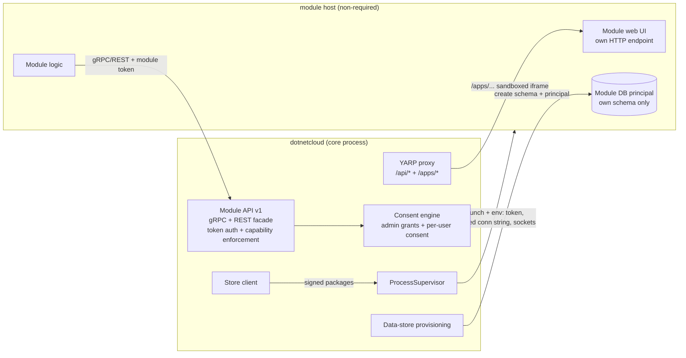

# Third-Party Module Sandbox & Module Store — Implementation Plan

> **Status:** Approved — ready for implementation
> **Branch:** `feature/third-party-module-support`
> **Last Updated:** 2026-09-15
> **Audience:** implementation agents (assumes knowledge of .NET 10 / EF Core / gRPC / Blazor, not of this repo's module history)

---

## 1. Purpose

DotNetCloud's architecture promises that modules are safely isolated, that third-party developers can build modules with the same power as first-party ones, and that an official module registry exists. Today, only the _process_ isolation is real. This program delivers the rest:

1. **Third-party modules must never have direct access to the DotNetCloud database.** Today every module process receives the core's DB connection string (via `config.json`) and connects directly with full credentials.
2. **Third-party modules may have their own data** — through a core-provisioned, scoped database principal they exclusively own, or no database at all.
3. **All access to DotNetCloud data flows through the server API** — a hardened, token-authenticated, capability-enforced gRPC API (canonical) with a REST/JSON facade, plus per-user consent for personal data.
4. **A module store** (Play-Store style, Nextcloud-app-store style) in a separate repository, with signed packages, a review pipeline, and a first-class install/update experience in the CLI, admin UI, and API.
5. **Dogfooding:** every _non-required_ module — first-party or third-party — must use exactly this sandboxed model.

### Goals

- Close every security gap documented in §3.2, with tests proving each closure.
- Ship a non-required module end-to-end through the sandbox + store pipeline (the Example module first).
- Keep required modules (Files, Chat, Contacts, Calendar, Notes, About) working exactly as today.
- Make the third-party developer experience workable: SDK, packaging tool, local-feed testing, plain documentation.

### Non-goals (out of scope for this program)

- Per-module OS user isolation (Linux systemd per-module users). Documented as future hardening.
- Moving required modules out of the `core` schema or off their current access model.
- Store features beyond the first pass: ratings/reviews, paid modules, publisher self-service portals, automated behavior analysis.
- macOS client work (unrelated to this program).
- Zero-knowledge encryption interactions with module data (unchanged rules apply).

---

## 2. Locked decisions

These were explicitly decided with the project owner. **Do not revisit during implementation.**

| #   | Decision                                                                                                                                                                                                                                                                                                           | Rationale                                                                                            |
| --- | ------------------------------------------------------------------------------------------------------------------------------------------------------------------------------------------------------------------------------------------------------------------------------------------------------------------ | ---------------------------------------------------------------------------------------------------- |
| 1   | Module-owned data: manifest-declared `dataStore: "isolated" \| "none"`; core provisions a scoped DB principal + schema; module self-migrates.                                                                                                                                                                      | Keeps EF Core developer experience; makes cross-schema access impossible at the DB layer.            |
| 2   | Authorization is **hybrid**: admin-granted capabilities (system scope) **plus per-user consent** for personal data (OIDC scopes + consent UI).                                                                                                                                                                     | Admin controls platform power; users control their own data. Mirrors the existing OpenIddict scopes. |
| 3   | Module→core API: **gRPC canonical** (extend/harden the existing capability service) + **internal REST/JSON facade** for language-agnostic module backends.                                                                                                                                                         | Matches the mandatory gRPC architecture; REST keeps the sandbox approachable.                        |
| 4   | Required modules keep today's access (shared `core` schema, core-managed migrations, current credentials, in-process Blazor UI). **All non-required modules** (first-party optional + third-party) use the unified sandboxed model and must be dogfooded.                                                          | Required modules are a core part; everything else must prove the third-party path works.             |
| 5   | Module UI: module-hosted web UI embedded in a **sandboxed iframe** via the core proxy + `postMessage` handshake.                                                                                                                                                                                                   | Third-party assemblies cannot load into the core process without destroying process isolation.       |
| 6   | Store: full platform in repo **`DotNetCloud.ModuleStore`** (private initially, public at launch); frontend lives in that repo; Ed25519 signing (curated store key + verified-publisher keys); sites `www.dotnetcloud.net` + `modules.dotnetcloud.net` on Cloudflare Pages, independent of the live cloud instance. | Self-contained store; private-first development; no coupling to `cloud.dotnetcloud.net`.             |
| 7   | SDK (`DotNetCloud.Modules.Sdk`) distributed via **GitHub Packages**.                                                                                                                                                                                                                                               | Avoids a NuGet.org dependency while keeping the dev workflow one command.                            |
| 8   | Transport hardening: **per-module Unix sockets (0600) / Named Pipes (ACL'd)** for gRPC + proxied HTTP, plus **per-module tokens** for identity.                                                                                                                                                                    | Removes cross-module reachability and header spoofing in one move.                                   |
| 9   | PostgreSQL provisioning requires `CREATEROLE` on the app role (accepted). SQL Server uses **contained database users** (see A1).                                                                                                                                                                                   | Both keep the app account's existing privilege level as low as each engine allows.                   |
| 10  | Iframe home widgets ship **in the first pass**. Package hosting at launch = **GitHub Release assets**.                                                                                                                                                                                                             | Widget parity for non-required modules; stable, CDN-backed downloads.                                |
| 11  | Execution is two **parallel tracks** (sandbox + store), converging at public launch.                                                                                                                                                                                                                               | Store distribution without the sandbox would expose users; sequential would stall momentum.          |

---

## 3. Current-state inventory (read this first)

### 3.1 How a module runs today

- `ProcessSupervisor.SpawnModuleProcess` (`src/Core/DotNetCloud.Core.Server/Supervisor/ProcessSupervisor.cs`) launches each module's host executable with:
  - `DOTNETCLOUD_MODULE_ID`, `DOTNETCLOUD_GRPC_ENDPOINT` (loopback TCP port), `DOTNETCLOUD_CORE_ENDPOINT`
  - forwarded `DOTNETCLOUD_CONFIG_DIR` and `DOTNETCLOUD_DATA_DIR`
- Module hosts load `config.json` from `DOTNETCLOUD_CONFIG_DIR` and connect a module-owned `DbContext` to the **same database, with the same credentials** as core (see `src/Modules/Example/DotNetCloud.Modules.Example.Host/Program.cs` and the Files host).
- Module→core capability calls go through gRPC (`CoreCapabilities` service defined in `src/Core/DotNetCloud.Core.Grpc/Protos/module_capabilities.proto`, implemented by `CoreCapabilitiesServiceImpl` in `src/Core/DotNetCloud.Core.Server/Grpc/Services/GrpcHealthServiceImpl.cs`).
- Core→module REST calls are reverse-proxied by YARP (`MapModuleApiProxies` in `src/Core/DotNetCloud.Core.Server/Program.cs`), which forwards the **user's auth cookie** and relies on the shared DataProtection key ring.
- Module UI is compiled into the core process: `ModuleUiRegistrationHostedService` (static `typeof(...)` page descriptors), `WidgetUiRegistrationHostedService` (home widgets), and `AddAdditionalAssemblies` in `Program.cs`. `DotNetCloud.Core.Server.csproj` holds `<ProjectReference>`s to every module's lib, Data, Data.SqlServer, and Widget projects.
- `manifest.json` v1 fields: `id`, `name`, `version`, `description`, `author`, `requiredCapabilities`, `publishedEvents`, `subscribedEvents`, `minCoreVersion`, `restartPolicy`, `memoryLimitMb`, `schemaProvider`.
- Schema strategy: required modules share the `core` schema; optional modules have dedicated schemas — but all with the same core credentials.

### 3.2 Security gaps being closed

| #   | Gap                                                                                                                                                                  | Evidence                                                                                       | Closed by                                      |
| --- | -------------------------------------------------------------------------------------------------------------------------------------------------------------------- | ---------------------------------------------------------------------------------------------- | ---------------------------------------------- |
| 1   | Every module process can read core DB credentials (`config.json` contains `connectionString`, admin identity, TLS paths) and read/write any schema in the database.  | `ProcessSupervisor.cs` env forwarding; `config.json` written by setup                          | A1 (scoped principals, config split)           |
| 2   | Module identity is a spoofable `module-id` gRPC metadata header — any local process can impersonate any module.                                                      | `src/Core/DotNetCloud.Core.Server/Grpc/Interceptors/AuthenticationInterceptor.cs`              | A2 (per-module tokens)                         |
| 3   | `ModuleCapabilityGrant` rows are validated only at startup; capability calls are not enforced per call.                                                              | `CapabilityValidator` vs `CoreCapabilitiesServiceImpl`                                         | A2 (`ModuleAccessEvaluator`)                   |
| 4   | Module processes share the core DataProtection key ring (cookie forgery risk), listen on loopback TCP (any local process can connect), and share one data directory. | Files host `AddDataProtection(...)`; `Listen(IPAddress.Loopback, ...)`; `DOTNETCLOUD_DATA_DIR` | A1 (key ring + dirs) + A4 (per-module sockets) |
| 5   | Third-party module UI is impossible, and optional first-party UI/widgets run **in-process** in the core web app.                                                     | `ModuleUiRegistrationHostedService`, `WidgetUiRegistrationHostedService`, csproj references    | A5 (iframe plane) + Track C                    |

### 3.3 What stays unchanged

For **required modules only** — `dotnetcloud.files`, `dotnetcloud.chat`, `dotnetcloud.contacts`, `dotnetcloud.calendar`, `dotnetcloud.notes`, `dotnetcloud.about` (`RequiredModules.cs`):

- Shared `core` schema, core-managed migrations, current connection-string delivery.
- In-core Blazor pages and home widgets.
- They DO receive the A2 hardening (token auth + runtime capability enforcement) because those are transport/authorization changes to the core API, not access-model changes.

### 3.4 Infrastructure to reuse (do not reinvent)

- `IModuleSchemaProvider` split (`DbContextSchemaProvider` / `SelfManagedSchemaProvider` / `ModuleSchemaService`) — extend, don't replace.
- `CapabilityValidator` tier lists — extract to a shared `CapabilityCatalog` in `DotNetCloud.Core` used by validator, evaluator, and SDK.
- `GitHubUpdateService` + `UpdateController` + caching/semver patterns — template for the store index client.
- OpenIddict application seeding (`OidcClientSeeder`) with custom scopes (`files:read`, `files:write`) and `ConsentTypes.Explicit` — template for module OIDC clients and per-user consent.
- `IAuditLogger` + `AuditLogService` — all new security events are audit-logged.
- `IProcessSupervisor` health monitoring + `ResourceLimiter` — extend with sandbox status.
- Test infrastructure: `tests/DotNetCloud.Core.Server.Tests`, `tests/DotNetCloud.Integration.Tests.PostgreSQL`, `tests/DotNetCloud.Integration.Tests.SqlServer`, `tests/DotNetCloud.CLI.Tests`, `tests/DotNetCloud.Modules.Example.Tests`.

### 3.5 Related repositories (separate workstreams)

| Repo                                               | Role in this program                                                                                         | Notes                                                                     |
| -------------------------------------------------- | ------------------------------------------------------------------------------------------------------------ | ------------------------------------------------------------------------- |
| `DotNetCloud.ModuleStore` (new, private initially) | Store packages, index, tooling, policy, store frontend                                                       | Goes public at launch                                                     |
| `DotNetCloud-WebSite` (existing)                   | `www.dotnetcloud.net` marketing site                                                                         | Static HTML/CSS/JS; add a Modules/Store entry; deploy to Cloudflare Pages |
| This repo (`DotNetCloud`)                          | Core sandbox (Track A), store client (B3), packaging tool (B1), dogfood migrations (Track C), docs (Track D) | Branch `feature/third-party-module-support`                               |

**Rule:** no committed document in this repo may reference private deployment topology (host names, IPs, machine names). The store and sites must not depend on the production cloud instance.

---

## 4. Target architecture



### 4.1 Trust tiers

| Tier                                      | Modules                                                     | DB access to `dotnetcloud`                      | Config visibility            | UI hosting                 |
| ----------------------------------------- | ----------------------------------------------------------- | ----------------------------------------------- | ---------------------------- | -------------------------- |
| **Required** (in-repo, shipped with core) | files, chat, contacts, calendar, notes, about               | Current: shared `core` schema, core credentials | `config.json` (unchanged)    | In-core Blazor (unchanged) |
| **Bundled optional** (in-repo, dogfooded) | ai, bookmarks, email, music, photos, video, tracks, example | Own schema via scoped principal only            | Sanitized `module.json` only | Module-hosted iframe       |
| **Store** (third-party)                   | any                                                         | Own schema via scoped principal only, or none   | Sanitized `module.json` only | Module-hosted iframe       |

### 4.2 Data plane

- A non-required module never sees the core connection string. It receives `DOTNETCLOUD_MODULE_DB_CONNECTION_STRING` (only when `dataStore: "isolated"`), valid **only** for its own schema and principal.
- The core provisions principals idempotently at install/first-start and stores the connection string encrypted with DataProtection in `ModuleDataStore`.
- The module self-migrates (existing `schemaProvider: "self"` pattern from the Example module).
- Uninstall destroys the principal + schema on explicit admin confirmation; a "keep data" option marks the store orphaned instead.

### 4.3 API plane

- One service definition (`module_api.proto`, package `dotnetcloud.moduleapi.v1`) is the canonical module→core contract; the legacy `module_capabilities.proto` surface keeps working for required modules and maps to the same implementation.
- Every call is authenticated by `dnc-module-id` + `dnc-module-token` metadata; the token is generated at install, stored as SHA-256, and rotatable/revocable.
- Every RPC maps to a capability name; `ModuleAccessEvaluator` checks grants (cached, invalidated on grant/revoke), denies with `PERMISSION_DENIED`/403, and audit-logs denials.
- REST/JSON facade on the same internal listener (`/internal/moduleapi/v1/...`) with identical auth + evaluation, per-module rate limits, and the standard error envelope.

### 4.4 Consent plane

- Personal-data access requires a per-user consent grant for the (module, user, scope) tuple — on top of the admin's capability grant.
- Consent is modelled on OpenIddict: each installed module is registered as an OAuth2 client (`dnc-module-<short>`); user consent is an explicit authorization grant for the module's declared scopes.
- A user-facing "Connected apps" page lists modules with access, scopes, and a revoke action; admins see consent stats on module detail pages.
- When an update introduces new scopes, the module runs until it needs the new scope, then users are re-prompted.

### 4.5 UI plane

- Non-required modules serve their UI from their own host process; the core proxies `/apps/{moduleId}/**` (YARP, per-module socket) and embeds it in `ModuleAppHost.razor` with `sandbox="allow-scripts allow-forms allow-popups"` (deliberately **no** `allow-same-origin`).
- A `postMessage` handshake provides theme/locale/token and supports `navigate`, `resize`, `title`, `openExternal`, `requestConsent`, `notify` events. The SDK ships `dncModuleBridge.js`.
- The proxy strips `Set-Cookie`, injects a short-lived user-scoped bearer token for module backend calls, and sets `frame-ancestors 'self'`.
- Home widgets for non-required modules render as iframe widget cards using the same plane.

### 4.6 Distribution plane

- `.dncpkg` package = deterministic zip (manifest v2, per-RID binaries, Ed25519 signature, LICENSE/README/CHANGELOG/icon).
- Store index (v1 JSON) lists packages/versions with hashes, signatures, compatibility ranges, declared capabilities/scopes, and review status; index signed with the curated store key.
- Core store client: fetch index (cache, offline fallback, mirrors) → verify → review capabilities/scopes with the admin → provision → install/update → health-check → rollback support.

### 4.7 Manifest v2 (non-required modules)

```json
{
  "manifestVersion": 2,
  "id": "org.example.customapp",
  "name": "Custom App",
  "version": "1.2.0",
  "description": "…",
  "publisher": {
    "id": "example-org",
    "name": "Example Org",
    "url": "https://example.org"
  },
  "moduleApiVersion": 1,
  "minCoreVersion": "0.5.0",
  "maxCoreVersion": "1.0.0",
  "dataStore": "isolated",
  "capabilities": ["INotificationService", "IStorageProvider"],
  "userConsentScopes": ["files:read", "calendar:write"],
  "events": {
    "publishes": ["ThingCreatedEvent"],
    "subscribes": ["FileUploadedEvent"]
  },
  "ui": {
    "type": "iframe",
    "entryPath": "/",
    "navItems": [
      { "id": "custom", "label": "Custom App", "icon": "widgets", "path": "/" }
    ]
  },
  "resources": { "memoryLimitMb": 256 },
  "restartPolicy": "backoff"
}
```

Validation rules (enforced by `ModuleManifestLoader`):

- `manifestVersion` defaults to 1; v1 modules keep today's behavior (required-module compatibility).
- `dataStore` must be `"isolated"` or `"none"`; any other value fails validation. Default for v2 non-required modules without `dataStore`: `"none"` (safe default).
- `ui.type` only supports `"iframe"` for non-required modules.
- Required modules must NOT declare `dataStore`/`ui`; new fields are ignored for them.
- IDs remain reverse-DNS, lowercase.

### 4.8 New database objects (Core.Data, both providers)

| Entity                     | Key                           | Columns                                                                                                                                                                                            |
| -------------------------- | ----------------------------- | -------------------------------------------------------------------------------------------------------------------------------------------------------------------------------------------------- |
| `ModuleCredential`         | `ModuleId`                    | `TokenHash` (SHA-256 hex), `TokenHint` (first 8 chars, UI display), `CreatedAtUtc`, `RotatedAtUtc?`, `RevokedAtUtc?`                                                                               |
| `ModuleDataStore`          | `ModuleId`                    | `Provider`, `SchemaName`, `PrincipalName`, `EncryptedConnectionString` (DataProtection), `Status` (`Pending`/`Active`/`Error`/`Orphaned`/`Dropping`), `LastError?`, `CreatedAtUtc`, `UpdatedAtUtc` |
| `ModuleUserConsent`        | (`ModuleId`,`UserId`,`Scope`) | `GrantedAtUtc`, `ExpiresAtUtc?`, `RevokedAtUtc?`, `GrantSource` (`OidcConsent`/`Admin`)                                                                                                            |
| `InstalledModule` (extend) | —                             | `TrustTier` (`Required`/`Bundled`/`Store`), `PublisherId?`, `SignedByKeyId?`, `DataStoreMode`, `SandboxStatus` (`Active`/`PendingProvisioning`/`Error`/`LegacyOverride`)                           |

EF migrations for PostgreSQL (`Core.Data/Migrations`) and SQL Server (`Core.Data.SqlServer/Migrations`), entity configurations under `Configuration/Modules/`.

### 4.9 Store index v1 (served from `modules.dotnetcloud.net`)

```json
{
  "schemaVersion": 1,
  "generatedAt": "2026-09-15T12:00:00Z",
  "signature": { "keyId": "store-2026", "value": "base64…" },
  "packages": [
    {
      "id": "org.example.customapp",
      "name": "Custom App",
      "publisher": {
        "id": "example-org",
        "name": "Example Org",
        "verified": false
      },
      "summary": "…",
      "source": "https://github.com/example/customapp",
      "iconUrl": "https://modules.dotnetcloud.net/icons/org.example.customapp.png",
      "screenshots": ["…"],
      "versions": [
        {
          "version": "1.2.0",
          "minCoreVersion": "0.5.0",
          "maxCoreVersion": "1.0.0",
          "moduleApiVersion": 1,
          "dataStore": "isolated",
          "capabilities": ["INotificationService"],
          "userConsentScopes": ["files:read"],
          "publishedAt": "2026-09-14T09:00:00Z",
          "downloadUrl": "https://github.com/…/customapp-1.2.0.dncpkg",
          "size": 8123456,
          "sha256": "…",
          "signature": { "keyId": "store-2026", "value": "base64…" },
          "reviewStatus": "reviewed",
          "yanked": false
        }
      ]
    }
  ]
}
```

### 4.10 `.dncpkg` package layout

```
<id>-<version>.dncpkg            (zip, deterministic: sorted entries, fixed timestamps)
├── manifest.json                (v2)
├── signature.json               ({ keyId, algorithm: "ed25519", value, sha256 of package })
├── LICENSE
├── README.md
├── CHANGELOG.md
├── icon.png
└── files/
    ├── linux-x64/               (self-contained publish output)
    └── win-x64/
```

---

## 5. Track A — Module sandbox (this repo)

### Phase A1 — Isolation foundation

**Status:** ☐ Not started
**Effort:** Large (~2–3 weeks)
**Blocks:** everything else in Track A and B3.

**Deliverables**

- ☐ Manifest v2 in `src/Core/DotNetCloud.Core.Server/ModuleLoading/ModuleManifestLoader.cs` (`ModuleManifestData` + validation rules per §4.7).
- ☐ New entities + configurations + migrations for `ModuleCredential`, `ModuleDataStore`, and extended `InstalledModule` (§4.8).
- ☐ `IModuleDataStoreProvisioningService` + implementation (PostgreSQL + SQL Server), with prereq detection, idempotent ensure, credential rotation, drop, and encrypted connection-string storage.
- ☐ `ProcessSupervisor` env-split: non-required modules stop receiving `DOTNETCLOUD_CONFIG_DIR`/`DOTNETCLOUD_DATA_DIR`; new per-module config/data/run directories; new env vars (§5.1).
- ☐ Sanitized `module.json` writer + module host template update (`Example` first), self-migration against the scoped connection string.
- ☐ DataProtection key ring no longer shared with non-required modules.
- ☐ Setup-wizard prerequisite checks (CREATEROLE / containment) with exact remediation output.
- ☐ Admin + CLI plumbing: data-store status, provision, rotate credentials, destroy.
- ☐ Tests: provisioning SQL generation, prereq detection, config split, supervisor launches with sandbox env (unit + integration on both providers).

**Implementation notes**

1. **Prerequisites the core checks (and how):**
   - PostgreSQL: `SELECT rolcreaterole FROM pg_roles WHERE rolname = current_user;` — if false, fail with remediation: `ALTER ROLE <approle> CREATEROLE;` (documented in the install docs; safe to run on existing installs).
   - SQL Server: `SELECT value_in_use FROM sys.configurations WHERE name = 'contained database authentication';` (must be 1) and `SELECT containment_desc FROM sys.databases WHERE name = DB_NAME();` (must be `PARTIAL`). Remediation: `sp_configure 'contained database authentication', 1; RECONFIGURE;` (admin, once) and `ALTER DATABASE [dotnetcloud] SET CONTAINMENT = PARTIAL;` (the app's `db_owner` can do this itself — do it automatically on first provisioning).
   - If a prerequisite cannot be met, provisioning fails with a clear admin-visible error (`ModuleDataStore.Status = Error`, `LastError` shown in the admin UI). Modules are **not started** until provisioned, unless the transitional override (§9) is explicitly enabled.
2. **PostgreSQL provisioning sequence (per module):**
   - `CREATE ROLE dnc_mod_<x> LOGIN PASSWORD '<generated>' CONNECTION LIMIT 10;`
   - `ALTER ROLE dnc_mod_<x> IN DATABASE <db> SET search_path = <schema>;`
   - `GRANT dnc_mod_<x> TO <approle>;` (so the app can create a schema owned by the role), then `CREATE SCHEMA <schema> AUTHORIZATION dnc_mod_<x>;`, then `REVOKE dnc_mod_<x> FROM <approle>;` (ownership persists; re-grant temporarily for future re-provision operations).
   - Rotation: `ALTER ROLE dnc_mod_<x> WITH PASSWORD '<new>';`
   - Drop: `DROP SCHEMA IF EXISTS <schema> CASCADE;` → `DROP OWNED BY dnc_mod_<x>;` → `DROP ROLE dnc_mod_<x>;`
3. **SQL Server provisioning sequence (per module):**
   - `CREATE USER [dnc_mod_<x>] WITH PASSWORD = '<generated>';` (contained database user — no server login, no `securityadmin` needed)
   - `EXEC('CREATE SCHEMA [<schema>] AUTHORIZATION [dnc_mod_<x>]');` (dynamic — schema names are identifiers)
   - `ALTER USER [dnc_mod_<x>] WITH DEFAULT_SCHEMA = [<schema>];`
   - Rotation: `ALTER USER [dnc_mod_<x>] WITH PASSWORD = '<new>';`
   - Drop: enumerate `sys.tables` in the schema and drop them, `DROP SCHEMA [<schema>];`, `DROP USER [dnc_mod_<x>];`
   - Fallback mode (containment forbidden by policy): optional provisioning credential (server-level) that can `CREATE LOGIN` + `CREATE USER FOR LOGIN`; documented, off by default.
4. **Connection strings** are derived from the core connection string with the principal swapped in (parse with `NpgsqlConnectionStringBuilder` / `SqlConnectionStringBuilder`; preserve host/port/database/TLS options; never log the password). Encrypted with `IDataProtectionProvider` purpose `"ModuleDataStore.v1"`; **`dotnet export/datastore reset-credentials` recovery path exists** because losing the DataProtection key ring would otherwise strand module credentials (§11, risk 1).
5. **Modules with `dataStore: "none"`** skip provisioning entirely; they persist state through module settings (KV via `IModuleSettings`) and/or their own files in the per-module data directory.

**§5.1 Environment matrix (ProcessSupervisor)**

| Env var                                   | Required modules       | Non-required modules (today) | Non-required modules (after A1)                            |
| ----------------------------------------- | ---------------------- | ---------------------------- | ---------------------------------------------------------- |
| `DOTNETCLOUD_MODULE_ID`                   | ✓                      | ✓                            | ✓                                                          |
| `DOTNETCLOUD_GRPC_ENDPOINT`               | ✓                      | ✓                            | ✓ (socket form after A4)                                   |
| `DOTNETCLOUD_CORE_ENDPOINT`               | ✓                      | ✓                            | ✓                                                          |
| `DOTNETCLOUD_CONFIG_DIR`                  | ✓ (core `config.json`) | ✓ (core `config.json`)       | **removed**                                                |
| `DOTNETCLOUD_DATA_DIR`                    | ✓                      | ✓                            | **removed**                                                |
| `DOTNETCLOUD_MODULE_CONFIG_DIR`           | —                      | —                            | new: sanitized `module.json` directory                     |
| `DOTNETCLOUD_MODULE_DATA_DIR`             | —                      | —                            | new: per-module data directory (0700)                      |
| `DOTNETCLOUD_MODULE_TOKEN`                | —                      | —                            | new: per-module API token (A2)                             |
| `DOTNETCLOUD_MODULE_DB_CONNECTION_STRING` | —                      | —                            | new: scoped connection string when `dataStore: "isolated"` |

Per-module directories: `<dataDir>/modules/<moduleId>/{config,data,run}` created with 0700 permissions; `module.json` contains only non-secret topology (core endpoints, module ID, version, dataStore mode).

---

### Phase A2 — Module API v1 (auth, enforcement, SDK)

**Status:** ☐ Not started
**Effort:** Large (~2–3 weeks)
**Depends on:** A1 (entities/ids); can start the proto/SDK work in parallel with A1's tail.

**Deliverables**

- ☐ `src/Core/DotNetCloud.Core.Grpc/Protos/module_api.proto` — `dotnetcloud.moduleapi.v1` service: lifecycle, directories (user/group/team), notifications, events, settings, audit, search submit, realtime broadcast, consent query. Legacy `module_capabilities.proto` mapped to the same implementation.
- ☐ `ModuleCredentialService`: generate (32 random bytes, base64url), hash (SHA-256), issue at install/registration, rotate, revoke; `dnc-module-id` + `dnc-module-token` metadata/headers are mandatory on every module→core call (required modules included).
- ☐ Rewritten `AuthenticationInterceptor` + REST middleware: constant-time comparison, `UserState` population, clear `Unauthenticated` failures, audit on failures.
- ☐ `ModuleAccessEvaluator` with per-RPC capability mapping sourced from a shared `CapabilityCatalog` (`DotNetCloud.Core`), grant cache with invalidation hooks on grant/revoke, audit on denials.
- ☐ Internal REST facade `/internal/moduleapi/v1/*` (same auth/evaluation; standard envelope; per-module rate limits).
- ☐ Per-module rate limits/quotas (`Modules:RateLimits` config; defaults applied).
- ☐ `src/SDK/DotNetCloud.Modules.Sdk/` project with manifest v2 types, gRPC/REST clients, lifecycle base, JS bridge (A5), and an in-memory test harness; CI workflow publishing to GitHub Packages.
- ☐ Example module rewritten against the SDK (reference implementation).
- ☐ Tests: token issue/verify/rotate/revoke, spoofing rejection, enforcement allow/deny paths, rate limiting, SDK client round-trip against the test harness.

**Implementation notes**

1. Token header constants live in the SDK (`DncModuleHeaders.ModuleId` = `dnc-module-id`, `.ModuleToken` = `dnc-module-token`) so modules and core cannot drift.
2. The evaluator's capability map is derived from the shared catalog; the required-capability list from the manifest only decides _what must be granted before start_, not what each call needs.
3. Enforcement closes gap #3 for **all** modules. Required-module hosts are updated in the same release to send tokens (small host change; their DB/config access is untouched).
4. Denied calls return a stable code (`MODULE_CAPABILITY_NOT_GRANTED`) and write an audit entry; rate-limit rejections return `MODULE_RATE_LIMITED`.
5. The SDK version tracks the core version from `Directory.Build.props`; `moduleApiVersion` (manifest) gates compatibility.

---

### Phase A3 — User consent (hybrid authorization)

**Status:** ☐ Not started
**Effort:** Large (~2 weeks)
**Depends on:** A2 (token auth for the consent RPCs); can proceed in parallel with A4.

**Deliverables**

- ☐ Scope catalog in `DotNetCloud.Core` (single source for core, SDK, docs): `profile`, `files:read|write`, `contacts:read|write`, `calendar:read|write`, `notes:read|write`, `mail:read|write`, `chat:read|write`, `tracks:read|write`, `photos:read|write`, `music:read|write`, `video:read|write`, `bookmarks:read|write`, `notifications:send`. Aligned with existing OpenIddict scopes.
- ☐ `ModuleUserConsent` entity + `IModuleConsentService` (grant/revoke/expire/query; audit).
- ☐ Consent enforcement decorators on user-scoped capability implementations (directory lookups that include email, and all module-scoped data RPCs); denial code `MODULE_CONSENT_REQUIRED` includes the scopes needed.
- ☐ Module OIDC client registration at install (`dnc-module-<short>`; confidential secret stored like module credentials; explicit consent; declared scopes) + consent page (extend the existing OpenIddict authorization flow; implement the consent UI if absent).
- ☐ Permission mapping table: capability → required scopes for user data (documented in `docs/modules/MODULE_SECURITY.md`).
- ☐ User UI: "Connected apps" page (list, scopes in plain language, revoke); consent prompt; admin module detail shows consent overview + revoke-on-behalf ability.
- ☐ Module-facing RPCs: `CheckUserConsent(userId, scopes)` / `GetGrantedScopes(userId)` so modules can degrade gracefully.
- ☐ Tests: grant/revoke/expire paths, denial codes, OIDC consent round-trip, update-with-new-scopes re-prompt, revoke invalidates in-flight usage on next call.

**Implementation notes**

1. Consent is per (module, user, scope) — a module still needs the admin's capability grant to reach the code path at all; consent decides _whose_ data it can touch.
2. System-scope capabilities (`INotificationService`, `IEventBus`, settings, search submit, audit) never require user consent — they are admin-granted only.
3. Users with no consent who are targeted by a module call cause `MODULE_CONSENT_REQUIRED`; the module UI triggers `requestConsent` (A5) which launches the OIDC authorization flow.
4. Consent records survive module updates; new scopes in a new version are simply not granted yet.

---

### Phase A4 — Transport hardening (per-module sockets)

**Status:** ☐ Not started
**Effort:** Medium (~1–1.5 weeks)
**Depends on:** A1 (directory layout).

**Deliverables**

- ☐ Endpoint allocation in `ProcessSupervisor`: `<dataDir>/modules/<moduleId>/run/module.sock` (0600) on Linux; `\\.\pipe\dotnetcloud-<moduleId>` with an explicit `PipeSecurity` ACL on Windows; passed to the host as `DOTNETCLOUD_GRPC_ENDPOINT` in socket form.
- ☐ Module hosts: Kestrel `ListenUnixSocket(...)` / `ListenNamedPipe(...)`; remove the loopback TCP listener for modules.
- ☐ Core clients: `GrpcChannelManager` and the YARP proxy use `ConnectCallback`-based custom transports for Unix sockets and named pipes.
- ☐ `Modules:Transport` setting (`Auto` default; `Sockets`; `Tcp` fallback documented for constrained hosts such as Docker without a shared socket volume).
- ☐ Docs: transport matrix + Docker volume guidance.
- ☐ Tests: socket creation/permissions, gRPC + REST round-trips over sockets, cross-module connect failure (a module cannot reach another module's socket), TCP fallback path.

**Implementation notes**

1. Kestrel supports both HTTP/1.1 and HTTP/2 over UDS on .NET 10; if a specific platform combination (e.g., named pipes) rejects HTTP/2, keep gRPC on HTTP/2-over-socket where supported and fall back to TCP+token for that platform — record the finding in the docs and keep the token layer as the identity guarantee regardless of transport.
2. Socket files are removed by the supervisor on stop/restart to avoid stale-connection hangs; Windows pipes are inherently ephemeral.
3. Symmetric hardening (core→module call authentication) is out of scope: modules' sockets are only reachable by the core process due to filesystem/ACL permissions, which covers the threat.

---

### Phase A5 — Iframe UI plane

**Status:** ☐ Not started
**Effort:** Large (~2–3 weeks)
**Depends on:** A4 (proxy transport), A3 (consent events).

**Deliverables**

- ☐ `ModuleAppRegistry` (`src/UI/DotNetCloud.UI.Web/Services/`) + `ModuleAppRegistrationHostedService` reading installed modules' v2 manifests; required modules keep the static Blazor registration path.
- ☐ Proxy route `/apps/{moduleId}/{**catch-all}` (new `MapModuleAppProxies` in `Program.cs`): authenticated users only, module-running check (503 otherwise), `Set-Cookie` stripping, `frame-ancestors 'self'`, `nosniff`, cache headers, per-module rate limits, short-lived user-scoped bearer token injection for the module backend.
- ☐ `ModuleAppHost.razor`: sandboxed iframe, message protocol (`dnc:init`, `dnc:ready`, `dnc:navigate`, `dnc:resize`, `dnc:title`, `dnc:openExternal`, `dnc:requestConsent`, `dnc:notify`), loading/error/stopped states, theme/locale propagation.
- ☐ Nav integration via `ModuleUiRegistry`/`ModuleIconProvider`; widget plane: `WidgetUiRegistry` iframe-card descriptor + `WidgetCard` iframe rendering with postMessage height contract (**first pass**).
- ☐ SDK: `dncModuleBridge.js` + typed JS wrapper + static-asset conventions (`wwwroot` served under the proxied path base).
- ☐ Tests: proxy security (cookie stripping, frame-ancestors, 503 when stopped), handshake protocol, nav registration from manifests, widget card rendering, external-link handling.

**Implementation notes**

1. Sandbox is deliberately opaque-origin (`allow-scripts allow-forms allow-popups`, no `allow-same-origin`): module UI cannot read core storage or cookies; authentication arrives via the proxy-injected token + `postMessage` for consent flows. Document that module UIs keep state server-side.
2. The proxy strips `/apps/{moduleId}` before forwarding so modules serve at `/`; the bridge derives all URLs from `window.location` to stay proxy-agnostic.
3. Optional future hardening (not in this pass): dedicated `apps.<host>` subdomain for true browser-level origin separation.
4. Required modules are explicitly excluded from this plane; their Blazor pages stay in-core.

---

### Phase A6 — Lifecycle, ops, audit

**Status:** ☐ Not started
**Effort:** Medium (~1 week)
**Depends on:** A1–A5.

**Deliverables**

- ☐ Admin UI (`ModuleDetail.razor`, new sections): trust tier, publisher, sandbox status, data-store status + destroy action, token rotate/revoke, consent overview.
- ☐ Uninstall flow: stop → admin chooses keep-or-destroy data → destroy drops schema/principal → files removed → DB records + audit entry. "Keep" marks `ModuleDataStore.Status = Orphaned` with an admin-visible cleanup list.
- ☐ Audit coverage: `ModuleInstalled`, `ModuleUpdated`, `ModuleUninstalled`, `ModuleCredentialRotated`, `ModuleDataStoreProvisioned|Destroyed|Error`, `ModuleCapabilityDenied`, `ModuleConsentGranted|Revoked`, `ModuleRateLimited`.
- ☐ Health/supervision: `SandboxStatus` per module surfaced in admin dashboard and `/health/ready` module rows; supervisor refuses to start unprovisioned `isolated` modules with a clear log message.
- ☐ Backup/restore verification: module schemas are in the same database and covered by existing dumps; document that module credentials depend on the DataProtection key ring (see §11 risk 1) and add the credential-reset recovery path.
- ☐ Tests: admin API endpoints, uninstall matrix (keep/destroy), audit assertions, backup/restore smoke.

---

## 6. Track B — Store platform & websites

### Phase B1 — Package format & tooling (this repo)

**Status:** ☐ Not started
**Effort:** Small–Medium (~1 week)
**Parallel with:** A1–A2.

**Deliverables**

- ☐ `.dncpkg` specification per §4.10 (`docs/modules/MODULE_PACKAGING.md`).
- ☐ `DotNetCloud.ModulePackaging` CLI tool (`tools/` in this repo or a new `src/Tools` project): `pack` (build + stage per-RID publishes + manifest validation + deterministic zip + sign), `verify`, `inspect`.
- ☐ Local-feed format (an `index.json` + packages directory) usable for dev/testing and by integration tests.
- ☐ Sample package fixture: the Example module, built as a `.dncpkg` in CI, stored as a test artifact for installer tests.
- ☐ Tests: determinism (same inputs → byte-identical zip), hash/signature verification, tamper detection, manifest validation failures.

### Phase B2 — Store repo (`DotNetCloud.ModuleStore`)

**Status:** ☐ Not started
**Effort:** Large (~2–3 weeks)
**Parallel with:** A3–A5.

**Deliverables**

- ☐ Repo scaffold (private initially): `packages/`, `index/`, `tools/` (index builder + Ed25519 signer), `policy/`, `site/` (frontend), `.github/workflows/`.
- ☐ Index builder producing `/v1/index.json` + per-package documents, signed with the curated store key (GitHub Actions secret).
- ☐ Validation workflow: JSON schema, semver + immutability (no version rewrites), SHA-256 verification, manifest v2 validation, dependency + secret scanning, SBOM generation.
- ☐ Submission process: PR template, `STORE_POLICY.md`, `REVIEW_CHECKLIST.md`, `PUBLISHER_AGREEMENT.md`, review SLA.
- ☐ Publisher registry (`publishers.json`) with verified publisher Ed25519 public keys (tier 2 signing).
- ☐ Revocation/yank process (`yanked: true` entries; documented operator runbook).
- ☐ Store frontend (browse/search/package detail/publisher page/install instructions) reading the index; deployed to `modules.dotnetcloud.net`; reuses the website's visual language.
- ☐ Private-phase note: while private, index/packages are not anonymously fetchable — the core-side client is developed against the local feed from B1; Release assets become the download source at launch.

### Phase B3 — Core store client (this repo)

**Status:** ☐ Not started
**Effort:** Large (~2–3 weeks)
**Depends on:** A1 (provisioning), A2 (tokens), B1 (packages); can be developed in parallel behind interfaces.

**Deliverables**

- ☐ `IModuleStoreService`: index fetch with cache (1 h TTL), stale/offline fallback, configurable mirrors (`Modules:Store:IndexUrl`, `Modules:Store:Mirrors`).
- ☐ `ModulePackageInstaller` state machine: download → SHA-256 + Ed25519 verify → staging extraction → manifest validate → compatibility check (core version, `moduleApiVersion`) → **admin review of capabilities/scopes** → data-store provisioning → atomic install to `modules/<id>` → `InstalledModules` record → start → health check → rollback on failure (previous version retained).
- ☐ Update checker (`UpdateAvailable` status per module) + `dotnetcloud module update` incl. rollback; revocation respected on updates.
- ☐ CLI (`ModuleCommands.cs`): `search`, `info`, `install`, `update`, `update --all`, `uninstall`, `verify`, `keys`; `--file <x.dncpkg>` sideload requiring `--allow-unverified` (air-gapped installs).
- ☐ Admin UI: `Admin/Store.razor` (browse/search/install with capability + scope consent dialog), updates section, module detail additions.
- ☐ Config: `Modules:Store:IndexUrl`, mirrors, `AllowUnverified`, per-module auto-update policy (**default off for third-party**, patch-only option for official).
- ☐ Tests: index parsing/caching/offline, verification (tamper, bad signature, version mismatch), installer state machine + rollback, revocation handling, CLI command coverage.

### Phase B4 — Websites (`www` + `modules`) on Cloudflare Pages

**Status:** ☐ Not started
**Effort:** Medium (~1–2 weeks)
**Parallel with:** all Track A/B work.

**Deliverables**

- ☐ `www.dotnetcloud.net`: deploy the existing `DotNetCloud-WebSite` repo (static HTML/CSS/JS: home, server, client pages, support; pending image assets tracked in `images/IMAGES_NEEDED.md`); add a "Modules" nav entry + store page linking `modules.dotnetcloud.net`.
- ☐ `modules.dotnetcloud.net`: store frontend deployed from the store repo (Cloudflare Pages GitHub integration); index JSON served from the same origin.
- ☐ Deployment pipelines: Cloudflare Pages for both (source repos vary — direct `wrangler pages deploy` upload for the Gitea-hosted website, GitHub integration for the store repo); documented rollback.
- ☐ DNS + TLS: Cloudflare DNS records for apex, `www`, `modules`; apex redirects to `www`; automatic TLS.
- ☐ Private-first gating: `modules` is held undeployed or gated (Cloudflare Access) until the store launch milestone (§7 of B2); no public index until then.
- ☐ Docs/link updates after launch: `README.md` "Website — Coming soon" line and the `.github/copilot-instructions.md` "Domain Information" section — **requires explicit user approval of the diff before committing** (instruction-file protocol).
- ☐ Smoke checks: both sites reachable over HTTPS, redirects correct, gate active while private, index fetch works.

### Phase B5 — Trust program

**Status:** ☐ Not started
**Effort:** Medium (~1 week, ongoing policy)
**Depends on:** B2.

**Deliverables**

- ☐ Trust tiers: Official (DotNetCloud-signed), Verified publisher (registered Ed25519 keys), Community (curated-signed after review), Unverified (sideload only, `--allow-unverified` + admin warning).
- ☐ Signing key management: key generation, storage in Actions secrets, offline backup, rotation procedure, key pinning list in the core (accepts current + previous key ids).
- ☐ Security review checklist (manifest, capabilities/scopes least-privilege, network behavior, telemetry declaration, license).
- ☐ Takedown/revocation runbook coordinated with `docs/security/VULNERABILITY_DISCLOSURE.md`.

---

## 7. Track C — Dogfood migrations (non-required first-party modules)

**Status:** ☐ Not started
**Effort:** Large (per-module; order below balances risk)
**Depends on:** A1/A2 for the data plane, A5 for the UI plane.

Per module, four workstreams:

1. **Data plane** — manifest v2 + `dataStore: "isolated"`; sanitized `module.json`; scoped credentials + self-migration verified; capability calls via SDK + token; consent scopes declared.
2. **UI plane** — convert in-core Blazor pages to module-hosted UI (iframe); move widgets to iframe cards.
3. **Decouple** — remove the module's `<ProjectReference>`s (lib, Data, Data.SqlServer, Widget) from `DotNetCloud.Core.Server.csproj`; remove its entries from `ModuleUiRegistrationHostedService`, `WidgetUiRegistrationHostedService`, and `AddAdditionalAssemblies`; delete core-managed migration paths for it (`DbContextSchemaProvider` mapping entry).
4. **Distribute** — build as `.dncpkg`; include in the offline "official bundle" and publish to the store.

Order and module checklist:

- ☐ **Example** — first; validates the whole path as the SDK reference.
- ☐ **Bookmarks** — smallest data + UI surface.
- ☐ **Email** — data plane only needs settings + own storage; moderate UI.
- ☐ **AI** — depends on core AI capability plumbing; verify provider settings migration.
- ☐ **Music** — large UI; validate widget conversion.
- ☐ **Photos** — large UI; media path checks.
- ☐ **Video** — largest media UI after Tracks; streaming/REST proxy checks.
- ☐ **Tracks** — largest surface; do last with all learnings applied.

A module completes the checklist only when: no ProjectReference remains, it runs sandboxed with scoped credentials, its UI renders through `/apps/<id>`, its tests pass, and its `.dncpkg` installs cleanly on a fresh test server.

---

## 8. Track D — Documentation & process

**Status:** ☐ Not started
**Parallel with:** all tracks (write as you go).

**Deliverables**

- ☐ This plan committed at `docs/THIRD_PARTY_MODULE_SANDBOX_AND_STORE_PLAN.md`.
- ☐ `docs/architecture/ARCHITECTURE.md` §5 (module system & security), §12 (API design), §13 (data model) updated to describe trust tiers, the module API, consent, transport, and the store.
- ☐ `docs/security/CROSS_MODULE_TRUST.md` updated so every claim it makes (sockets, permissions, authentication) is **true** after A2/A4.
- ☐ `docs/guides/MODULE_DEVELOPMENT.md` rewritten around manifest v2, the SDK, packaging, and the sandbox model.
- ☐ New docs: `docs/modules/MODULE_SECURITY.md`, `docs/modules/MODULE_STORE.md`, `docs/modules/MODULE_UI_HOSTING.md`, `docs/modules/MODULE_PACKAGING.md`.
- ☐ Deployment docs: provisioning prerequisites (PostgreSQL `CREATEROLE`, SQL Server containment), socket transport + Docker volumes, store mirror / air-gapped install (`--file`, `AllowUnverified`), backup/restore note on module credentials.
- ☐ `docs/IMPLEMENTATION_CHECKLIST.md` + `docs/MASTER_PROJECT_PLAN.md` updated with targeted edits (✓/☐) as each phase completes — the only status-tracking formats are `✓` and `☐`.

---

## 9. Upgrade path for existing installs

1. On first start after upgrade, a `ModuleSandboxMigrationHostedService` provisions credentials + data stores for already-installed non-required modules (adopting their existing schemas — no data movement), registers their OIDC clients, and marks `SandboxStatus = Active`.
2. Required modules are untouched.
3. If provisioning prerequisites are missing, non-required modules are held with `SandboxStatus = Error` + admin guidance, **unless** the transitional `Modules:AllowLegacyAccess=true` override is set. The override is admin-only, audit-logged, marked deprecated in the admin UI, and documented for removal after 1.0.
4. Schema additions are additive; rolling back binaries leaves harmless extra tables. Module data stores remain intact across rollback.
5. Docker deployments require a shared volume for module sockets; otherwise use `Modules:Transport=Tcp` (token auth still enforced) — documented.

---

## 10. Verification plan

**Unit** — manifest v2 validation (all rules §4.7); token generation/rotation/revocation + constant-time compare; evaluator allow/deny/audit + cache invalidation; consent grant/revoke/expire; provisioning SQL generation (both providers incl. prereq detection + remediation strings); connection-string derivation (no secret leakage in logs); package verification (hash, signature, tamper, wrong key, wrong version); index parsing/caching/offline/mirror fallback; installer state machine + rollback; CLI commands; proxy security (cookie stripping, frame-ancestors, token injection, 503 when module stopped); `ModuleAppHost` handshake; widget card rendering.

**Integration** (`tests/DotNetCloud.Integration.Tests.PostgreSQL` + `.SqlServer`) — provision a module store → **negative test: the module principal is denied any read of the `core` schema** → grant enforcement (denied until granted) → consent grant/revoke/expire → uninstall drop (schema + principal gone) → socket-only transport round-trip → TCP fallback with token enforcement.

**End-to-end (test server)** — build Example as `.dncpkg` (B1 fixture) → install from local feed via CLI and via admin UI → confirm the module host has no core `config.json`, no DataProtection keys, no core DB reachability → capability call denied → admin grant → call allowed → consent flow → iframe UI loads and calls back through the proxy → update → rollback → uninstall (keep + destroy variants).

**Security** — spoofed module ID without token rejected; forged token rejected; a module cannot connect to another module's socket; scope-escalation attempts rejected; `permission denied` on core schema objects; secrets absent from module env/files/logs (scan).

**Process** — `dotnet build`, full `dotnet test`, `dotnet format` green before any commit; repo pre-commit ritual (git status clean, unexpected untracked files removed, never deleting untracked `.cs` files); documentation checklist above satisfied per phase.

---

## 11. Risks & mitigations

| #   | Risk                                                                           | Mitigation                                                                                                                                                    |
| --- | ------------------------------------------------------------------------------ | ------------------------------------------------------------------------------------------------------------------------------------------------------------- |
| 1   | DataProtection key loss → module DB credentials unrecoverable after restore    | Key ring is part of backups (verify); `datastore reset-credentials` recovery command re-provisions the DB password and re-encrypts; documented in backup docs |
| 2   | Per-call enforcement adds latency                                              | Grant cache (60 s TTL + explicit invalidation); benchmark in tests; evaluation is in-memory lookups                                                           |
| 3   | Windows named-pipe + Kestrel/gRPC/YARP combination has platform gaps           | Feature-detect at startup; documented TCP fallback with token enforcement; integration tests on Windows agents                                                |
| 4   | Docker deployments can't share socket volumes                                  | `Modules:Transport=Tcp` fallback documented; sockets remain the default on bare metal                                                                         |
| 5   | Upgrades break existing non-required modules                                   | Migration hosted service + legacy override (§9) + clear admin errors + rollback safety (additive schema)                                                      |
| 6   | Third-party UI is remote code inside an iframe                                 | Opaque-origin sandbox, CSP, consent, store review, per-module session tokens; document that module UI cannot read core storage                                |
| 7   | `CREATEROLE` on the app role increases blast radius if the core is compromised | Accepted for self-hosted simplicity; provisioning-credential mode available; documented with trade-offs                                                       |
| 8   | Consent fatigue reduces module adoption                                        | Prompt once per scope, human-readable scope names, "Connected apps" self-service, admin pre-approval feature candidate (§12)                                  |
| 9   | Store/index unavailability blocks installs                                     | Index caching + mirrors + offline `.dncpkg` install path                                                                                                      |
| 10  | Signing key compromise                                                         | Key rotation with overlap window (core pins current + previous), revocation list, runbook; offline backup of keys                                             |

---

## 12. Resolved decisions log

| Date       | Question                          | Decision                                                                                                                               |
| ---------- | --------------------------------- | -------------------------------------------------------------------------------------------------------------------------------------- |
| 2026-09-15 | Third-party module data storage   | Manifest-declared `isolated` (scoped principal + schema, self-migrated) or `none`                                                      |
| 2026-09-15 | Core-data authorization           | Hybrid: admin-granted capabilities + per-user consent (OIDC scopes + consent UI)                                                       |
| 2026-09-15 | Module→core API                   | gRPC canonical + internal REST/JSON facade                                                                                             |
| 2026-09-15 | Required vs non-required modules  | Required keep current access; all non-required dogfood the sandbox                                                                     |
| 2026-09-15 | Third-party UI                    | Module-hosted UI in sandboxed iframe via core proxy                                                                                    |
| 2026-09-15 | Store platform scope              | Full platform; repo `DotNetCloud.ModuleStore` (private initially); Ed25519; frontend in-repo                                           |
| 2026-09-15 | Sites & hosting                   | `www` + `modules` on Cloudflare Pages, independent of the live cloud instance; existing `DotNetCloud-WebSite` repo is the `www` source |
| 2026-09-15 | SDK distribution                  | GitHub Packages                                                                                                                        |
| 2026-09-15 | Transport hardening               | Per-module sockets/pipes + per-module tokens                                                                                           |
| 2026-09-15 | PostgreSQL provisioning privilege | `CREATEROLE` on the app role (accepted)                                                                                                |
| 2026-09-15 | SQL Server provisioning           | Contained database users (+ one-time containment prerequisites) with a documented fallback                                             |
| 2026-09-15 | Iframe widgets                    | First pass                                                                                                                             |
| 2026-09-15 | Package hosting at launch         | GitHub Release assets                                                                                                                  |
| 2026-09-15 | Execution order                   | Parallel tracks (sandbox + store), converging at public launch                                                                         |

## 13. Future considerations (explicitly out of scope)

- Per-module OS user isolation (systemd units, Windows service accounts).
- Dedicated `apps.<host>` subdomain mode for browser-level origin separation.
- Publisher self-service portal, paid modules, ratings/reviews.
- Admin pre-consent on behalf of managed fleets (consent policy).
- Symmetric core→module call authentication.
- Module-to-module API rate fairness beyond per-module limits.
